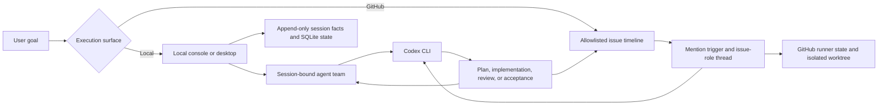

# Moebius

Moebius gives developers persistent, role-based coding-agent teams across local project sessions and GitHub issues, so planning, implementation, review, handoff, and verification can continue with less manual coordination.

<p align="center">
  
</p>

<p align="center">
  <a href="README.md">English</a> · <a href="README.zh-CN.md">简体中文</a>
</p>

<p align="center">
  <a href="https://github.com/tranfu-labs/agent-moebius/actions/workflows/ci.yml"></a>
  <a href="LICENSE"></a>
</p>

Moebius is under active development; see the [changelog](CHANGELOG.md) for release history.

## Why Moebius

- Define agent responsibilities and collaboration rules in plain Markdown instead of hard-coding one fixed workflow.
- Keep conversations, handoffs, failures, and recovery state across long-running work.
- Separate planning, implementation, QA, product review, and final acceptance among explicit roles.
- Run locally by default, or opt into an allowlisted GitHub Issue runner when a shared issue timeline fits the team better.

## Supported today

- [x] Persistent local sessions backed by append-only JSONL facts and a rebuildable SQLite index
- [x] Session-bound agent teams with a primary agent responsible for routing and closeout
- [x] A local console with managed attachments, interrupted-run recovery, and resumable Codex threads
- [x] An allowlisted GitHub Issue runner with mention-based handoffs and per-issue, per-role Codex threads
- [x] Isolated issue worktrees, bounded concurrency, media input, and release-backed output artifacts
- [x] An Electron desktop shell and reusable React console component library
- [x] A read-only observer for runner and goal-ledger diagnostics

## Prerequisites

For source development and terminal use:

- Git
- Node.js 24
- pnpm 9.15.4, matching the repository's `packageManager` field
- An installed and authenticated `codex` CLI available on `PATH`

GitHub mode also requires:

- An installed `gh` CLI
- `gh auth login` completed for an account with access to the repositories you allowlist
- Network access to GitHub and the configured Codex provider

Packaged desktop releases support macOS on Apple Silicon only. Windows, Linux, Intel Mac, and universal macOS packages are not part of the current release commitment.

## Quick start

```bash
git clone https://github.com/tranfu-labs/agent-moebius.git
cd agent-moebius
corepack enable
corepack prepare pnpm@9.15.4 --activate
pnpm install --frozen-lockfile
pnpm start
```

`pnpm start` enters local mode. It starts the loopback local console, prints its URL, and does not scan or read GitHub issues. A clean startup does not need repository configuration or GitHub authentication; `codex` is needed when a local session actually runs an agent.

Open the printed URL, add or select a project, create a session, choose an agent team, and send a goal.

## Common modes

| Goal | Command | Behavior |
| --- | --- | --- |
| Run the local console | `pnpm start` | Local sessions only; no GitHub intake |
| Run the pure GitHub Issue runner | `pnpm start -- --github-mode` | Scans only allowlisted repositories; does not start the local console |
| Run the Electron desktop app from source | `pnpm desktop` | Builds and opens the local desktop operator console |
| Run the read-only observer | `pnpm observer` | Shows diagnostics without controlling the runner or writing runner state |
| Run the console UI Storybook | `pnpm --filter @moebius/console-ui storybook` | Opens the component development environment |

### GitHub Issue runner

The checked-in `config.toml` intentionally enables no repositories. Add machine-local repositories to the ignored `config.local.toml`:

```toml
[[watchRepositories]]
owner = "your-org"
repo = "your-repo"
```

Then verify authentication and start the explicit GitHub mode:

```bash
gh auth status
pnpm start -- --github-mode
```

The first scan establishes a baseline instead of processing historical issues. Later updates can trigger an agent when the latest issue body or comment hands off control with one valid mention, for example:

```text
@dev Investigate the failing test, propose a verifiable plan, and continue through review.
```

A message may contain at most one valid agent mention. In GitHub mode, `@` means “hand off the next step,” not “refer to this role.” See the [GitHub interaction protocol](docs/protocols/github-interaction.md) before operating a shared runner.

Do not run a terminal GitHub-mode runner and the desktop runner against the same repository at the same time. If you intentionally switch between them, point both at the same `MOEBIUS_DATA_ROOT` so they share GitHub runner state and local configuration.

### Desktop development and releases

Run the desktop shell from source on macOS:

```bash
pnpm desktop
```

Desktop tags matching `desktop-v*` build DMG and ZIP artifacts for macOS Apple Silicon only. Current artifacts are not code-signed or notarized, so macOS may show a security warning. Review the release provenance and use the system-provided Open flow only if you trust the artifact.

### Data roots

| Context | Default data root |
| --- | --- |
| Terminal source run | Repository root |
| Desktop development | Repository root |
| Packaged desktop app | `~/.moebius` |

Set `MOEBIUS_DATA_ROOT` to override configuration and runtime data, and `MOEBIUS_WORKDIR_ROOT` to override issue worktrees. Local sessions and the GitHub runner use separate SQLite stores and are not mirrored into each other.

## How it works



The runner treats the local Codex CLI as the execution driver. Agent Markdown defines responsibilities and trusted capabilities; runtime code owns routing, persistence, bounded side effects, recovery, and GitHub adapters.

## Security boundaries

- Local mode binds its console to loopback by default and does not enable GitHub intake.
- GitHub mode is opt-in and mutating: it can read issues, add `eyes` reactions, post comments, create child issues, provision local worktrees, and publish selected artifacts through GitHub Releases.
- The repository allowlist is empty by default. Access is limited by the permissions of the authenticated `gh` account.
- GitHub issue workspace access is role-scoped. `read-run` is a collaboration rule, not an operating-system sandbox; such roles may still run commands and create caches or test output.
- Issue bodies, comments, attachments, and project files may be included in prompts or passed to the configured Codex provider. Do not place secrets in content an agent can read.
- Keep credentials in the normal Codex and GitHub CLI stores or environment variables. Never commit `.env` or `config.local.toml`.
- Packaged desktop artifacts are currently unsigned and unnotarized. Verify the GitHub Release and commit or tag before opening one.

Report vulnerabilities privately through [GitHub Security Advisories](https://github.com/tranfu-labs/agent-moebius/security/advisories/new).

## Development

```bash
pnpm test
pnpm typecheck
pnpm brand:check
pnpm --filter @moebius/desktop build
```

`pnpm brand:generate` requires macOS and `/usr/bin/sips`; the read-only `pnpm brand:check` can run in CI without regenerating assets.

Architecture and product intent are documented in [the module map](docs/architecture/module-map.md), [architecture invariants](docs/architecture/invariants.md), and [the product PRD](docs/product/prd.md).

## Contributing

Contributions are welcome. Read [CONTRIBUTING.md](CONTRIBUTING.md) for setup, Conventional Commits, tests, review expectations, and the squash-merge workflow. Use the repository's Issue Forms for bugs, feature requests, and questions.

## License

Moebius is licensed under the [MIT License](LICENSE). Copyright © 2026 TranFu.
