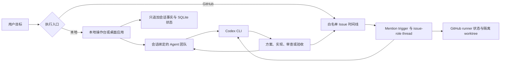

# Moebius

Moebius 为开发者提供可持续运行、按角色分工的编码 Agent 团队，同时支持本地项目会话与 GitHub Issue，让方案、实现、审查、交棒和验证以更少的人工协调持续推进。

<p align="center">
  
</p>

<p align="center">
  <a href="README.md">English</a> · <a href="README.zh-CN.md">简体中文</a>
</p>

<p align="center">
  <a href="https://github.com/tranfu-labs/agent-moebius/actions/workflows/ci.yml"></a>
  <a href="LICENSE"></a>
</p>

Moebius 仍在积极开发中；发布状态见[变更日志](CHANGELOG.md)。

## 为什么使用 Moebius

- 用普通 Markdown 定义 Agent 职责与协作规则，不必把团队固化成单一工作流。
- 在长任务中持续保存对话、交棒、失败和恢复状态。
- 让方案、实现、测试、产品审查与最终验收由职责明确的不同角色承担。
- 默认在本地运行；需要共享 Issue 时间线时，也可显式启用仅扫描白名单仓库的 GitHub Issue runner。

## 当前能力

- [x] 以只追加 JSONL 事实日志和可重建 SQLite 索引承载持久化本地会话
- [x] 会话绑定 Agent 团队，由主 Agent 负责路由和最终收尾
- [x] 支持托管附件、中断恢复和 Codex thread 续跑的本地操作台
- [x] 支持 mention 交棒及 issue + role 独立 Codex thread 的白名单 GitHub Issue runner
- [x] Issue 隔离 worktree、有界并发、媒体输入和通过 GitHub Release 发布的输出产物
- [x] Electron 桌面壳与可复用 React 操作台组件库
- [x] 用于 runner 与目标账本诊断的只读 observer

## 前置条件

从源码开发和使用终端入口需要：

- Git
- Node.js 22
- pnpm 9.15.4，与仓库 `packageManager` 字段一致
- 已安装并完成认证、可通过 `PATH` 调用的 `codex` CLI

GitHub 模式还需要：

- 已安装 `gh` CLI
- 已通过 `gh auth login` 登录，并有权访问白名单仓库
- 能够访问 GitHub 和所配置 Codex 服务的网络

打包桌面版仅支持 Apple Silicon Mac。Windows、Linux、Intel Mac 和 universal macOS 包不在当前正式发行范围内。

## 快速开始

```bash
git clone https://github.com/tranfu-labs/agent-moebius.git
cd agent-moebius
corepack enable
corepack prepare pnpm@9.15.4 --activate
pnpm install --frozen-lockfile
pnpm start
```

`pnpm start` 进入本地模式：启动 loopback local console、打印访问地址，并且不会扫描或读取 GitHub Issue。干净环境冷启动不需要仓库配置或 GitHub 认证；只有本地会话真正运行 Agent 时才需要 `codex`。

打开命令打印的地址，添加或选择项目，创建会话，选择 Agent 团队，然后发送目标。

## 常用模式

| 目标 | 命令 | 行为 |
| --- | --- | --- |
| 运行本地操作台 | `pnpm start` | 只运行本地会话，不启用 GitHub intake |
| 运行纯 GitHub Issue runner | `pnpm start -- --github-mode` | 只扫描白名单仓库，不启动本地操作台 |
| 从源码运行 Electron 桌面应用 | `pnpm desktop` | 构建并打开本地桌面操作台 |
| 运行只读 observer | `pnpm observer` | 只显示诊断，不控制 runner，也不写 runner 状态 |
| 运行操作台组件 Storybook | `pnpm --filter @moebius/console-ui storybook` | 打开组件开发环境 |

### GitHub Issue runner

提交到仓库的 `config.toml` 默认不启用任何仓库。请在被忽略的 `config.local.toml` 中添加本机要监听的仓库：

```toml
[[watchRepositories]]
owner = "your-org"
repo = "your-repo"
```

然后确认认证状态并显式启动 GitHub 模式：

```bash
gh auth status
pnpm start -- --github-mode
```

首次扫描只建立 baseline，不会批量处理历史 Issue。后续更新中，最新 Issue 正文或评论使用一个合法 mention 交出控制权时，可以触发对应 Agent，例如：

```text
@dev 排查失败测试，给出可验证方案，并继续推进审查。
```

每条消息最多只能包含一个合法 Agent mention。在 GitHub 模式中，`@` 表示“把下一步控制权交给该角色”，而不是普通提及。在运行共享 runner 前，请先阅读 [GitHub 交互协议](docs/protocols/github-interaction.md)。

同一时间不要让终端 GitHub-mode runner 和桌面 runner 监听同一仓库。如需有意切换，请让两者指向相同的 `MOEBIUS_DATA_ROOT`，以共享 GitHub runner 状态和本地配置。

### 桌面开发与发行

在 macOS 上从源码运行桌面壳：

```bash
pnpm desktop
```

匹配 `desktop-v*` 的 tag 会生成仅适用于 Apple Silicon Mac 的 DMG 和 ZIP。目前产物不做代码签名或 notarization，因此 macOS 可能显示安全提醒。打开前请检查 GitHub Release 的来源和对应 commit 或 tag，只在信任产物时使用系统提供的“打开”流程。

### 数据根目录

| 场景 | 默认数据根目录 |
| --- | --- |
| 终端源码运行 | 仓库根目录 |
| 桌面开发 | 仓库根目录 |
| 打包桌面应用 | `~/.moebius` |

使用 `MOEBIUS_DATA_ROOT` 覆盖配置与运行时数据目录，使用 `MOEBIUS_WORKDIR_ROOT` 覆盖 Issue worktree 目录。本地会话与 GitHub runner 使用相互独立的 SQLite，不会互相镜像。

## 工作原理



Runner 把本机 Codex CLI 作为执行驱动。Agent Markdown 定义职责与可信能力；运行时代码负责路由、持久化、有界副作用、恢复和 GitHub adapter。

## 安全边界

- 本地模式默认只绑定 loopback，不启用 GitHub intake。
- GitHub 模式需要显式启用且会产生外部写操作：它可以读取 Issue、添加 `eyes` reaction、发布评论、创建子 Issue、准备本地 worktree，以及通过 GitHub Release 发布选中的产物。
- 仓库白名单默认为空；可访问范围受当前 `gh` 账号权限限制。
- GitHub Issue workspace 权限按角色配置。`read-run` 是协作规则，不是操作系统级沙箱；这些角色仍可能运行命令并产生缓存或测试输出。
- Issue 正文、评论、附件和项目文件可能进入 prompt 或被发送给配置的 Codex 服务。不要把秘密放进 Agent 可读取的内容。
- 凭证应保存在 Codex、GitHub CLI 的常规凭证存储或环境变量中。不要提交 `.env` 或 `config.local.toml`。
- 打包桌面产物目前没有签名或 notarization。打开前请核对 GitHub Release 及对应 commit 或 tag。

请通过 [GitHub Security Advisories](https://github.com/tranfu-labs/agent-moebius/security/advisories/new) 私下报告安全漏洞。

## 开发

```bash
pnpm test
pnpm typecheck
pnpm brand:check
pnpm --filter @moebius/desktop build
```

`pnpm brand:generate` 依赖 macOS 与 `/usr/bin/sips`；只读的 `pnpm brand:check` 无需重新生成资产，可在 CI 中运行。

架构与产品意图见[模块地图](docs/architecture/module-map.md)、[架构不变量](docs/architecture/invariants.md)和[产品 PRD](docs/product/prd.md)。

## 参与贡献

欢迎贡献。开发环境、Conventional Commits、测试要求、审查标准和 Squash Merge 流程见 [CONTRIBUTING.md](CONTRIBUTING.md)。提交 Bug、功能建议或问题时，请使用仓库提供的 Issue Forms。

## 许可证

Moebius 使用 [MIT License](LICENSE)。Copyright © 2026 TranFu。
