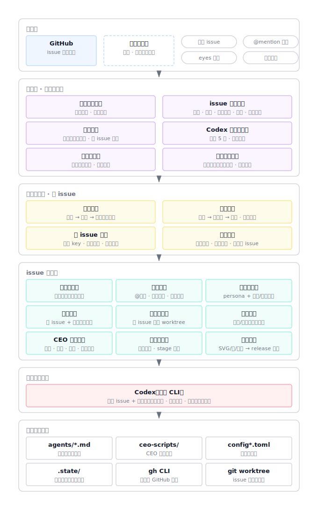
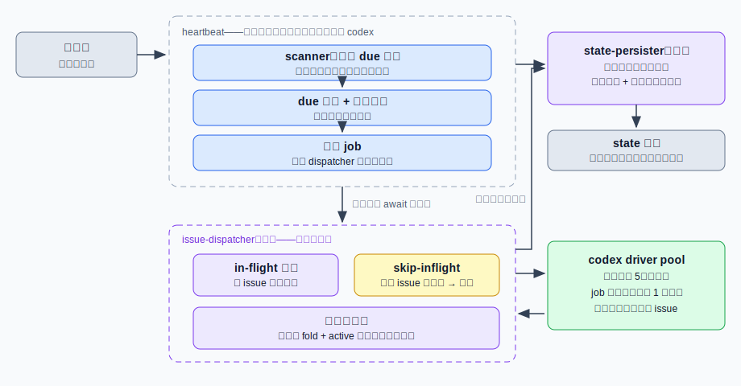
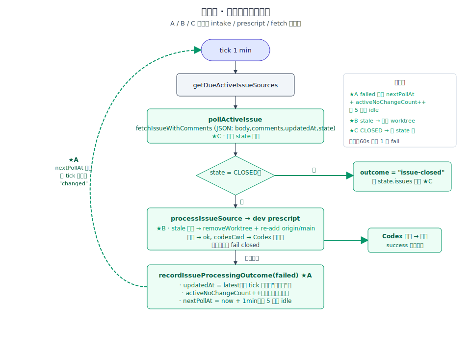
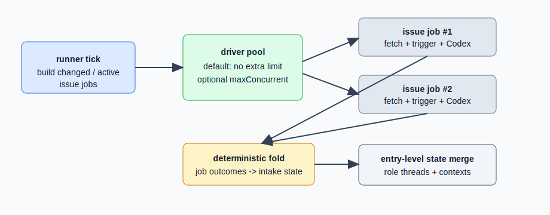

# 模块地图

当前仓库已提供 TypeScript 运行时代码；`agents/` 仍只作为 Markdown 素材模块记录，不承担运行时状态。

## 业务视角五层总览

自上而下：交互层（GitHub 及对外功能）→ 运维层（仓库、issue、Codex 的规模与节奏管理）→ issue 内处理（单个 issue 的处理能力）→ 大模型执行层（Codex）→ 资产及其维护。图中块名按业务能力命名，不与具体文件绑定；文件级职责见下方各模块条目。

### agents
- 职责边界：存放 agent/用户画像类 Markdown 素材；可通过受信任 frontmatter 声明 runner 预置的 `preScript`，但不负责 GitHub 轮询、状态记录或直接执行本地脚本。`agents/ceo.md` 是发布前 guardrail persona，只承载校正规则，不作为普通 mention Codex agent 运行；`agents/secretary.md` 是 CEO guardrail 规则维护入口，作为普通 mention agent 运行但只维护当前仓库的 CEO 规则与相关事实源。
- 入口：`agents/product-manager.md`、`agents/hermes-user.md`、`agents/dev.md`、`agents/dev-manager.md`、`agents/secretary.md`、`agents/ceo.md`
- 上游：`src/runner.ts` 扫描 `agents/*.md`；最新 issue body/comment 中的 `@<name>` 命中可交互 agent 时读取对应 Markdown 作为 system/persona 素材；`src/format-ceo.ts` 按需读取 `agents/ceo.md` 作为 CEO guardrail persona。
- 下游：frontmatter 中的 `preScript` 只能指向 `src/agent-prescripts/` 下的受信任脚本；agent persona 可声明 runner 可解析的 stage metadata 枚举契约。
- 禁止依赖：MUST NOT 依赖运行时状态文件、GitHub token 或本地脚本输出。

### stages
- 职责边界：集中定义 stage 枚举，并提供 stage marker 宽容解析 / 尾部验证。它只处理字符串规则，不知道 GitHub、timeline、Codex 或 runner 编排。
- 入口：`src/stages.ts`
- 上游：`src/format-ceo.ts` 用 `AllStages` 和尾部验证校验 CEO 修正版；agent persona 文档引用同一枚举契约。
- 下游：无真实外部操作。
- 禁止依赖：MUST NOT 调用 `gh` / `codex` / 文件系统；MUST NOT 依赖 runner 状态；MUST NOT 把 stage 白名单复制到触发器或 CEO 模块里各自维护。

### ceo-format-guardrail
- 职责边界：在 GitHub 评论发布前，用 `agents/ceo.md` persona 和完整公开 issue context 校正 Codex agent 输出；负责组装 `issueContext`（issue 链接、issue body、所有 comment body 原文）、`latestResponse`、`agent`、`allowedStages` prompt，解析 JSON 输出，对修正版做尾部 stage marker 后置验证，并在异常 / 超时 / 非法输出时 fail-open 返回原文。不维护 role thread，不推进 issue 状态。
- 入口：`src/format-ceo.ts`
- 上游：`src/runner.ts` 在 mention Codex 分支、`postComment` 前调用。
- 下游：`src/codex.ts` 的受控 Codex 调用、`src/stages.ts` 的 stage 验证、`agents/ceo.md` persona。
- 禁止依赖：MUST NOT 调用 GitHub；MUST NOT 更新 `.state/*`；MUST NOT 复用 dev / 其他 role thread；MUST NOT 把事故处理规则硬编码到 TypeScript 里；MUST NOT 因 CEO 失败阻断原 agent 评论发布。

### triggers
- 职责边界：把最新共享时间线消息解析成触发结果；当前只包含普通 mention trigger。可返回运行某个 Codex agent 或跳过。
- 入口：`src/triggers/index.ts`；`src/triggers/mention-trigger.ts`
- 上游：`src/runner.ts` 在构造 timeline 与 agent 名单后调用。
- 下游：`src/conversation.ts` 的 timeline / mention 纯函数。
- 禁止依赖：MUST NOT 调用 `gh` / `codex` / 文件系统；MUST NOT 把 issue 内容拼成 shell 命令；MUST NOT 把 stage / CEO guardrail 业务规则写进 trigger。

### agent-prescripts
- 职责边界：在 Codex 执行前为特定 agent 准备确定性运行上下文；`dev-workspace` 基于 runner 正在处理的 GitHub issue source 创建 / 复用 issue 独占 worktree，刷新远端 `main` 基线，复用时检测 worktree 是否已包含最新 `main`，并返回 Codex cwd；`current-repo-workspace` 返回 agent-moebius 当前仓库根目录，供 `@secretary` 维护 CEO 规则时使用，不创建 worktree、不读写状态。
- 入口：`src/agent-manifest.ts` 解析 `agents/*.md` frontmatter；`src/agent-prescripts/index.ts` 通过静态 registry 执行受信任脚本；`src/agent-prescripts/dev-workspace.ts` 实现 `@dev` 工作目录准备；`src/agent-prescripts/current-repo-workspace.ts` 实现 `@secretary` 当前仓库工作目录准备。
- 上游：`src/runner.ts` 在选中 agent 且需要调用 Codex 前执行。
- 下游：本地 `git` CLI、`src/agent-context-state.ts`、`src/config.ts` 的 workdir root 与 issue source。
- 禁止依赖：MUST NOT 执行 issue body/comment 中声明的任意脚本路径；MUST NOT 用 shell 拼接外部输入；MUST NOT 把运行状态写入 `agents/`。

### github-response-intake
- 职责边界：纯业务数据操作，负责 GitHub repository / issue source key 生成、闲时 repo 扫描 due 判断、active issue 轮询 due 判断、`updatedAt` 去重、active/idle 状态转换、运行中断 outcome 调度、失败计数与失败原因记账、dead-lettered 可见 ack 折叠、active 无变化计数与 active issue 上限裁剪。
- 入口：`src/github-response-intake.ts`、`src/issue-source.ts`
- 上游：`src/runner.ts` 与 `src/scanner.ts` 在每轮心跳中调用，用于决定哪些 repository / issue source 需要外部读取；`src/issue-dispatcher.ts` 在 job 完成折叠时调用状态转换纯函数。
- 下游：无真实外部操作。
- 禁止依赖：MUST NOT 调用 `gh` / `codex` / 文件系统；MUST NOT 读取 agent 文件或构造 prompt；MUST NOT 把 issue 内容拼成 shell 命令。

### driver-pool
- 职责边界：执行 runner 提交的 driver job 并承载并发策略；默认不施加额外并发上限，显式 `maxConcurrent` 为正整数时按队列限流。它只接收 `() => Promise<T>` job，不理解 GitHub issue、trigger、prompt、Codex 参数或 intake state。
- 入口：`src/driver-pool.ts`
- 上游：`src/issue-dispatcher.ts` 把心跳派发的 issue jobs 提交给 pool；job 可长跑，只占用名额，不阻塞心跳。
- 下游：无领域依赖；只调调用方传入的 job 函数。
- 禁止依赖：MUST NOT 调用 `gh` / `codex` / 文件系统；MUST NOT 读取或写入 `.state/*`；MUST NOT 引入 GitHub issue domain types、trigger 规则或 prompt 构造。

### local-config
- 职责边界：解析提交版 `config.toml` 与本机覆盖 `config.local.toml` 的 TOML 内容并校验成本地运行配置；默认 watched repositories 为空。不负责 GitHub CLI、状态文件、轮询调度或 agent 触发。
- 入口：`src/local-config.ts`
- 上游：`src/config.ts` 在启动加载配置时调用。
- 下游：TOML parser 依赖。
- 禁止依赖：MUST NOT 调用 `gh` / `codex`；MUST NOT 读取 GitHub issue 内容；MUST NOT 保存 token 或运行状态。

### github-issue-runner
- 职责边界：常驻运行，每分钟一轮心跳：按 `config.toml` / `config.local.toml` 解析出的白名单扫描 GitHub repositories，把 changed / due active 的 issue 转成 issue processing jobs，批内按 issueKey 去重后交给 issue-dispatcher，**不等待任何 job 执行完成**（心跳防重入仅覆盖秒级扫描派发阶段）；runner 包装 job 结果，在失败达 `FAILURE_RETRY_LIMIT` 时尝试发布无 agent mention 的死信评论，发布成功后把结局改判为 `dead-lettered`，发布失败则保持 `failed` 继续重试；每个 issue 的 body + comments 会归一化为带 speaker 的共享时间线；目标 issue 暂不存在时记录 skip 并等待后续轮询；当 mention trigger 解析结果要求运行 agent 时，进入该 issue + role 独立 Codex thread，先准备本轮 prompt 范围内的 issue 图片 / 视频输入媒体，再在真正调用 Codex driver 前通过 GitHub client 为本轮触发源消息添加 `eyes` reaction（issue body 触发则打到 issue，comment 触发则打到该 comment），并在 Codex 完成、且最终确认未被新 comment 打断后发布生成 artifact、走 CEO guardrail、再回评 GitHub issue；当 `@dev` 运行期间检测到新 comment 时中断本轮 Codex 并保持 issue active。
- 入口：`pnpm start` → `src/runner.ts`
- 上游：进程启动命令、本机 `gh auth login`、本机 `codex` CLI。
- 下游：`src/scanner.ts`、`src/issue-dispatcher.ts`、`src/state-persister.ts`、`src/github-response-intake.ts`、`src/driver-pool.ts`、`src/github-intake-state.ts`、`src/github.ts`、`src/conversation.ts`、`src/conversation-interrupt.ts`、`src/issue-media.ts`、`src/media-assets.ts`、`src/triggers/*`、`src/codex.ts`、`src/format-ceo.ts`、`src/state.ts`、`src/agent-manifest.ts`、`src/agent-prescripts/*`、`agents/*.md`。
- 禁止依赖：MUST NOT 依赖 `agents/` 作为运行状态；MUST NOT 直接拼接 issue 内容为 shell 命令；MUST NOT 在 codex 失败时发评论。

### intake-scanner
- 职责边界：发现层。判定 due 仓库、拉取 open issue 列表、把扫描结果以纯变换应用到内存状态并返回 changed issues；先完成异步列表拉取、再应用纯变换，不覆盖执行侧折叠结果；单仓库失败记日志继续其余仓库。
- 入口：`src/scanner.ts`
- 上游：`src/runner.ts` 心跳每轮调用。
- 下游：`src/github-response-intake.ts` 的 due 判定与扫描纯函数、`src/github.ts` 的 issue 列表读取（注入）。
- 禁止依赖：MUST NOT 调用 `codex`；MUST NOT 触发 issue 处理或写状态文件（状态变更只通过注入的 applyState 应用）。

### issue-dispatcher
- 职责边界：派发层。维护跨心跳 in-flight issue 集合（在跑 issue 重复派发记 `skip-inflight` 跳过，实现 issue 级串行）；把 job 提交给 driver pool 执行，完成即把结果以纯函数折叠进 state persister 并执行 active 上限策略（豁免在跑 issue）；job 异常时记 `issue-job-error` 并保证从集合移除。
- 入口：`src/issue-dispatcher.ts`
- 上游：`src/runner.ts` 心跳派发 jobs。
- 下游：`src/driver-pool.ts`、`src/state-persister.ts`、`src/github-response-intake.ts` 的折叠与上限纯函数。
- 禁止依赖：MUST NOT 调用 `gh` / `codex` / 文件系统；MUST NOT 理解 trigger、prompt 或 Codex 参数（job 内容由注入的 runJob 承载）。

### state-persister
- 职责边界：intake state 的单写者。内存持有唯一权威状态，所有变更以纯函数变换同步应用；文件写入串行化且可合并（连续变更只落盘最新快照），写失败记 `state-save-failed` 不中断运行、后续变更重试。
- 入口：`src/state-persister.ts`
- 上游：`src/runner.ts`（组装与扫描应用）、`src/issue-dispatcher.ts`（完成折叠）。
- 下游：`src/github-intake-state.ts` 的原子写（注入）。
- 禁止依赖：MUST NOT 理解 GitHub / Codex / trigger 语义；MUST NOT 主动读文件（初始状态由组装方注入）。

### conversation-protocol
- 职责边界：纯业务数据操作，负责共享时间线归一化、speaker 判定、agent mention 选择、full/resume prompt 构造、delta 消息选择、agent 评论格式化、role thread 状态更新计算。其中 agent mention 解析遵守 `docs/protocols/github-interaction.md` 的代码区域规则：fenced code block 与 inline backtick 内的 mention 不参与触发，代码区域外的 index 契约保持原文坐标。不负责 GitHub、Codex CLI 或文件系统。
- 入口：`src/conversation.ts`
- 上游：`github-issue-runner`
- 下游：无真实外部操作。
- 禁止依赖：MUST NOT 调用 `gh` / `codex` / 文件系统；MUST NOT 把 issue 内容拼成 shell 命令。

### issue-media
- 职责边界：纯业务数据操作，负责从共享时间线消息中提取图片 / 视频候选引用，并把已准备好的媒体文件格式化为 prompt media manifest。它只做 URL shape、协议与文本模式判断，不下载、不读取文件、不知道 Codex runDir。
- 入口：`src/issue-media.ts`
- 上游：`github-issue-runner` 在 Codex run 前按 full / resume / fallback prompt 范围选择 timeline messages 后调用。
- 下游：无真实外部操作；输出的结构化 media references 交给 `media-assets` adapter 准备文件。
- 禁止依赖：MUST NOT 调用 `gh` / `codex` / `fetch` / 文件系统；MUST NOT 把 issue 内容拼成 shell 命令；MUST NOT 自行推进 role thread 或 intake state。

### media-assets
- 职责边界：媒体 IO adapter。负责把 issue 图片 / 视频 URL 下载到当前 Codex runDir、校验 MIME / size、生成图片路径与视频 manifest；Codex 完成后发现本轮生成或最终回复明确引用的 SVG / 图片 / 视频产物，复制到 runDir/output-artifacts 并生成可发布 artifact 数据与 Markdown。它不理解 trigger 规则、role thread 语义或 GitHub response intake。
- 入口：`src/media-assets.ts`
- 上游：`github-issue-runner` 在 Codex run 前后调用。
- 下游：Node `fetch` / 文件系统；发布 URL 由 `github-client` 的 artifact publisher 返回。
- 禁止依赖：MUST NOT 调用 `codex`；MUST NOT 写入 `agents/`、`.state/` 或目标 worktree 的输入媒体；MUST NOT 提交生成产物到业务仓库；MUST NOT 把外部 URL 或文件名拼成 shell 命令。

### conversation-interrupt
- 职责边界：纯业务数据操作，负责基于 driver 提供的 conversation snapshot（当前仅 message count）判断是否出现新消息，并提供可复用的轮询 monitor 将新消息转换为中断回调。
- 入口：`src/conversation-interrupt.ts`
- 上游：`github-issue-runner` 在运行 `@dev` Codex 时把 GitHub issue 当前消息数适配为 conversation snapshot。
- 下游：无真实外部操作；driver 通过回调提供 snapshot 读取函数。
- 禁止依赖：MUST NOT 调用 `gh` / `codex` / 文件系统；MUST NOT 知道具体 driver 类型；MUST NOT 解析 issue 内容或构造 prompt。

### local-script-executor
- 职责边界：以受控方式调用本机 `codex`，支持首次 `codex exec` 与后续 `codex exec resume <threadId>`；把 prompt 作为 argv 传入；可接收已准备好的图片文件路径并通过重复 `--image <file>` 传给 Codex；可接收 pre script 返回的 `cwd` 显式设置 Codex 工作目录；可接收 AbortSignal 中断正在运行的 Codex 子进程；落盘 stdout/stderr 并提取最终 assistant 文本、`thread.started.thread_id`、`turn.completed.usage.cached_input_tokens`。不负责轮询 GitHub、speaker 归一化、driver pool 并发策略或判断 issue 是否已处理。
- 入口：`src/codex.ts`
- 上游：`github-issue-runner`
- 下游：本机 `codex` CLI、`/tmp/agent-moebius-<ISO>-c<count>-r<sequence>/stdout.jsonl`、`/tmp/agent-moebius-<ISO>-c<count>-r<sequence>/stderr.log`。
- 禁止依赖：MUST NOT 执行来自 issue body / comment 的任意命令；MUST NOT 在日志中输出敏感配置。

### role-thread-state
- 职责边界：读取与写入本地 `.state/role-threads.json`，保存 issue + role 到 Codex threadId 与 lastSeenIndex 的映射；提供按 issue + role entry 级别 merge 保存的串行写入 helper，避免并发 Codex 成功结果覆盖彼此。不负责 prompt 构造、speaker 判定或 GitHub/Codex 调用。
- 入口：`src/state.ts`
- 上游：`github-issue-runner`
- 下游：本地 `.state/role-threads.json`。
- 禁止依赖：MUST NOT 存放在 `agents/`；MUST NOT 存 GitHub token、prompt 全文或 codex 执行日志。

### agent-context-state
- 职责边界：读取与写入本地 `.state/agent-contexts.json`，保存 issue + role 到 agent pre script 上下文的映射；当前用于记录 `@dev` 的 issue 独占 worktree；提供按 issue + role entry 级别 merge 保存的串行写入 helper，避免并发 dev pre script context 覆盖彼此。
- 入口：`src/agent-context-state.ts`
- 上游：`agent-prescripts`
- 下游：本地 `.state/agent-contexts.json`。
- 禁止依赖：MUST NOT 存放在 `agents/`；MUST NOT 存 GitHub token、prompt 全文或 codex 执行日志。

### github-intake-state
- 职责边界：读取与写入本地 `.state/github-response-intake.json`，保存 repository 闲时扫描时间与 per-issue active/idle 调度状态。不负责 GitHub CLI、trigger 判定或 active/idle 业务规则。
- 入口：`src/github-intake-state.ts`
- 上游：`github-issue-runner`
- 下游：本地 `.state/github-response-intake.json`。
- 禁止依赖：MUST NOT 存放在 `agents/`；MUST NOT 存 GitHub token、prompt 全文、comment 正文或 codex 执行日志。

### github-client
- 职责边界：通过 `gh` CLI 拉取 repository open issue summaries、读取指定 issue body/comments/updatedAt/comment node id，通过 stdin 向指定 issue 发布评论，通过 `gh api` argv 参数数组为指定 issue 或 issue comment 添加受控 reaction，并通过同仓库 GitHub release asset 上传把本地输出 artifact 转成 GitHub comment 可引用 URL；不负责对话触发规则或 active/idle 调度规则。
- 入口：`src/github.ts`
- 上游：`github-issue-runner`
- 下游：本机 `gh` CLI。
- 禁止依赖：MUST NOT 在命令参数中拼接 shell 字符串；评论正文 MUST 通过 `--body-file -` 从 stdin 传入；reaction target 与 content MUST 来自受控枚举 / adapter shape；artifact asset 名称 MUST 来自已校验 / 清洗后的本地 artifact 数据。
