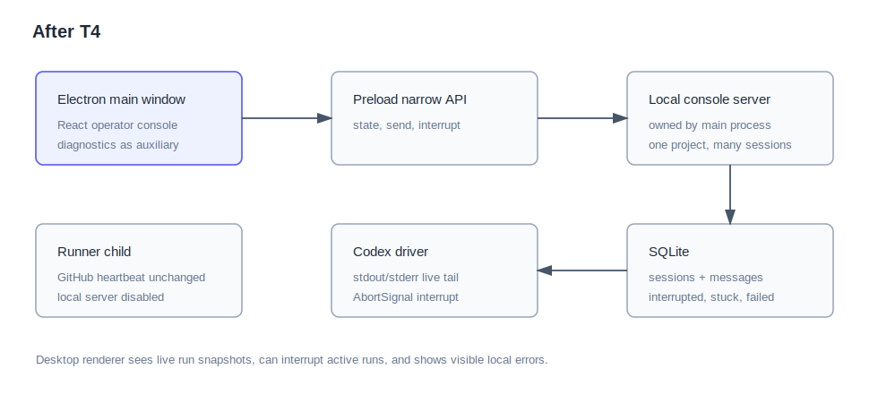
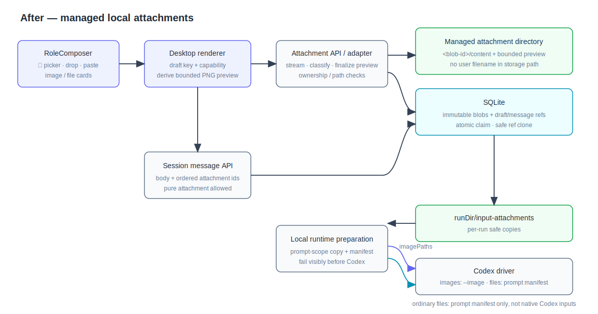
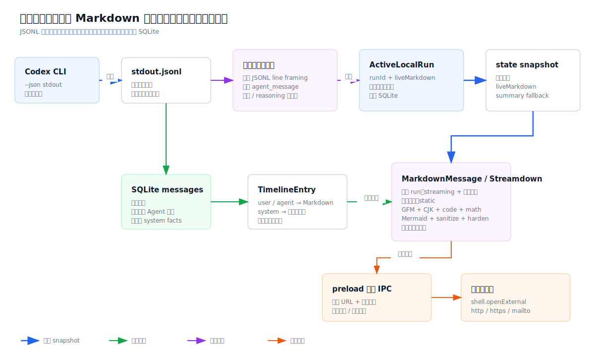
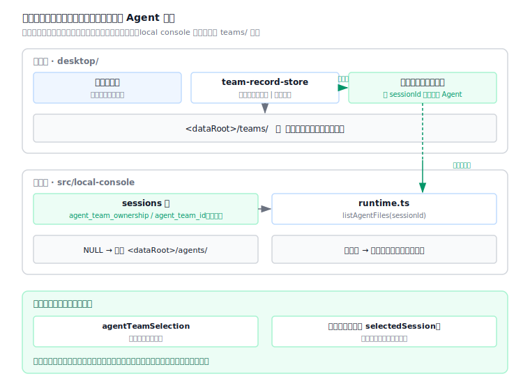
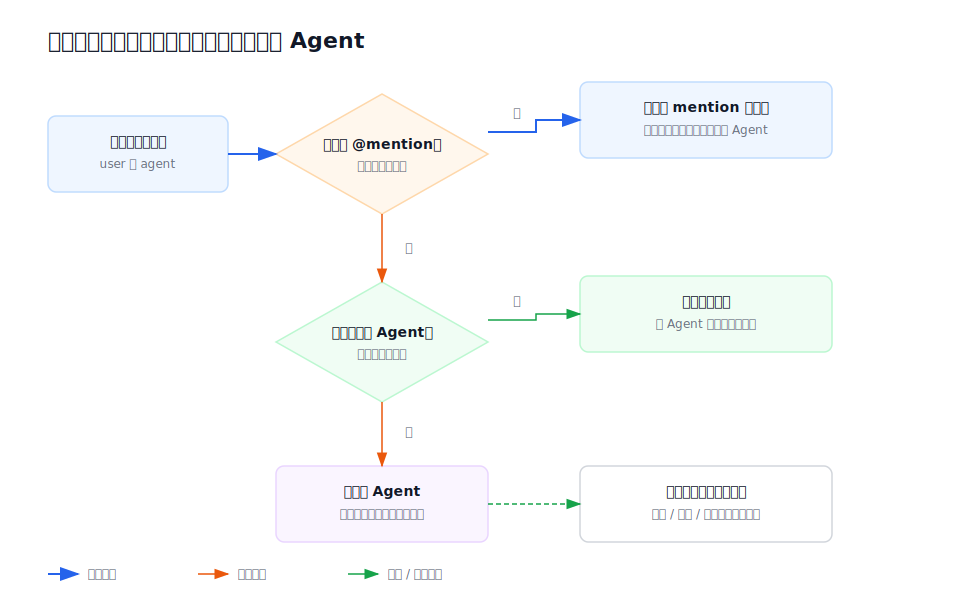
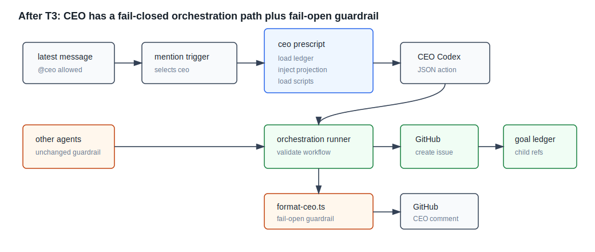
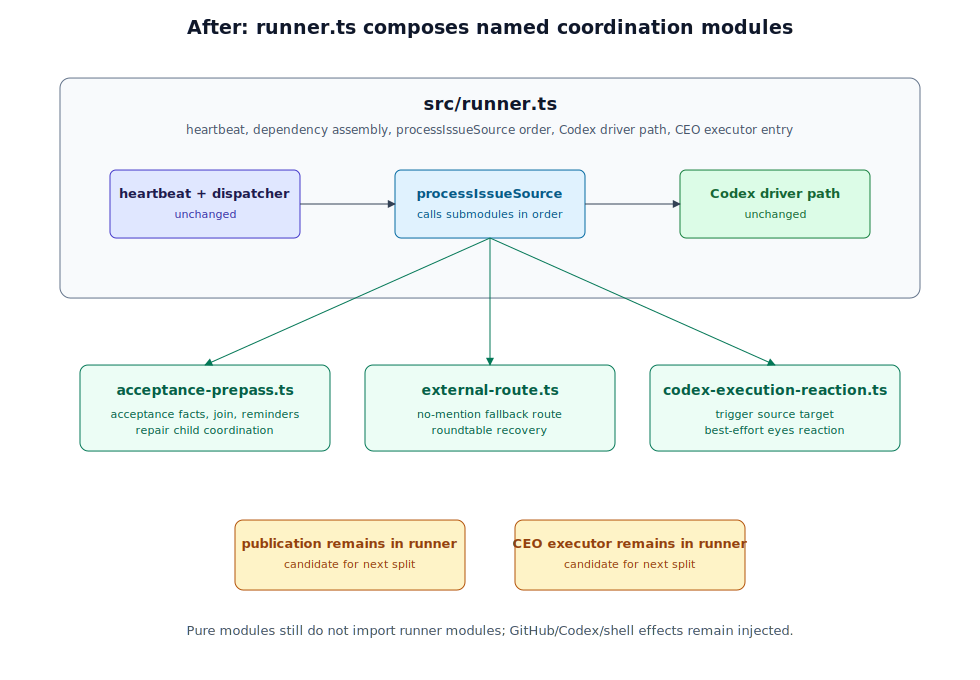

# 模块地图

当前仓库已提供 TypeScript 运行时代码与可选 Electron 桌面壳；`agents/` 仍只作为 Markdown 素材模块记录，不承担运行时状态。

## 业务视角六层总览

自上而下：交互层（GitHub 及对外功能，含本地只读观察页与桌面状态页）→ 运维层（仓库、issue、Codex 的规模与节奏管理）→ 目标编排层（跨 issue 的目标入账、目标账本、子 issue 派生与验收回流）→ issue 内处理（单个 issue 的处理能力）→ 大模型执行层（Codex）→ 资产及其维护。图中块名按业务能力命名，不与具体文件绑定；文件级职责见下方各模块条目。

### desktop-shell
- Markdown 外链边界：renderer 只能调用单用途 preload IPC，main 复验绝对 `http:` / `https:` / `mailto:` URL 后交给系统浏览器；主窗口拒绝新窗口和离开应用页面的顶层导航。
- 职责边界：Electron 桌面壳，把 runner、observer 与 local console server 装配成纯本地桌面应用；负责数据根解析、macOS PATH 修复、首启种子拷贝、Agent 团队磁盘布局与内置团队指纹播种、会话绑定团队的名单解析注入、环境自检、observer 动态端口启动、main 进程拥有的 local console server、runner 子进程监管、操作台主窗口、辅助状态页 IPC、日志落盘与更新检查。壳层只做装配、监管、自检、更新提示与 renderer 托管，不承载 GitHub issue runner、目标账本、trigger、Codex prompt、local-console 运行语义或 observer 读模型的业务规则。
- 入口：`desktop/src/main.ts`；runner 子进程入口 `desktop/src/runner-child.ts`；preload `desktop/src/preload.ts`；操作台 renderer `desktop/src/console-page/*`；辅助状态页 `desktop/src/status-page/*`；纯逻辑模块 `desktop/src/data-root.ts`、`desktop/src/shell-path.ts`、`desktop/src/env-doctor.ts`、`desktop/src/runner-supervisor.ts`、`desktop/src/updater.ts`。Agent 团队十个模块全部收敛在 `desktop/src/team-*.ts`：内置团队内容指纹与 `.system` 覆盖播种在 `team-seed.ts`，结构与有效性判定在 `team-model.ts`，磁盘读写与内置只读保护在 `team-store.ts`，用户团队稳定记录、团队定义摘要与重定位身份校验在 `team-record-store.ts`，团队列表 / 成员读写 / 复制 / 删除的窄 IPC 在 `team-ipc.ts`，重新定位与仅移除记录的 IPC 独立收敛于 `team-repair-ipc.ts`，成员 `AGENT.md` 外部修改探测与冲突判定在 `team-external-change.ts`，在平台文件管理器中打开与移到废纸篓在 `team-file-manager.ts`，上一次成功创建会话所用团队的记录与回退预选在 `team-conversation-preference.ts`，会话绑定团队的实时健康度与严格成员名单解析在 `team-runtime-binding.ts`。用户团队位置一律经记录解析；内置团队仍按 `.system/<id>` 解析。
- 上游：用户启动桌面应用；Electron 主进程生命周期；本机 `codex` CLI 与 `gh` CLI；GitHub Releases 更新通路。
- 下游：`src/observer/server.ts` 的 `startObserverServer()` 编程入口；`src/local-console/server.ts` 的 `startLocalConsoleServer()` 编程入口；`src/runner.ts` 的 `start({ mode: "github" })` 编程入口（经 `utilityProcess` 子进程，并携带 `--github-mode`）；提交版 `agents/` 与 `config.toml` 种子资源；数据根 `~/.agent-moebius` 或 `AGENT_MOEBIUS_DATA_ROOT` 覆盖目录。
- 禁止依赖：MUST NOT 给 observer 增加写接口或 runner 控制能力；MUST NOT 复制 runner / observer / ledger / local-console 业务规则；MUST NOT 把用户配置或 agent 素材写回应用资源目录；MUST NOT 用 shell 字符串拼接外部输入；MUST NOT 在同一实例内派生多个 runner；MUST NOT 在 runner child 已显式选择 GitHub mode 时再启动第二个 local console server；Agent 团队 UI MUST NOT 另行复制结构有效性规则，只消费 store/IPC 给出的状态、可用性与 issue code；移除失效记录 MUST NOT 删除、移动或修改团队目录内容。

### console-ui
- Markdown 边界：共享 `MarkdownMessage` / Streamdown 呈现静态用户与 Agent 正文及单条活动 run Markdown，统一承载 GFM、CJK、代码、数学、Mermaid 与 URL/HTML 收紧；系统事实仍属于结构化组件。
- 职责边界：React 对话操作台组件库与 Storybook 展示台，提供可被 Electron renderer import 的 shadcn 风格源码组件、Radix 无障碍原语封装、Tailwind 近单色令牌和项目专属复合组件。含 Agent 团队页的团队横行陈列、团队详情、成员选择器与 `@slug` 提及编辑器，但团队磁盘布局、播种与结构有效性判定属于 desktop-shell，本包只消费其结果。它只承载界面组件、样式令牌与组件级可测协议文本生成逻辑，不读取 `.state/`，不调用 runner / observer / GitHub / Codex，也不实现真实桌面对话操作台的数据流。
- 入口：`packages/console-ui/src/index.ts`；全局样式 `packages/console-ui/src/styles/globals.css`；Storybook `pnpm --filter @agent-moebius/console-ui storybook`。
- 上游：desktop operator console renderer、Storybook 开发期浏览器、组件测试。
- 下游：React、Radix UI、Tailwind、lucide 图标；本包内 `tokens.css` 的近单色语义变量。
- 禁止依赖：MUST NOT 反向 import `src/runner*`、`src/observer*`、`src/local-console*`、`src/goal-ledger*` 或任何 `.state` adapter；MUST NOT 调用 `gh` / `codex` / shell；MUST NOT 把业务事实复制进组件层。真实 renderer app、IPC 与 local console API 对接属于 desktop-shell。

### local-console
- 活动 Markdown 边界：active run snapshot 只在内存/API 中携带当前最新一段 Agent 可见 `liveMarkdown`；Codex driver 以 1 MiB 单行上限增量 framing JSONL，命令、reasoning 和生命周期事件不进入对话事实，最终 Agent 消息仍只落库一次。
- 职责边界：本地对话操作台数据通道。它在本机 loopback HTTP server 与 `.state/local-console.sqlite` 上提供一个本地项目、多会话、会话级 Agent 团队标识、session-scoped message submit、agent 回复接力 drain、SQLite 消息处理位点、active run snapshot、有界 stdout/stderr tail、中断、失败、卡住状态记录，以及本地 failure budget / dead-letter / restart recovery 可见收敛。它还通过 capability 保护的窄附件 API，把不可变托管 blob 与草稿/消息有序 refs 分离持久化，原子提交正文和附件，并在 Codex 运行前把 prompt 范围附件复制到当前 runDir：图片进入 `imagePaths`，普通文件只进入 prompt manifest。它按 `sessionId` 向桌面壳注入的 resolver 请求可用 Agent 名单；团队快照首成员是主 Agent 单一事实，显式 mention 优先，非主 Agent 无 mention 时最终回到主 Agent，主 Agent 无 mention 时结束本轮。未绑定的存量会话回退共享 `agents/`，绑定团队不可用时显式失败。agent 回复落库后可立即作为同一 session 的下一轮可 claim 触发源继续处理，server 启动只做一次 catch-up，不依赖固定 1s 周期 poll。cursor 待处理 source、active claim 与真实 running message 合并派生 `hasPendingControlWork`，供 session/project、侧边栏和子会话状态共同消费；该事实不表示成功或验收通过。自然语言中的“验收 / 通过 / 不通过”只保留为时间线内容，既有 acceptance 表只读保留且不再驱动路由或返工。
- 入口：`src/local-console/server.ts`、`src/local-console/runtime.ts`、`src/local-console/prompt.ts`、`src/local-console/store.ts`、`src/local-console/attachments.ts`、`src/local-console/output-tail.ts`。
- 上游：Electron main process、兼容的本地浏览器调试页、local-console 测试。
- 下游：`src/conversation.ts` 的时间线与 mention 纯函数、`src/triggers/*`、`src/ceo-orchestration.ts` 的纯结构化 parser、`src/codex.ts`、SQLite state worker、数据根下的托管附件目录、会话团队快照、agent Markdown 素材目录、Codex runDir stdout/stderr artifacts 与 `input-attachments/`。
- 禁止依赖：MUST NOT 调用 GitHub / artifact publisher / GitHub CEO orchestration executor；MUST NOT 修改 conversation、trigger、stage、goal-ledger 或 GitHub issue runner 的业务规则；MUST NOT 启动 GitHub heartbeat、读取 GitHub intake 或把 local session 数据镜像到 `.state/github-runner.sqlite`。本地 child session orchestration 只允许复用纯 parser 并映射为 local child session、`sessions.parent_session_id` 和桌面子会话呈现，不得反向调用 GitHub child issue 编排；本地 descriptor 的任务检查可选，legacy `acceptanceStatements` 只兼容显示为“任务检查参考”，不得恢复 formal acceptance scope。dead-letter/recovery 仍仅限本地 SQLite 可见收敛。

### agents
- 职责边界：存放 agent/用户画像类 Markdown 素材；可通过受信任 frontmatter 声明 runner 预置的 `pre_script`，或通过 `workspace_access: write | read-run` 选择内置 issue worktree capability，但不负责 GitHub 轮询、状态记录或直接执行本地脚本。`agents/ceo.md` 是 CEO 的共享身份素材：发布前 guardrail 路径只读取 persona body 并保持无状态 fail-open，普通 `@ceo` agent 路径执行 frontmatter prescript 并进入 fail-closed 编排。`agents/ceo-scripts/` 存放 CEO 剧本数据，不作为可 mention agent。`agents/secretary.md` 是 CEO 规则维护入口，作为普通 mention agent 运行但只维护当前仓库的 CEO 规则与相关事实源。
- 入口：`agents/product-manager.md`、`agents/hermes-user.md`、`agents/dev.md`、`agents/dev-manager.md`、`agents/secretary.md`、`agents/ceo.md`
- 上游：`src/runner.ts` 扫描 `agents/*.md`；最新 issue body/comment 中的 `@<name>` 命中可交互 agent 时读取对应 Markdown 作为 system/persona 素材；`src/format-ceo.ts` 按需读取 `agents/ceo.md` 作为 CEO guardrail persona；`src/ceo-scripts.ts` 读取 `agents/ceo-scripts/*.md` 作为剧本数据。
- 下游：frontmatter 中的 `pre_script` 只能指向 `src/agent-prescripts/` 下的受信任脚本；`workspace_access` 只允许 `write` / `read-run` 并由 runner 解释为内置 issue workspace capability，不是脚本路径；agent persona 可声明 runner 可解析的 stage metadata 枚举契约。
- 禁止依赖：MUST NOT 依赖运行时状态文件、GitHub token 或本地脚本输出。

### stages
- 职责边界：集中定义 stage 枚举，并提供 stage marker 宽容解析 / 尾部验证。它只处理字符串规则，不知道 GitHub、timeline、Codex 或 runner 编排。
- 入口：`src/stages.ts`
- 上游：`src/format-ceo.ts` 用 `AllStages` 和尾部验证校验 CEO 修正版；agent persona 文档引用同一枚举契约。
- 下游：无真实外部操作。
- 禁止依赖：MUST NOT 调用 `gh` / `codex` / 文件系统；MUST NOT 依赖 runner 状态；MUST NOT 把 stage 白名单复制到触发器或 CEO 模块里各自维护。

### ceo-format-guardrail
- 职责边界：在 GitHub 评论发布前，用 `agents/ceo.md` persona body、CEO 剧本摘要和完整公开 issue context 校正 Codex agent 输出；负责组装 `issueContext`（issue 链接、issue body、所有 comment body 原文）、`latestResponse`、`agent`、`allowedStages` prompt，解析 JSON 输出，对修正版做尾部 stage marker 后置验证，并在异常 / 超时 / 非法输出时 fail-open 返回原文。它还提供 active issue 最新外部无 mention 评论的轻量路由判定包装：复用 CEO persona，解析 `no_action` / `append` JSON，并只做结构、单 mention、可触发 agent 白名单与代码区域过滤校验；目标不清或需要编排裁决时可接受单个 `@ceo`。业务判据仍在 `agents/ceo.md` 与剧本数据。处理 `agent=ceo` 时阻断 `append as=ceo` 或正文回交 `@ceo` 的自激环。它不维护 role thread，不推进 issue 状态，不执行 `agents/ceo.md` 的 frontmatter prescript。
- 入口：`src/format-ceo.ts`
- 上游：`src/runner.ts` 在 mention Codex 分支、`postComment` 前调用；也在 active no-trigger 兜底分支中调用外部评论路由判定。
- 下游：`src/codex.ts` 的受控 Codex 调用、`src/stages.ts` 的 stage 验证、`src/conversation.ts` 的 mention 解析、`src/ceo-scripts.ts` 的只读剧本加载、`agents/ceo.md` persona。
- 禁止依赖：MUST NOT 调用 GitHub；MUST NOT 更新 `.state/*`；MUST NOT 复用 dev / 其他 role thread；MUST NOT 把事故处理规则硬编码到 TypeScript 里；MUST NOT 因 CEO 失败阻断原 agent 评论发布。

### ceo-scripts
- 职责边界：读取并校验 `agents/ceo-scripts/*.md` 剧本数据。剧本通过 frontmatter 声明 workflow id 与 action；数据包含方案评审、执行后复盘、里程碑拆解 / 子 issue 创建、集成验收请求、集成验收失败 repair child、v0 串行圆桌方案评审团模板、目标入账 `goal-intake` 剧本，以及 `switch_phase` 的窄契约说明。该模块只负责解析、唯一性校验、必需剧本存在校验和 prompt 格式化，不判断业务场景，不执行 GitHub 或 Codex。
- 入口：`src/ceo-scripts.ts`
- 上游：`src/format-ceo.ts` 为 guardrail prompt 附带剧本摘要；`src/agent-prescripts/ceo-ledger-context.ts` 与 `src/runner.ts` 为 CEO agent 编排加载必需剧本。
- 下游：Node 文件系统只读 API、`agents/ceo-scripts/*.md`。
- 禁止依赖：MUST NOT 调用 GitHub / Codex；MUST NOT 写文件；MUST NOT 把剧本文件当作可 mention agent。

### ceo-orchestration
- 职责边界：处理 CEO 普通 agent 的结构化编排输出：解析 fenced JSON + `in-progress` stage marker，校验 workflow id、action、ledger task id、分组、初始交棒角色、质量基准、验收语句与子 issue 字段，生成稳定 orchestration key，并渲染受控 child issue body；同时解析 `roundtable` action 的 `start` / `route` / `complete` mode，生成 hidden roundtable key / completion key，渲染 roundtable child issue、单 mention route handoff 与父 issue 汇总正文；解析 `goal_intake` action 的 `interview` / `propose` / `confirm` mode，校验 2-4 个采访问题、2-5 个粗里程碑、3-7 个阶段一任务、每任务 1-3 条验收语句、质量基准与支付类 demo 免责声明，并生成稳定 goal-intake proposal key / hidden proposal marker。它不执行 GitHub 创建、不读写账本、不更新 role thread。
- 入口：`src/ceo-orchestration.ts`
- 上游：`src/runner.ts` 在 `agent=ceo` 的 Codex run 成功后调用。
- 下游：`src/issue-source.ts`、`src/conversation.ts` 的 mention 解析约束、`src/stages.ts` 的 stage marker 解析。
- 禁止依赖：MUST NOT 调用 GitHub / Codex / 文件系统 / shell；MUST NOT 直接持久化状态。

### triggers
- 职责边界：把最新共享时间线消息解析成触发结果；当前只包含普通 mention trigger。可返回运行某个 Codex agent 或跳过。
- 入口：`src/triggers/index.ts`；`src/triggers/mention-trigger.ts`
- 上游：`src/runner.ts` 在构造 timeline 与 agent 名单后调用。
- 下游：`src/conversation.ts` 的 timeline / mention 纯函数。
- 禁止依赖：MUST NOT 调用 `gh` / `codex` / 文件系统；MUST NOT 把 issue 内容拼成 shell 命令；MUST NOT 把 stage / CEO guardrail 业务规则写进 trigger。

### agent-prescripts
- 职责边界：在 Codex 执行前为 agent 准备确定性运行上下文；`issue-worktree` 是 runner 内置 issue 级 workspace capability，基于 runner 正在处理的 GitHub issue source 创建 / 复用共享 worktree，首建从最新 `origin/main` 建立，复用时只检测并提示 main 是否前进，不自动删除 / 重建 / merge / rebase，并通过有界 git 调用与 repo cache keyed mutex 避免 workspace prepare 永久挂起；`current-repo-workspace` 返回 agent-moebius 当前仓库根目录，供 `@secretary` 维护 CEO 规则时使用，不创建 worktree、不读写状态；`ceo-ledger-context` 为普通 `@ceo` agent fail-closed 校验目标账本、剧本与唯一 active projection，并返回确定性 prompt context；当当前 issue 是 task child ref（包括 T6 roundtable child）时，owner 解析会把 task 及其 goal / milestone 上层纳入候选，再按唯一 active owner 裁决，避免 child issue 因 active phase 挂在上层目标而无法主持收口；当账本缺失或当前 issue 没有唯一 active owner 且账本可加载时，`ceo-ledger-context` 返回 goal-intake bootstrap context，供 CEO 只走 `goal_intake` 入口，不伪造 active projection。
- 入口：`src/agent-manifest.ts` 解析 `agents/*.md` frontmatter 的 canonical `pre_script` / `workspace_access` 与 legacy camelCase aliases，再映射到内部 `preScript` / `workspaceAccess` 模型；`src/runner.ts` 对内部 `workspaceAccess` 调用内置 `src/agent-prescripts/issue-worktree.ts`；`src/agent-prescripts/index.ts` 通过静态 registry 执行受信任 `preScript`；`src/agent-prescripts/current-repo-workspace.ts` 实现 `@secretary` 当前仓库工作目录准备；`src/agent-prescripts/ceo-ledger-context.ts` 实现 `@ceo` 编排上下文准备；`src/agent-prescripts/dev-workspace.ts` 保留用于 legacy context 兼容和旧测试覆盖。
- 上游：`src/runner.ts` 在选中 agent 且需要调用 Codex 前执行。
- 下游：本地 `git` CLI、`src/agent-context-state.ts`、`src/goal-ledger-state.ts`、`src/goal-ledger.ts`、`src/ceo-scripts.ts`、`src/config.ts` 的 workdir root、goal ledger state path 与 issue source。
- 禁止依赖：MUST NOT 执行 issue body/comment 中声明的任意脚本路径；MUST NOT 用 shell 拼接外部输入；MUST NOT 把运行状态写入 `agents/`。

### github-response-intake
- 职责边界：纯业务数据操作，负责 GitHub repository / issue source key 生成、闲时 repo 扫描 due 判断、active issue 轮询 due 判断、`updatedAt` 去重、active/idle 状态转换、运行中断 outcome 调度、失败计数与失败原因记账、dead-lettered 可见 ack 折叠、active 无变化计数与 active issue 上限裁剪；同时按 comment id 或 `issue-body:<digest>` 有界 key 记录外部无 mention 兜底路由判定 ledger（`no_action` / `append` / `fail_open`），只折叠纯 outcome，不调用 Codex 或 GitHub，不保存完整 issue body/comment。
- 入口：`src/github-response-intake.ts`、`src/issue-source.ts`
- 上游：`src/runner.ts` 与 `src/scanner.ts` 在每轮心跳中调用，用于决定哪些 repository / issue source 需要外部读取；`src/issue-dispatcher.ts` 在 job 完成折叠时调用状态转换纯函数。
- 下游：无真实外部操作。
- 禁止依赖：MUST NOT 调用 `gh` / `codex` / 文件系统；MUST NOT 读取 agent 文件或构造 prompt；MUST NOT 把 issue 内容拼成 shell 命令。

### driver-pool
- 职责边界：执行 runner 提交的 driver job 并承载并发策略；默认不施加额外并发上限，显式 `maxConcurrent` 为正整数时按队列限流。它只接收 `() => Promise<T>` job，不理解 GitHub issue、trigger、prompt、Codex 参数或 intake state。
- 入口：`src/driver-pool.ts`
- 上游：`src/issue-dispatcher.ts` 把心跳派发的 issue jobs 提交给 pool；job 可长跑，只占用名额，不阻塞心跳。
- 下游：无领域依赖；只调调用方传入的 job 函数。
- 禁止依赖：MUST NOT 调用 `gh` / `codex` / 文件系统；MUST NOT 读取或写入 `.state/*`；MUST NOT 引入 GitHub issue domain types、trigger 规则或 prompt 构造。

### local-config
- 职责边界：解析提交版 `config.toml` 与本机覆盖 `config.local.toml` 的 TOML 内容并校验成本地运行配置；默认 watched repositories 为空。不负责 GitHub CLI、状态文件、轮询调度或 agent 触发。
- 入口：`src/local-config.ts`
- 上游：`src/config.ts` 在启动加载配置时调用。
- 下游：TOML parser 依赖。
- 禁止依赖：MUST NOT 调用 `gh` / `codex`；MUST NOT 读取 GitHub issue 内容；MUST NOT 保存 token 或运行状态。

### observer
- 职责边界：本地只读观察页旁路。按浏览器请求读取 `config.toml` / `config.local.toml`、`.state/goal-ledger.json`、`.state/github-response-intake.json`、`.state/role-threads.json`、`.state/agent-contexts.json` 与 `.state/run-manifests.jsonl`，以目标账本为主视图渲染 goal -> milestone -> task 树、owner phase 摘要、人工闸口、显式 run evidence 与 unlinked local runs，并保留 legacy issue/run records 作为二级诊断；缺失 / 损坏状态 fail-open 为页面诊断，不写任何状态。
- 入口：`pnpm observer` → `src/observer/server.ts`
- 上游：本地浏览器 HTTP 请求；本地配置与 `.state` 文件；目标账本契约；T3 run manifest 契约。
- 下游：`src/local-config.ts` 的 TOML shape 解析、`src/issue-source.ts` 的 repo / issue key 工具、`src/goal-ledger.ts` 的只读 schema / type 口径与缺字段纯函数、Node 文件系统只读 API。
- 禁止依赖：MUST NOT 被 `runner.ts`、scanner、dispatcher、state persister 或任何 GitHub / Codex 主链路模块依赖；MUST NOT 调用 `gh` / `codex` / artifact publisher；MUST NOT 写 `.state/*`、run manifest、release asset、worktree 文件或运行时状态；MUST NOT 提供重跑、ack、发布、同步等操作能力。

### github-issue-runner
- 职责边界：只在 exact `--github-mode` 下常驻运行；缺省 `pnpm start` 属于 local-console。GitHub mode 启动前把 GitHub intake、role thread、agent context、goal ledger 准备到 `.state/github-runner.sqlite`，从历史 `.state/local-console.sqlite` 只迁移 GitHub runner state slice，迁移失败或超时在扫描前可见失败。进入运行后每分钟一轮心跳：按 `config.toml` / `config.local.toml` 解析出的白名单扫描 GitHub repositories，把 changed / due active 的 issue 转成 issue processing jobs，批内按 issueKey 去重后交给 issue-dispatcher，**不等待任何 job 执行完成**（心跳防重入仅覆盖秒级扫描派发阶段）；runner 包装 job 结果，在失败达 `FAILURE_RETRY_LIMIT` 时尝试发布无 agent mention 的死信评论，发布成功后把结局改判为 `dead-lettered`，发布失败则保持 `failed` 继续重试；每个 issue 的 body + comments 会归一化为带 speaker 的共享时间线；目标 issue 暂不存在时记录 skip 并等待后续轮询；`src/runner.ts` 保留 heartbeat、依赖装配与 issue-processing 主顺序，`src/runner/acceptance-prepass.ts`、`src/runner/external-route.ts`、`src/runner/codex-execution-reaction.ts` 与 `src/runner/runtime-contracts.ts` 承载 runner 主链路内部的高内聚副作用协调，仍属于 GitHub issue runner 边界而不是独立业务域；在 mention trigger 前先执行验收 pre-pass：真实验收角色的 child / parent 验收评论先写入 bounded ledger fact / integration event，全部当前 active phase in-scope child passed 后按 hidden integration key 在父 issue 发起目标级集成验收，父级验收失败按 hidden orchestration key 创建或找回 repair child；在普通 trigger 前还会识别 T6 roundtable child issue 中参与者未回交 CEO 或错误交给非 CEO 的评论，发布单 mention `@ceo` recovery / correction 并按 comment id 去重；当 mention trigger 解析结果要求运行 agent 时，进入该 issue + role 独立 Codex thread，先准备本轮 prompt 范围内的 issue 图片 / 视频输入媒体，再在真正调用 Codex driver 前通过 GitHub client 为本轮触发源消息添加 `eyes` reaction（issue body 触发则打到 issue，comment 触发则打到该 comment），并在 Codex 完成、且最终确认未被新 comment 打断后发布生成 artifact、走 CEO guardrail、再回评 GitHub issue；当 `agent=ceo` 时进入受控编排路径，解析 CEO 结构化输出，通过共享 spawn executor 串行创建或按 hidden orchestration key 找回同仓库子 issue，写回 ledger child refs，全部副作用成功后才保存 ceo role thread，失败则发布可见 fail-closed 评论或进入既有 retry / dead-letter；CEO `roundtable` action 由 runner 执行 v0 串行圆桌副作用：start 创建 / 找回 child issue，route 在 child issue 内单 mention handoff，complete 校验全员发言后按 stable completion key 回流父 issue；CEO `goal_intake` action 由 runner 执行三段入口：`interview` 只发布有界采访，`propose` 写 pending ledger bundle 并发布 hidden proposal key，`confirm` 先把 ledger 转 ready/active 再复用共享 spawn executor 创建 / 找回阶段一子 issue；当 active issue 的最新外部 user comment 无合法 mention 且该 comment id 未判定过，或当前处理的 issue body 呈明显目标形状且无合法 mention 时，runner 在 no-trigger 分支执行一次有界 CEO 式兜底路由判定，发布 `ceo` role envelope append 或记录 no_action / fail_open；目标 handoff append 发布失败时返回 `failed` 而不推进 `updatedAt`；当 `@dev` 运行期间检测到新 comment 时中断本轮 Codex 并保持 issue active。runner 子模块等待 GitHub、Codex、ledger state、formatter、reaction 或评论发布依赖时必须遵守 L1 有界完成、S1 可见结果前不推进游标、V1 降级可见或 retryable 的边界。
- 入口：`pnpm start -- --github-mode` → `src/runner.ts`；启动参数解析 `src/runtime-mode.ts`；GitHub state 路径与迁移 `src/github-state-store.ts`；runner 内部子模块 `src/runner/acceptance-prepass.ts`、`src/runner/external-route.ts`、`src/runner/codex-execution-reaction.ts`、`src/runner/runtime-contracts.ts`
- 上游：进程启动命令、本机 `gh auth login`、本机 `codex` CLI。
- 下游：`src/scanner.ts`、`src/issue-dispatcher.ts`、`src/state-persister.ts`、`src/github-response-intake.ts`、`src/driver-pool.ts`、`src/github-intake-state.ts`、`src/github.ts`、`src/conversation.ts`、`src/conversation-interrupt.ts`、`src/issue-media.ts`、`src/media-assets.ts`、`src/triggers/*`、`src/codex.ts`、`src/format-ceo.ts`、`src/ceo-scripts.ts`、`src/ceo-orchestration.ts`、`src/goal-ledger.ts`、`src/goal-ledger-state.ts`、`src/state.ts`、`src/agent-manifest.ts`、`src/agent-prescripts/*`、`agents/*.md`。
- 禁止依赖：MUST NOT 依赖 `agents/` 作为运行状态；MUST NOT 直接拼接 issue 内容为 shell 命令；MUST NOT 在 codex 失败时发评论；MUST NOT 让 `src/goal-ledger.ts`、`src/conversation.ts`、`src/github-response-intake.ts`、`src/driver-pool.ts`、`src/triggers/*` 或 `src/observer/*` 反向 import `src/runner/*`；MUST NOT 把 acceptance、orchestration、mention 或 route judgement 的业务事实复制进 runner 子模块形成多事实源。

### intake-scanner
- 职责边界：发现层。判定 due 仓库、拉取 open issue 列表、把扫描结果以纯变换应用到内存状态并返回 changed issues；先完成异步列表拉取、再应用纯变换，不覆盖执行侧折叠结果；单仓库失败记日志继续其余仓库。
- 入口：`src/scanner.ts`
- 上游：`src/runner.ts` 心跳每轮调用。
- 下游：`src/github-response-intake.ts` 的 due 判定与扫描纯函数、`src/github.ts` 的 issue 列表读取（注入）。
- 禁止依赖：MUST NOT 调用 `codex`；MUST NOT 触发 issue 处理或写状态文件（状态变更只通过注入的 applyState 应用）。

### issue-dispatcher
- 职责边界：派发层。维护跨心跳 in-flight issue 集合（在跑 issue 重复派发记 `skip-inflight` 跳过，实现 issue 级串行）；把 job 提交给 driver pool 执行，完成即把结果以纯函数折叠进 state persister 并执行 active 上限策略（豁免在跑 issue）；job 异常时记 `issue-job-error` 并保证从集合移除。
- 入口：`src/issue-dispatcher.ts`
- 上游：`src/runner.ts` 心跳派发 jobs。
- 下游：`src/driver-pool.ts`、`src/state-persister.ts`、`src/github-response-intake.ts` 的折叠与上限纯函数。
- 禁止依赖：MUST NOT 调用 `gh` / `codex` / 文件系统；MUST NOT 理解 trigger、prompt 或 Codex 参数（job 内容由注入的 runJob 承载）。

### state-persister
- 职责边界：intake state 的单写者。内存持有唯一权威状态，所有变更以纯函数变换同步应用；文件写入串行化且可合并（连续变更只落盘最新快照），写失败记 `state-save-failed` 不中断运行、后续变更重试。
- 入口：`src/state-persister.ts`
- 上游：`src/runner.ts`（组装与扫描应用）、`src/issue-dispatcher.ts`（完成折叠）。
- 下游：`src/github-intake-state.ts` 的原子写（注入）。
- 禁止依赖：MUST NOT 理解 GitHub / Codex / trigger 语义；MUST NOT 主动读文件（初始状态由组装方注入）。

### conversation-protocol
- 职责边界：纯业务数据操作，负责共享时间线归一化、speaker 判定、agent mention 选择、full/resume prompt 构造、delta 消息选择、agent 评论格式化、role thread 状态更新计算。其中 agent mention 解析遵守 `docs/protocols/github-interaction.md` 的代码区域规则：fenced code block 与 inline backtick 内的 mention 不参与触发，代码区域外的 index 契约保持原文坐标。不负责 GitHub、Codex CLI 或文件系统。
- 入口：`src/conversation.ts`
- 上游：`github-issue-runner`
- 下游：无真实外部操作。
- 禁止依赖：MUST NOT 调用 `gh` / `codex` / 文件系统；MUST NOT 把 issue 内容拼成 shell 命令。

### issue-media
- 职责边界：纯业务数据操作，负责从共享时间线消息中提取图片 / 视频候选引用，并把已准备好的媒体文件格式化为 prompt media manifest。它只做 URL shape、协议与文本模式判断，不下载、不读取文件、不知道 Codex runDir。
- 入口：`src/issue-media.ts`
- 上游：`github-issue-runner` 在 Codex run 前按 full / resume / fallback prompt 范围选择 timeline messages 后调用。
- 下游：无真实外部操作；输出的结构化 media references 交给 `media-assets` adapter 准备文件。
- 禁止依赖：MUST NOT 调用 `gh` / `codex` / `fetch` / 文件系统；MUST NOT 把 issue 内容拼成 shell 命令；MUST NOT 自行推进 role thread 或 intake state。

### media-assets
- 职责边界：媒体 IO adapter。负责把 issue 图片 / 视频 URL 下载到当前 Codex runDir、校验 MIME / size、生成图片路径与视频 manifest；Codex 完成后发现本轮生成或最终回复明确引用的 SVG / 图片 / 视频产物，复制到 runDir/output-artifacts 并生成可发布 artifact 数据与 Markdown。它不理解 trigger 规则、role thread 语义或 GitHub response intake。
- 入口：`src/media-assets.ts`
- 上游：`github-issue-runner` 在 Codex run 前后调用。
- 下游：Node `fetch` / 文件系统；发布 URL 由 `github-client` 的 artifact publisher 返回。
- 禁止依赖：MUST NOT 调用 `codex`；MUST NOT 写入 `agents/`、`.state/` 或目标 worktree 的输入媒体；MUST NOT 提交生成产物到业务仓库；MUST NOT 把外部 URL 或文件名拼成 shell 命令。

### conversation-interrupt
- 职责边界：纯业务数据操作，负责基于 driver 提供的 conversation snapshot（当前仅 message count）判断是否出现新消息，并提供可复用的轮询 monitor 将新消息转换为中断回调。
- 入口：`src/conversation-interrupt.ts`
- 上游：`github-issue-runner` 在运行 `@dev` Codex 时把 GitHub issue 当前消息数适配为 conversation snapshot。
- 下游：无真实外部操作；driver 通过回调提供 snapshot 读取函数。
- 禁止依赖：MUST NOT 调用 `gh` / `codex` / 文件系统；MUST NOT 知道具体 driver 类型；MUST NOT 解析 issue 内容或构造 prompt。

### local-script-executor
- 职责边界：以受控方式调用本机 `codex`，支持首次 `codex exec` 与后续 `codex exec resume <threadId>`；把 prompt 作为 argv 传入；可接收已准备好的图片文件路径并通过重复 `--image <file>` 传给 Codex；可接收 pre script 返回的 `cwd` 显式设置 Codex 工作目录；可接收 AbortSignal 中断正在运行的 Codex 子进程；每次 run 内部独立计时双看门狗（空闲：连续 `CODEX_RUN_IDLE_TIMEOUT_MS` 无 stdout 输出判卡死；硬上限：总时长达 `CODEX_RUN_MAX_DURATION_MS` 终止），到期分级终止子进程（SIGINT → SIGTERM → SIGKILL）并返回 `idle-timeout:*` / `max-duration-timeout:*` 失败；任一终止路径保证返回 promise 有限时间内 settle（SIGKILL 宽限期后强制脱钩 stdio 合成结果），避免 driver pool 名额被永久占住；落盘 stdout/stderr 并提取最终 assistant 文本、`thread.started.thread_id`、`turn.completed.usage.cached_input_tokens`。不负责轮询 GitHub、speaker 归一化、driver pool 并发策略或判断 issue 是否已处理。
- 入口：`src/codex.ts`
- 上游：`github-issue-runner`
- 下游：本机 `codex` CLI、`/tmp/agent-moebius-<ISO>-c<count>-r<sequence>/stdout.jsonl`、`/tmp/agent-moebius-<ISO>-c<count>-r<sequence>/stderr.log`。
- 禁止依赖：MUST NOT 执行来自 issue body / comment 的任意命令；MUST NOT 在日志中输出敏感配置。

### goal-ledger
- 职责边界：目标账本事实源的本地 schema 与状态 adapter。`src/goal-ledger.ts` 只做目标 / 里程碑 / 任务 / 阶段 / 质量基准 / 验收语句 / 依赖 / provenance / 父子 issue reference（含有界 note）/ child acceptance fact / integration acceptance event / run manifest reference / 阶段归档引用的纯业务建模、部分入账、缺字段计算、ready gate、阶段切换、当前阶段上下文投影、join 评估与归档引用回查；同时提供 goal-intake 的纯 proposal / confirm helpers，用稳定 proposal key 写 pending goal/milestone/task/phase bundle、确认后转 ready 并激活阶段一，且保持重复 propose / confirm 幂等与冲突 fail-closed；`src/goal-ledger-state.ts` 只负责 `.state/goal-ledger.json` 缺失加载、shape 校验、临时文件 + rename 原子保存、entry-level merge、同文件写串行化、可注入 IO 与 timeout / AbortSignal 包装。CEO 编排可通过 runner 显式读取 projection、写入 child issue ref 与 orchestration key；T6 roundtable 只把 child issue ref 与 hidden roundtable key 写入既有 bounded note，不新增 ledger schema，也不把 roundtable completion 计为 acceptance fact 或 integration event；验收 pre-pass 可通过 runner 显式写入 bounded acceptance provenance 与 integration event；账本模块自身不创建 GitHub issue、不解析或修复 run manifest。
- 入口：`src/goal-ledger.ts`、`src/goal-ledger-state.ts`
- 上游：`src/agent-prescripts/ceo-ledger-context.ts` 读取当前 active phase projection；`src/runner.ts` 在 CEO 编排成功创建或找回子 issue 后显式写入 task child refs，并在验收 pre-pass 中显式写入 child acceptance facts、integration acceptance events 与 repair task refs。
- 下游：本地 `.state/goal-ledger.json`；`src/config.ts` 的 `GOAL_LEDGER_STATE_PATH`。
- 禁止依赖：`src/goal-ledger.ts` MUST NOT 调用 GitHub / Codex / 文件系统 / shell；`src/goal-ledger-state.ts` MUST NOT 调用 GitHub / Codex 或执行 issue 内容；MUST NOT 存放在 `agents/`；MUST NOT 把 run manifest 当成目标账本唯一事实源；MUST NOT 让 observer 成为账本写入口或复用会全局 fail-closed 的执行期 projection/assert 路径；MUST NOT 被 runner 主链路隐式依赖。

### role-thread-state
- 职责边界：读取与写入本地 `.state/role-threads.json`，保存 issue + role 到 Codex threadId 与 lastSeenIndex 的映射；提供按 issue + role entry 级别 merge 保存的串行写入 helper，避免并发 Codex 成功结果覆盖彼此。不负责 prompt 构造、speaker 判定或 GitHub/Codex 调用。
- 入口：`src/state.ts`
- 上游：`github-issue-runner`
- 下游：本地 `.state/role-threads.json`。
- 禁止依赖：MUST NOT 存放在 `agents/`；MUST NOT 存 GitHub token、prompt 全文或 codex 执行日志。

### agent-context-state
- 职责边界：读取与写入本地 `.state/agent-contexts.json`，保存 issue + role 到 legacy agent pre script 上下文的映射，并用受控保留 entry 保存 issue 级 workspace context；当前用于记录 issue 共享 worktree、legacy dev context 懒迁移来源、workspace access 与 main freshness 状态；提供按 issue + entry 级别 merge 保存的串行写入 helper，避免并发 context 覆盖彼此。
- 入口：`src/agent-context-state.ts`
- 上游：`agent-prescripts`
- 下游：本地 `.state/agent-contexts.json`。
- 禁止依赖：MUST NOT 存放在 `agents/`；MUST NOT 存 GitHub token、prompt 全文或 codex 执行日志。

### github-intake-state
- 职责边界：读取与写入本地 `.state/github-response-intake.json`，保存 repository 闲时扫描时间与 per-issue active/idle 调度状态。不负责 GitHub CLI、trigger 判定或 active/idle 业务规则。
- 入口：`src/github-intake-state.ts`
- 上游：`github-issue-runner`
- 下游：本地 `.state/github-response-intake.json`。
- 禁止依赖：MUST NOT 存放在 `agents/`；MUST NOT 存 GitHub token、prompt 全文、comment 正文或 codex 执行日志。

### github-client
- 职责边界：通过 `gh` CLI 拉取 repository open issue summaries、读取指定 issue body/comments/updatedAt/comment node id，通过 stdin 向指定 issue 发布评论，通过 `gh api` argv 参数数组为指定 issue 或 issue comment 添加受控 reaction，通过 `gh issue create` 在父 issue 同仓库创建 CEO 编排子 issue，通过 `gh issue list --search` 按 hidden orchestration key 查找既有子 issue，并通过同仓库 GitHub release asset 上传把本地输出 artifact 转成 GitHub comment 可引用 URL；不负责对话触发规则或 active/idle 调度规则。
- 入口：`src/github.ts`
- 上游：`github-issue-runner`
- 下游：本机 `gh` CLI。
- 禁止依赖：MUST NOT 在命令参数中拼接 shell 字符串；评论正文和 issue body MUST 通过 `--body-file -` 从 stdin 传入；reaction target 与 content MUST 来自受控枚举 / adapter shape；artifact asset 名称 MUST 来自已校验 / 清洗后的本地 artifact 数据；可见写操作 MUST 保持无自动重试。
