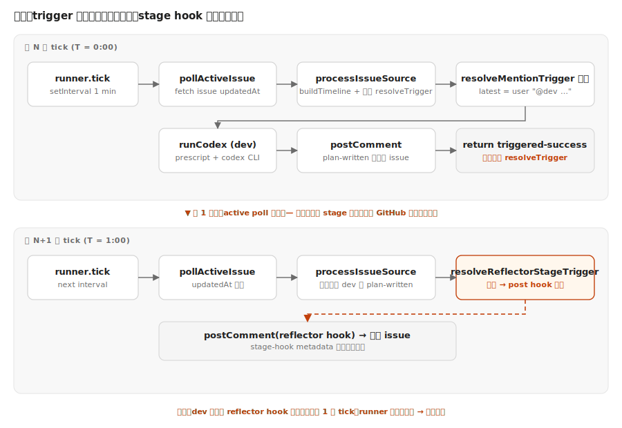
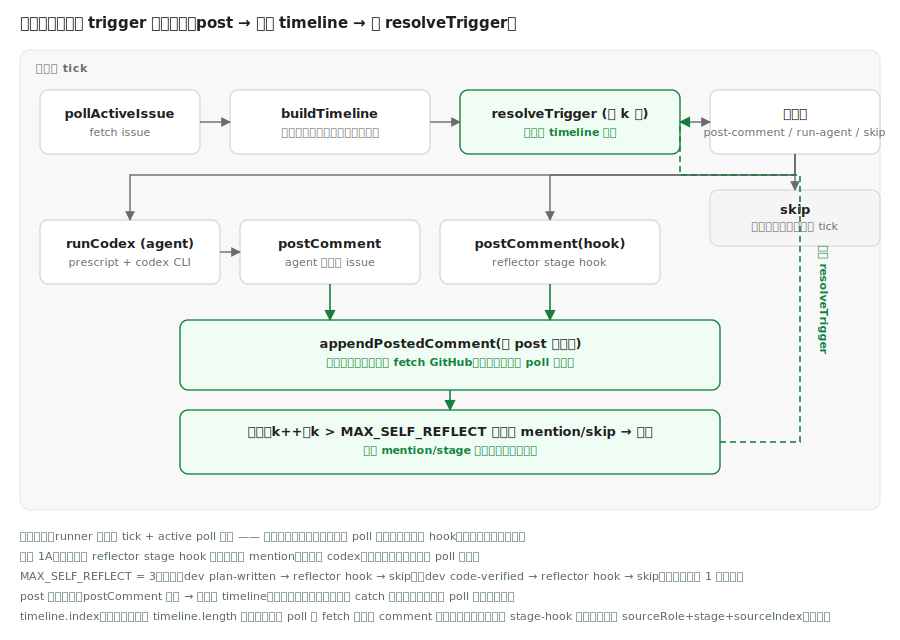

# 设计：add-trigger-self-reflection

## 架构对照





## 方案

### 模块切分

新增 `src/triggers/self-reflect.ts`，导出两个**纯函数**：

- `appendPostedComment(timeline, role, body): TimelineMessage[]`
  - 在 timeline 末尾追加一条 `{ index: timeline.length, speaker: role, body, source: "comment" }`。
  - 不依赖 `normalizeComment`——已知 speaker 是 runner 自己刚 post 的 agent role，直接构造即可。
  - 不修改入参数组（返回新数组）。

- `decideNextSelfReflectStep(nextTrigger, iteration, maxIterations): { kind: "continue-hook" | "stop", reason: string }`
  - `nextTrigger.kind === "post-comment"` 且 `iteration <= maxIterations` → `{ kind: "continue-hook", reason: "stage-hook" }`。
  - `nextTrigger.kind === "post-comment"` 且 `iteration > maxIterations` → `{ kind: "stop", reason: "max-iterations" }`。
  - `nextTrigger.kind === "run-agent"` → `{ kind: "stop", reason: "mention-not-self-reflected" }`（决策 1A）。
  - `nextTrigger.kind === "skip"` → `{ kind: "stop", reason: "trigger-skip" }`。

`src/runner.ts` `processIssueSource` 在 mention-codex 分支的 `postComment` 与 `saveRoleThreadStateStore` 之后、`triggered-success` return 之前插入：

```
let workingTimeline = timeline
let lastPostedRole = selectedAgent.name
let lastPostedBody = formatAgentComment(selectedAgent.name, result.finalText)

for (let iteration = 1; iteration <= MAX_SELF_REFLECT; iteration++) {
  workingTimeline = appendPostedComment(workingTimeline, lastPostedRole, lastPostedBody)
  const nextTrigger = resolveTrigger({ timeline: workingTimeline, availableAgentNames: agentNames })
  const step = decideNextSelfReflectStep(nextTrigger, iteration, MAX_SELF_REFLECT)

  if (step.kind === "stop") {
    log({ event: "self-reflect-stopped", iteration, reason: step.reason, issueKey: input.source.issueKey })
    break
  }

  // 仅 stage hook 走这里
  await postComment(input.source, nextTrigger.body)
  log({
    event: "self-reflect-hook-commented",
    iteration,
    stage: nextTrigger.stage,
    sourceRole: nextTrigger.sourceRole,
    sourceIndex: nextTrigger.sourceIndex,
    issueKey: input.source.issueKey,
  })

  lastPostedRole = nextTrigger.role
  lastPostedBody = nextTrigger.body
}
```

仅插在 mention-codex 分支；post-comment 分支（reflector stage hook 直触）保持不变——它已经发出 hook，本身就是自反链的终点。

### 常量

`src/config.ts` 新增：

```ts
export const MAX_SELF_REFLECT = 3;
```

并加入 `CONFIG_LOG_FIELDS`。

### 失败处理

- `postComment` 抛错 → 自反循环未捕获、整个 `processIssueSource` 走原 catch（`process-issue-error`）→ 不更新 intake `updatedAt` → 下一轮 active poll 重试。
- 自反循环抛错不影响已成功的 dev codex 评论与已落盘的 role thread 状态（在 break 之前已完成）。

### `availableAgentNames` 与 timeline 一致性

自反循环复用 mention-codex 分支已构造的 `timeline` 与 `agentNames`。dev 评论的 speaker 用 `selectedAgent.name`（即 `dev`），与 `normalizeComment` 从 `<!-- agent-moebius:role=dev -->` metadata 解出的结果一致——下一轮 poll 重 fetch 时本地编号与真编号不同但去重 hash（`source+stage+sourceIndex`）正确性不受影响。

## 权衡

### 决策 1：自反命中 mention 时不自反

允许 mention 自反会让单轮 wall-clock 串多次 codex CLI 调用（每次几十秒），把 tick 拖死、与 active poll 节奏脱节。stage hook 是确定性 post（毫秒级），自反成本可以忽略。

代价：dev 在回复里 `@product-manager` 时，PM 仍需等 1 分钟 active poll，不会同轮接力。可接受——多 agent 接力是低频场景；现状本来就是这样。

### 决策 2：MAX_SELF_REFLECT = 3

典型链路：`mention(@dev) → dev codex post → 拼回 timeline → resolveTrigger 命中 stage hook → post hook → 拼回 → resolveTrigger 命中 skip（hasExistingStageHook 去重）→ stop`。实际只用 2 次自反。设 3 留 1 个余量。

不设无上限：万一未来引入新 trigger 互相调用，循环上限是兜底防御。

### 决策 3：本地拼接而非重新 fetch

`fetchIssueWithComments` 走 `gh` CLI 子进程，单次开销 ~200ms+。本地拼接零延迟、零失败模式。下一轮 poll 自然校准真编号。

### 决策 4：保留 active poll 兜底

外部 actor（人、其它 bot）可能写带 stage marker 的评论；自反 `postComment` 失败也需要补救；改这个会破坏现有 2 类调用方的语义。

## 风险

- `runCodex` 返回 `result.finalText` 经 `formatAgentComment` 包成 `&lt;dev&gt;:\n…\n\n<!-- agent-moebius:role=dev -->` 后才写回 GitHub。**自反时本地拼接的 body 必须是 `formatAgentComment` 后的形态**（与 GitHub 上实际 comment body 一致），才能被 `normalizeComment` / `parseMetadataRole` / `parseReflectorStages` 正确识别。设计已显式传 `formatAgentComment(selectedAgent.name, result.finalText)` 作为 `lastPostedBody`。
- 自反循环里再次 resolveTrigger 是同步纯函数计算，不会引入新并发问题。
- 回滚：移除 `runner.ts` 里的自反循环 + 删除 `src/triggers/self-reflect.ts` + 撤销 `MAX_SELF_REFLECT` 常量与 spec-delta，行为退回现状（依赖跨轮 active poll 触发 stage hook）。

## 不做

- 不调整 `TICK_INTERVAL_MS`、`ACTIVE_ISSUE_POLL_INTERVAL_MS`、`ACTIVE_ISSUE_NO_CHANGE_LIMIT`。
- 不让 mention trigger 同轮自反（决策 1A）。
- 不调整 `resolveTrigger` 内 stage / mention 的优先级。
- 不修改 `agents/dev.md` 或 `agents/reflector.md`（agents/dev.md 工作树中已有的小修改与本次 change 无关，提交时不携带）。
