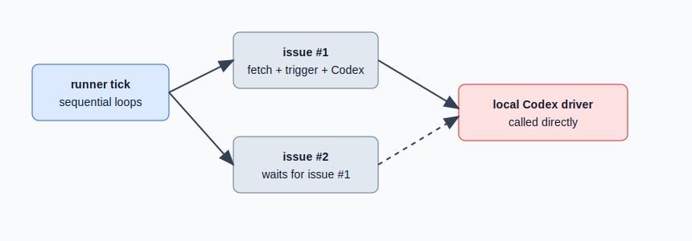

# 设计：add-driver-pool

## 架构变化

## 方案

### Driver pool

`driver-pool` 是纯执行抽象：

- 输入：`job: () => Promise<T>`。
- 输出：原样返回 job 的 resolve / reject。
- 默认：不设置 `maxConcurrent` 时直接启动 job，不加额外调度限制。
- 限流：传入正整数 `maxConcurrent` 时使用 FIFO queue，running job 完成后继续 pump。

pool 不依赖 GitHub issue、trigger、prompt、intake state 或本地 Codex 参数，因此 runner 测试可以注入 fake / instrumented pool。

### Runner job orchestration

runner 的 tick 拆为两个 issue processing phase：

1. repository idle scan 只负责读取 summaries 与调用 `resolveRepositoryScan`，收集 changed issue jobs。
2. changed issue jobs 经 driver pool 执行后，runner 按 jobs 原顺序折叠 outcome。
3. 基于折叠后的 state 计算 due active issue jobs。
4. active issue jobs 经 driver pool 执行后，runner 再按原顺序折叠 outcome。

job 内部可以 fetch issue / 调 `processIssueSource`，但只返回 `IssueProcessingJobResult`，不写完整 intake state。这样并发只发生在 driver / issue processing IO 上，state 推进仍保持单线程、确定性。

### State merge

`processIssueSource` 在 Codex 成功且 GitHub comment 成功后，不再保存早先读取的完整 role thread store，而是调用 `saveRoleThreadStateEntry(issueKey, role, state)`。helper 在文件级锁内重新读取最新 store、merge 当前 entry、再原子写回。

`dev-workspace` 首次创建 context 时同理调用 `saveAgentContextStateEntry(issueKey, role, state)`，避免多个 dev issue 同时准备 worktree 时覆盖 `.state/agent-contexts.json`。

### Run directory

`makeRunDir(count, now)` 追加 `-r<sequence>`，`sequence` 是 runner 进程内递增值。并发 run 即使同一 timestamp / 同一 message count，也写入不同目录。

## 权衡

- 本次不把 `maxConcurrent` 暴露到 TOML 配置；需求重点是架构隔离与默认不限制。pool 已支持显式参数，后续接配置不需要改 runner 编排。
- tick 仍保留进程内防重入。pool 解决同一 tick 内 due jobs 并发，不改变跨 tick overlap 规则。
- repository summary scan 仍先完成再处理 changed jobs；这是 GitHub discovery 阶段，不属于 Codex driver pool 的职责。
