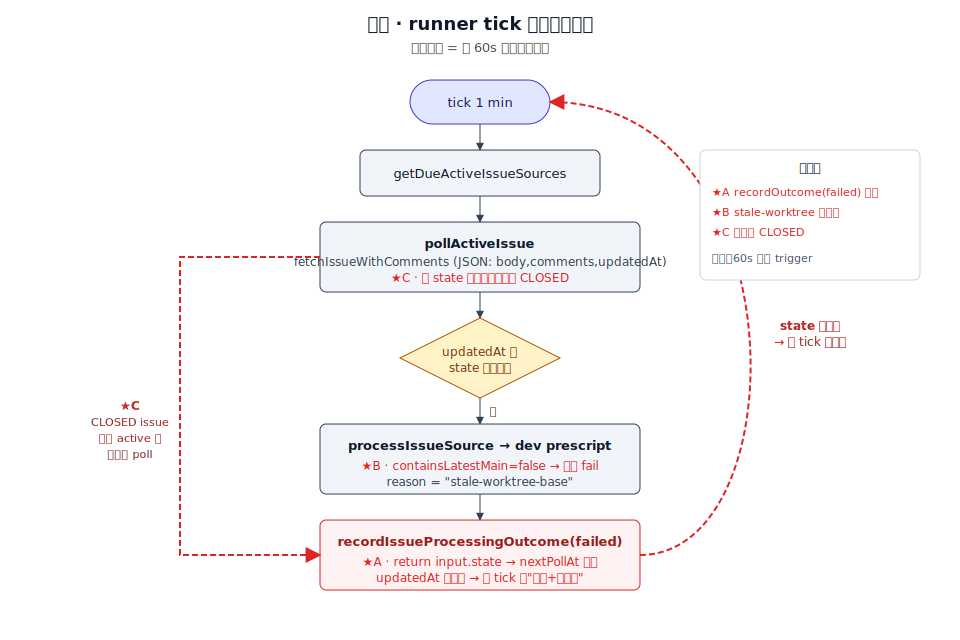

# 设计：fix-runner-issue-processing-loop

## 方案

### 现状架构



三处红色回路：**A** `recordIssueProcessingOutcome(failed)` 直接 return 不推进 state；**B** dev prescript 见 stale 直接 fail 无自愈；**C** `pollActiveIssue` 不感知 CLOSED，active 池里的关闭 issue 继续被 poll。

### 改造后架构


三条绿色破除路径：**A** failed 分支同步 `updatedAt` 到 latest + `activeNoChangeCount++` + 推 `nextPollAt`；**B** stale 分支自动 remove + re-add worktree；**C** CLOSED 走新 outcome `issue-closed`，从 state 移除。

### 关键改动

**1. src/github.ts**

- `buildFetchIssueWithCommentsArgs` 返回值增加 `state`：
  ```
  ["issue", "view", ..., "--json", "body,comments,updatedAt,state"]
  ```
- `GitHubIssue` 类型增加 `state: "OPEN" | "CLOSED"` 字段
- `isGitHubIssue` type guard 校验 `state` 值域

**2. src/github-response-intake.ts**

- `IssueProcessingOutcome` 类型追加 `"issue-closed"`
- `recordIssueProcessingOutcome` 分支重构：
  - `"issue-not-found"`：不变（从 state 删除）
  - `"issue-closed"`：**复用** issue-not-found 的删除语义
  - `"failed"`：**改为**——同步 `updatedAt` 到 `input.summary.updatedAt`（latest 拉取值），保持 `mode = active`，`activeNoChangeCount + 1`，`nextPollAt = processedAt + activeIssuePollIntervalMs`；一旦累加到 `activeIssueNoChangeLimit` 就把 `mode` 降为 `idle`、`nextPollAt = null`
  - `"triggered-success"` / `"no-trigger"`：不变

**3. src/runner.ts**

- `pollActiveIssue`：`fetchIssueWithComments` 成功后先判 `issue.state === "CLOSED"`，是则调 `recordIssueProcessingOutcome` 用 `"issue-closed"` outcome + 打日志 `event="skip", reason="issue-closed", issueKey`，**不进** `processIssueSource`
- `fetchAndProcessChangedIssue`：同上处理

**4. src/agent-prescripts/dev-workspace.ts**

- `containsLatestMain === false` 分支不再直接返回 fail
- 新逻辑：
  1. `removeWorktree(paths.worktreePath)` — 依赖注入：默认实现 `git worktree remove --force <path>`；失败则 fallback 到 `rm -rf <path>` + `git --git-dir <repoCache> worktree prune`
  2. `runGit(["--git-dir", paths.repoCachePath, "worktree", "add", paths.worktreePath, REMOTE_MAIN_REF])`
  3. `access(paths.worktreePath)` 断言
  4. 保留原 `context state`（issue + role 关系不变，只是 base 重建；`preparedFromMessageIndex` 保持不动）
  5. 返回 `{ ok: true, codexCwd: paths.worktreePath }`
- 任何一步失败 → 返回 `{ ok: false, reason: "stale-worktree-rebuild-failed:<detail>" }`（fail closed）
- `DevWorkspaceDependencies` 追加 `removeWorktree(path: string): Promise<void>`

## 权衡

**A · 复用 `activeNoChangeCount` vs 新增 `failedCount`**：复用现有字段能自动接入既有降级路径，代码改动最小；代价是字段名语义扭一点（failed 也算 no-change tick）。已在 spec 里显式说明。

**B · 直接重建 worktree vs 先 rebase**：直接重建最简单；未推送的本地 commit 会被丢，但项目约定 agent 的产出应 commit + push（未 push 就是丢改动，不属于要保护的状态）。rebase 方案会对"能自动 rebase"情况奇佳，但冲突就败，且要新增"冲突时降级到重建"分支，复杂度多一层，收益低。

**C · 只处理 CLOSED vs 一起处理 PR / draft**：本 runner 目前只轮询 issue（`gh issue list --state open`），PR 不在处理范围；引入 PR 概念会污染 `IssueProcessingOutcome`。等真的接 PR 再扩。

**failed backoff 策略：固定 1min vs 指数退避**：固定间隔够用——`activeNoChangeCount` 到 5 就降级，最多 5 分钟。指数退避会新增一个字段和一层复杂度，收益不明显。

## 风险

- **未推送 commit 丢失**：`removeWorktree` 会丢 worktree 里未 push 的 commit。前提假设 agent 产出 commit + push，若违反假设会静默丢改动。缓解：在日志里明确记录 `event="dev-workspace-rebased"` + `worktreePath`，未来可以在 remove 前扫描 unpushed commits 做一次告警。
- **`gh issue view` 突然不再返回 `state`**：`state` 字段是标准字段，不太可能消失；type guard 会 fail fast，runner 立刻记 `event="active-issue-fetch-failed"`，通过既有 failed 分支收敛到降级 idle，不会静默失败。
- **A 让 failed 也累加 `activeNoChangeCount`**：如果一个 issue 正常有变化 + 处理成功前偶发 1 次 failed，会浪费一次 no-change tick 额度。可接受——`activeIssueNoChangeLimit = 5` 有余量，且下次成功会重置计数。
- **回滚**：三处改动均为局部 diff，直接 revert commit 即可恢复。spec-delta 未合并前不影响 `specs/`。
