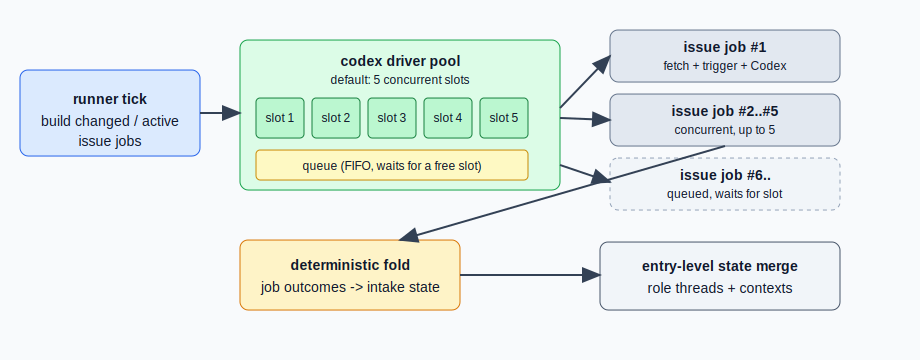

# 设计：limit-codex-driver-pool-by-default

## 方案

### 常量与配置
在 `src/config.ts` 加入：

```ts
export const CODEX_DRIVER_POOL_MAX_CONCURRENT = 5;
```

并把它加进 `CONFIG_LOG_FIELDS`（字段名 `codexDriverPoolMaxConcurrent`），保证启动日志能反映实际限流值。

### 编排层装配
在 `src/runner.ts` 新增：

```ts
export function createDefaultCodexDriverPool(): DriverPool {
  return createDriverPool({ maxConcurrent: CODEX_DRIVER_POOL_MAX_CONCURRENT });
}
```

`DEFAULT_TICK_DEPENDENCIES.driverPool` 从原来的 `createDriverPool()` 改为 `createDefaultCodexDriverPool()`。函数导出是为了：
1. 测试可以直接对默认 pool 断言并发上限；
2. 未来若要注入不同策略，替换点集中在这一个函数。

### 抽象层保持不变
`src/driver-pool.ts` 不做修改。`createDriverPool()` 无参时仍返回直通壳——这是**测试用**的语义（`makeTickDependencies` 的 fake pool 需要它，或将来其他 mock 场景），不是运行时会走的分支。

### 术语澄清
文件名 `driver-pool.ts` 与符号 `createDriverPool` / `DriverPool` 全部保留。仅在 spec.md、design.md、AGENTS.md 的自然语言表述中统一使用 **codex driver pool** 强调其面向 codex driver 的语义。

### 架构图
- `architecture/before.svg`：拷贝当前 `docs/architecture/runner-driver-pool.svg`，driver pool 那块标注"default: no extra limit"（历史事实）。
- `architecture/after.svg`：把 pool 画成 5 个 slot（图形上体现 5 个槽），slot 右侧多一条"queue"通道，示意超额 job 排队；job 完成后从 slot 释放再拉队列下一个。

归档时 `after.svg` 覆盖 `docs/architecture/runner-driver-pool.svg`；`before.svg` 保留在 archive 目录作为历史快照。

## 权衡

**为什么把 5 硬编码而不是走 `config.local.toml` 覆盖？**
现在没有机器差异化并发的诉求；先把默认行为改对是主要目标。加配置覆盖会拉大 change 面（要动 `local-config.ts` 的 shape、schema、启动日志、测试），性价比低。等真正需要"某台机器要 3、某台要 8"时再单独立 change 引入覆盖机制。

**为什么默认限流决策放在 runner 而不是 driver-pool？**
`driver-pool.ts` 是通用工具（`{maxConcurrent, run}`），谁调用谁决定策略。把 `5` 硬编码进抽象会：
1. 让 driver-pool 依赖 config.ts，破坏当前无依赖的清爽形态；
2. 让"抽象自带默认策略"这种反直觉行为出现——目前 `createDriverPool()` 无参是"不限"，改成"5"会让 `driver-pool.test.ts` 4 条测试大改，且 fake pool 注入变复杂。
决策放 runner 只需 3 行代码，不破坏抽象边界。

**为什么 5 而不是别的数字？**
- 上限太低（1-2）：白名单里 20 个 issue 同时 due 时排队严重，感受上像单线程。
- 上限太高（10+）：一台 mac 上跑 10 个 codex 子进程 + 10 条 gh CLI 请求，很容易触发 gh API rate limit 或本地 fd 上限。
- 5 是"多数场景下没排队感、异常场景下也不会全线炸"的中间值；跟已有 `ACTIVE_ISSUE_NO_CHANGE_LIMIT = 5` 数量级一致，好记。

**为什么保留 `driver-pool.ts` 的 `undefined = 不限` 语义？**
测试用的 `makeTickDependencies` 已经绕过 `createDriverPool` 直接手写 `{ run: (job) => job() }`，没依赖这个 code path。但保留它可以让未来"想临时注入无限并发看极端行为"的场景不用改抽象。

## 风险

- **本地 dev 场景**：如果开发者本机同时给 6+ 个 issue 加评论触发 mention，第 6 个会排队。风险低，且日志会反映——用户能看到 `pool` 状态（未来可加日志字段）。
- **hang 攻击面仍在**：即使限流到 5，如果 5 个 issue 同时 hang，tick 还是不 resolve、后续 `skip-overlap`。本 change **只解决"1 个 hang 死全部"**这一层；"多个同时 hang"要等下一个 change 引入 job 级 timeout（这个也是本 skill 步骤 8 之后可以另立的方向）。
- **回滚**：如果发现 5 太少，把常量改成更大的数字或改回 `createDriverPool()`（无参不限）即可；spec-delta 已归档就再走一个反向 change。



