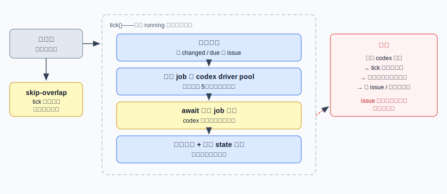

# 设计：decouple-scan-from-execution

## 架构形态

基线：`docs/architecture/runner-driver-pool.svg` 与 `docs/architecture/runner-issue-processing.svg`。




## 方案

### 1. state-persister —— 单写者状态仓库

```
createStatePersister({ initialState, save, onSaveError? })
  → { state(): 当前内存权威状态
    , update(mutate: (state) => state): 应用纯变换并调度落盘，返回新状态
    , flush(): Promise<void>  // 等待所有已调度写完成（测试 / 退出用） }
```

- Node 单线程模型下 `update` 的「读-改-写」是同步原子的，天然无竞争；需要串行化的只有**文件写入**。
- 文件写入串行 + 合并：写进行中再来变更只标记 dirty，本次写完后再写一次最新快照；连续 N 次 `update` 至多两次磁盘写。
- 写失败记日志（`event = "state-save-failed"`）不抛出——状态仍在内存里，下次变更会再次尝试落盘。
- `save` 注入（默认 `saveGitHubResponseIntakeState`），文件格式与原子写（tmp + rename）不变。

### 2. scanner —— 发现层

```
runIntakeScan({ repositories, getState, applyState, now, listOpenIssueSummaries, config })
  → Promise<IssueSummary[]>   // 本轮 changed issues
```

- `getDueRepositories` 在心跳开始的状态快照上判定 due 仓库。
- 每个仓库：**先** `await listOpenIssueSummaries`（异步 IO，不持有状态），**再**通过 `applyState` 用 `resolveRepositoryScan` 纯变换应用——避免「异步取回旧状态整体覆盖」清掉执行侧刚折叠的结果。
- 单仓库扫描失败记 `repo-scan-failed` 继续下一个（现行为保留）。

### 3. issue-dispatcher —— 派发层

```
createIssueDispatcher({ driverPool, persister, runJob, timing, policy })
  → { dispatch(job): boolean   // false = 在跑跳过
    , busyIssueKeys(): ReadonlySet<string>
    , idle(): Promise<void> }  // 全部在飞 job settle（测试用）
```

- `dispatch`：issueKey 已在 in-flight 集合 → 记 `skip-inflight` 返回 false；否则登记、`driverPool.run(runJob)`，**完成即** `persister.update(fold + enforceActiveIssueLimit)`，`finally` 从集合移除（异常路径也保证移除，另记 `issue-job-error`）。
- `IssueProcessingJob` / `IssueProcessingJobResult` / `foldIssueProcessingJobResult` / `issueKeyForJob` 从 `runner.ts` 迁入本模块（折叠是派发层的核心职责）。
- `enforceActiveIssueLimit` 增加 `excludedIssueKeys` 参数：在跑 issue 不进降级候选，允许瞬时超额，完成后下一次折叠收敛。

### 4. runner —— 心跳编排

```
heartbeat(now):
  if (scanning) → log skip-overlap; return      // 防重入仅覆盖本函数
  agentFiles ← listAgentFiles()
  changed    ← runIntakeScan(...)                // 只等 GitHub 列表请求，秒级
  activeDue  ← getDueActiveIssueSources(persister.state(), now)
  jobs       ← dedupe(changed + activeDue)       // 批内 issueKey 去重（现规则保留）
  jobs.forEach(dispatcher.dispatch)              // 不 await 执行
```

- `start()`：加载 state → 建 persister / dispatcher → 立即一轮心跳 → `setInterval`。
- `tick()`、模块级 `running`、`processIssueJobs`、tick 末尾统一 `saveGitHubResponseIntakeState` 删除。
- `processActiveIssueJob` / `processChangedIssueJob`（fetch、closed 判定、unchanged 判定）合成 `runJob` 注入 dispatcher，内容不变；`processIssueSource` 及下游零改动。
- `pollActiveIssue` 导出保留（实现改为复用 dispatcher 模块的折叠函数）。

## 权衡

- **心跳重推导 vs worker 信箱**：讨论稿曾设计每 issue 一个带信箱与自轮询定时器的 worker（actor）。最终用「in-flight 集合 + 心跳从状态重推导」实现同一语义：job 运行期间状态不推进，GitHub 侧的变化在 job 完成折叠后被下一次心跳自然重新发现——等价于容量 1、最新快照胜出的信箱，因为处理永远基于运行时才 fetch 的最新 issue 快照，排队重放旧事件没有意义。换来的可测试性收益：没有每 worker 定时器（无 fake timer 编排）、没有事件队列状态机，时间判定全部是既有纯函数（`getDueRepositories` / `getDueActiveIssueSources`），任意时刻系统状态 = intake state + in-flight 集合，两个数据结构就能断言。
- **完成即落盘 vs 攒批落盘**：选完成即落盘（persister 写合并已控制磁盘写频率），崩溃丢失窗口更小；放弃了「每 tick 恰好一次写」的旧不变量，spec 对应规则改写。
- **在跑 issue 豁免降级**：active 超上限时在跑 issue 不降级，避免「跑一半被降级、完成折叠又激活」的抖动；代价是 active 数可能瞬时超过上限，由后续折叠收敛。
- **不做单 job 超时**：与本次目标正交，留待后续 change（dispatcher 的 in-flight 集合是天然挂载点）。

## 风险

- **重构半径**：`runner.ts` 的编排段被替换，`tests/runner.test.ts` 的 tick 编排用例需改写。缓解：`processIssueSource` 及全部下游、`github-response-intake.ts` 纯函数、driver-pool 均零改动；行为差异集中在「何时扫描、何时落盘」，用集成测试覆盖（长跑不阻塞、在跑防重、并发折叠不覆盖）。
- **落盘频率上升**：从每 tick 一次变为每次折叠调度一次（含写合并）。state 文件几 KB 级，风险可忽略。
- **回滚**：改动集中在 4 个新文件 + `runner.ts`，`git revert` 单个 commit 即可整体回退。
