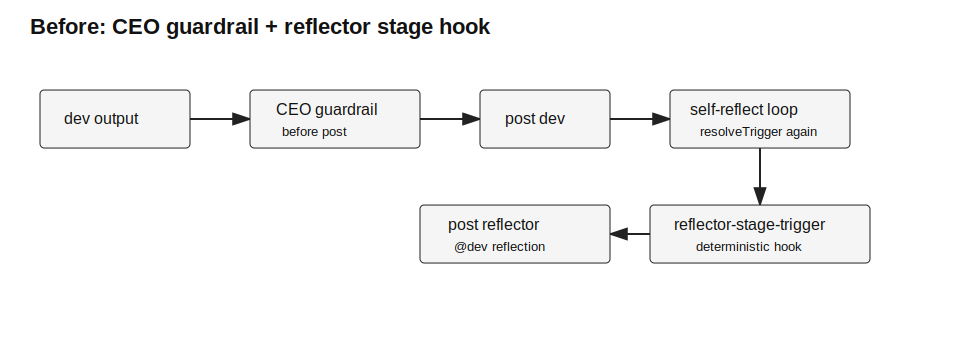
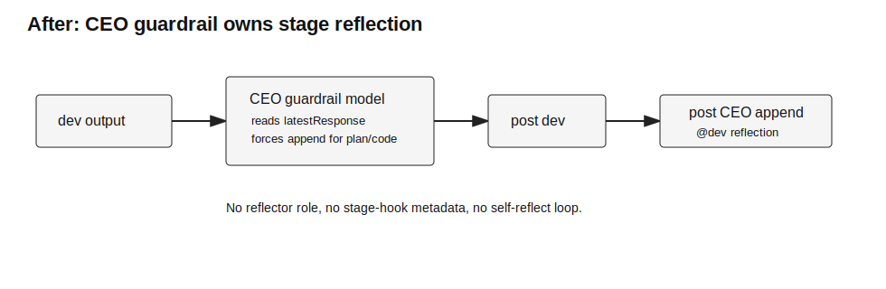

# 设计：replace-reflector-with-ceo-guardrail

## 方案

架构现状与改造目标：

### 1. 收口 trigger 层

`resolveTrigger` 不再组合 reflector stage trigger，只保留 mention trigger：

- 删除 `src/triggers/reflector-stage-trigger.ts`。
- 删除 `src/triggers/self-reflect.ts`。
- `src/triggers/index.ts` 只调用 `resolveMentionTrigger`，无 trigger 时返回 `skip`。

这保持 trigger 模块的职责边界：它只解析最新消息中的普通 mention，不再生成确定性 hook 评论。

### 2. 简化 runner post 流程

`src/runner.ts` 保留 Codex agent -> CEO guardrail -> GitHub post 的主链路，但删除 post 后的 self-reflect loop：

- CEO `NO_CHANGE` / `REPLACE` / `APPEND` 的 post 分支保留。
- `APPEND` 仍先 post 原 agent 评论，再 post CEO 独立评论。
- 不再把 post 后 timeline 交给 `resolveTrigger` 做同轮自反。
- CEO append 正文中的 `@dev` 等 mention 由下一轮 active poll 按普通 mention trigger 处理。

### 3. CEO persona 承担阶段反思

`agents/ceo.md` 增加明确规则：

- 当 `latestResponse` 尾部 stage 是 `plan-written` 或 `code-verified` 时，必须返回 `{"action":"append","as":"ceo","body":"..."}`。
- CEO 正文说明这是阶段反思 / 推进裁决，并按上下文 `@dev`。
- `in-progress` 不强制 append，仍按普通 guardrail 场景判断。
- CEO 不再把 reflector 描述为现存协作对象；如历史评论里出现 reflector，只把它当旧数据背景处理。

强制语义放在 persona 层，而不是 `format-ceo.ts` 里硬编码业务判据；`format-ceo.ts` 继续只校验 JSON shape、action、append role、非空 body 与 replace stage marker。若 CEO 调用失败或返回非法结果，仍按既有 fail-open 策略发布原 agent 评论。

### 4. 删除 reflector role

- 删除 `agents/reflector.md`。
- `CEO_APPEND_ROLES` 从 `{ceo, dev, product-manager, hermes-user, reflector}` 改为 `{ceo, dev, product-manager, hermes-user}`。
- `availableAgentNames` 由实际 agent markdown 文件得出；删除文件后 `@reflector` 不会被普通 mention trigger 选中。

### 5. 配置与 stage 子集清理

- 删除 `MAX_SELF_REFLECT` 与 `CONFIG_LOG_FIELDS.maxSelfReflect`。
- `src/stages.ts` 删除 `REFLECTOR_STAGES` 导出。
- 保留 `ALL_STAGES`、尾部 marker 校验和宽容解析能力，供 agent 契约与 CEO replace 校验使用。

### 6. 规格与文档回流

实现完成后归档时：

- 合并 spec-delta 到 `openspec/specs/github-issue-runner/spec.md`。
- 更新 `docs/architecture/module-map.md` 中 `triggers`、`ceo-format-guardrail`、`github-issue-runner` 等模块描述。
- 用 `architecture/after.svg` 回流更新相关架构图。
- 更新 `AGENTS.md`，删除 reflector 行为说明，改为 CEO guardrail 阶段反思规则。

## 权衡

- 选择 CEO 模型 append，而不是继续 deterministic hook：满足用户希望“把功能放进 CEO”并减少 issue 中的协作身份数量。
- 保留 fail-open：CEO 是发布前 guardrail，不能因为 guardrail 失败阻断主 agent 评论，这是现有可靠性边界。
- 不在 `format-ceo.ts` 硬编码 `plan-written` / `code-verified` 业务判据：避免破坏既有模块边界，业务场景仍由 persona 承担。
- 删除同轮 self-reflect：CEO append 若包含 `@dev`，会在下一轮 active poll 触发 dev；这放弃了原先“同轮发 reflector hook”的即时性，但换来单一纠偏入口。

## 风险

- CEO 模型可能违反 persona 规则返回 `no_change`；代码层不会硬改业务判据，只能通过 persona 明确约束和测试 prompt/role 校验降低风险。
- 删除 self-reflect 后，阶段反思的下一步 dev 触发依赖 active poll，响应会比同轮 hook 慢最多一个 active poll 周期。
- 旧 issue 历史中已有 `<reflector>` 评论；归一化时可把它作为普通历史文本处理，不再赋予新触发能力。
- 若第三方文档或用户仍 `@reflector`，系统会无响应；文档必须明确该角色已移除。
