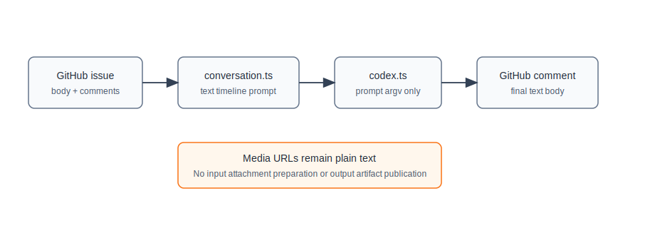
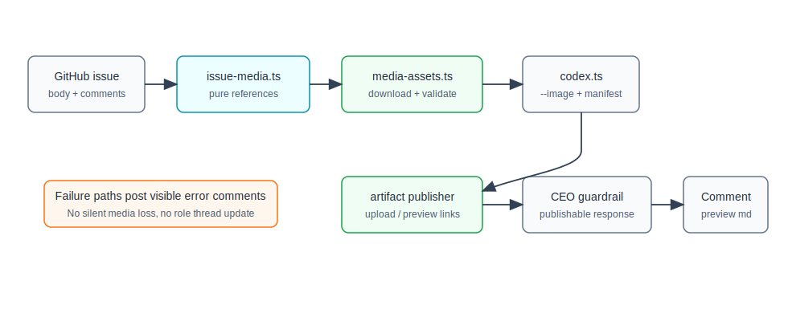

# 设计：support-bidirectional-issue-media

## 架构快照




## 方案

### 1. 媒体引用解析保持纯业务化
新增 `src/issue-media.ts`，只做字符串到结构化数据的纯转换：

- 输入：`TimelineMessage[]` 或单条 message body。
- 输出：`IssueMediaReference[]`，字段包含 `messageIndex`、`source`、`kind = image | video`、`url`、`label`、`ordinalInMessage`。
- 识别范围：
  - Markdown image：``。
  - Markdown link 中明显指向图片 / 视频扩展名或可判定媒体类型的 URL：`[name](url)`。
  - GitHub / HTML 常见嵌入：``、`<video src="...">`、`<source src="...">`。
  - 裸露 `http:` / `https:` URL，若路径扩展名或后续下载 `Content-Type` 可判定为图片 / 视频。
- URL 必须通过 `new URL()` 校验，协议只允许 `http:` / `https:`。解析层不访问网络，不读取文件，不调用 `gh`。

该模块服务于 full / resume / fallback prompt：

- full run：使用完整 timeline 的媒体引用。
- resume：只使用本轮 delta external messages 的媒体引用。
- fallback full：重新使用完整 timeline 的媒体引用。

### 2. 输入媒体准备在 runner adapter 层完成
新增 `src/media-assets.ts`，负责真实 IO：

- 下载目录位于当前 Codex `runDir` 下，例如 `<runDir>/input-media/`，不写进目标 worktree。
- 下载使用 Node `fetch` / stream API 与 `AbortSignal`，不通过 shell 拼接 URL。
- 校验：
  - 只接受图片和视频 MIME。
  - 默认大小上限按 GitHub 网页附件公开限制设定：图片 / GIF 10MB，视频默认 100MB；常量集中在 `src/config.ts`。
  - 文件名由 message index、ordinal 与 MIME/URL 推导，避免使用 URL 原始文件名作为可信路径。
- 下载结果生成 `PreparedIssueMedia[]`：
  - 图片：写入 `imagePaths`，传给 Codex `--image`。
  - 视频：写入 manifest，放在 prompt 的 `本轮可用媒体文件` 区块中，提醒 Codex 可以用本地工具抽帧 / 检查。

如果任一必须媒体下载或校验失败，runner 发布错误评论，例如：

```text
无法准备媒体输入：
- #5 image[1] https://...：响应不是支持的图片 / 视频，content-type=...

<!-- moebius:stage=in-progress -->
```

该评论使用触发 agent 的 role envelope 发布，保持 timeline 可归一化；不更新 role thread。处理结果视为本轮 mention 已处理，避免同一坏链接每分钟重复刷屏。

### 3. Codex driver 扩展图片参数
扩展 `CodexRunOptions`：

```ts
imagePaths?: string[];
```

`buildCodexArgs()` 在 full 与 resume 两种 mode 下都把每个图片路径编码为 `--image <file>`：

- full：`codex exec ... --image a.png --image b.jpg <prompt>`
- resume：`codex exec resume ... --image a.png <threadId> <prompt>`

视频不传 `--image`，只以本地文件 manifest 进入 prompt，因为当前 `codex exec` 与 `codex exec resume` 只暴露图片附件参数。

### 4. 输出 artifact 发现与发布
新增输出发布边界，避免 runner 直接理解上传细节：

```ts
interface ArtifactPublisher {
  publish(input: {
    source: IssueSource;
    files: PreparedOutputArtifact[];
  }): Promise<PublishedArtifact[]>;
}
```

输出发现规则：

- 优先解析 Codex final text 中明确提到的本地 SVG / 图片 / 视频路径。
- 同时扫描本轮 Codex 开始后在 `codexCwd` 中新增或修改的支持媒体文件。
- 排除 `.git/`、`node_modules/`、`.state/`、`dist/`、`coverage/`、临时 runDir 与超过大小上限的文件。
- 产物只读校验后复制到 runDir 的 `output-artifacts/` 再发布，避免 publisher 直接读取任意工作区路径。

发布结果会追加到 agent final text 末尾：

```md
### 生成产物


[demo.mp4](https://github.com/user-attachments/assets/...)
```

SVG 优先作为图片预览发布，视频优先发布为 GitHub 可查看链接。生成文件不提交到业务仓库。

GitHub 的公开 issue comment API / `gh issue comment` 没有一等本地附件上传能力；默认实现使用同仓库 GitHub release tag `moebius-artifacts` 上传 release assets，并把 asset URL 作为 Markdown 预览或可点击链接追加到评论。该路径不提交生成产物到业务仓库，但会在目标 GitHub repository 中维护一个专用 release。若 release asset 创建 / 上传失败，runner 发布错误评论并不更新 role thread，避免用户误以为媒体已交付。

### 5. 评论与 CEO guardrail 顺序
输出 artifact 成功发布后，runner 构造 `publishableFinalText = result.finalText + artifactPreviewMarkdown`，再调用 CEO guardrail。这样 CEO 看到的 `latestResponse` 与即将发布的 agent comment 一致。

若 CEO 返回 `append`，原 agent comment 仍包含 artifact 预览；CEO 追加评论不重复附 artifact。

## 权衡
- 视频不做原生 Codex attachment：当前 CLI 没有视频参数。把视频作为本地文件交给 Codex，能保持“本地对话”工作方式，并允许 Codex 用工具抽帧。
- 不把生成产物提交到仓库：符合用户要求；默认使用 release asset 承载产物，代价是在目标 repository 中多一个专用 release / tag。若 publisher 失败，只能明确报错，不能伪造可查看预览。
- 不把媒体下载逻辑放进 `conversation.ts`：保持 prompt / timeline 纯函数可测，不破坏模块地图禁止依赖。
- 不把坏媒体静默忽略：用户明确要求评论提示报错，且静默降级会让 Codex 在缺失视觉上下文下做错事。

## 风险
- GitHub 附件上传没有稳定公开 API；release asset 是可用但不等同于网页端 issue attachment 的折中。第一版必须保证失败可观察，不能产生“评论说有图但实际不可看”的假成功。
- 扫描 Codex 输出文件可能误收临时文件；需要用最终回复路径优先、支持类型白名单、目录排除、大小限制和 run start time 共同收窄。
- 私有仓库中的外链 / GitHub user attachment 可能因权限无法下载；这种情况按媒体准备失败评论处理。
- 媒体文件可能增加 Codex 输入体积与运行时间；下载和 Codex run 都必须复用现有 AbortSignal / watchdog 机制。

## 参考
- GitHub Docs: [Attaching files](https://docs.github.com/en/get-started/writing-on-github/working-with-advanced-formatting/attaching-files)
- GitHub CLI issue: [support image/file attachments in gh issue create and gh issue comment](https://github.com/cli/cli/issues/12960)
