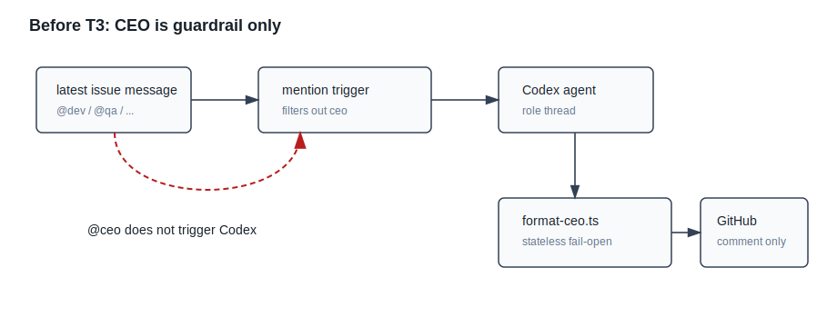

# 设计：ceo-agent-orchestration-t3

## 方案
本变更把 CEO 拆成同一身份的两条调用路径：发布前 guardrail 继续由 `format-ceo.ts` 无状态 fail-open 调用；普通 agent 路径由 mention trigger 触发、拥有独立 role thread、运行账本 prescript，并由 runner 受控执行编排副作用。




### 1. CEO agent 可触发
`agents/ceo.md` 增加 frontmatter：

```yaml
preScript: src/agent-prescripts/ceo-ledger-context.ts
```

`src/triggers/mention-trigger.ts` 移除 `ceo` 的非 Codex 排除。`agents/ceo.md` 仍在顶层 `agents/*.md`，因此现有 `listAgentFiles()` 会把 `ceo` 放进 `availableAgentNames`；role thread 状态自然使用既有 issue + role entry。`src/conversation.ts` 保留 `role=ceo` metadata 特判，guardrail 发布的 `<ceo>:` 评论仍归一化为 `speaker=ceo`，但不影响手动 `@ceo` 触发。

CEO agent persona 固定要求最终可见回复为 `in-progress`，不使用 `plan-written` / `code-verified`，避免进入 dev 阶段验收回流。

### 2. 剧本库数据文件
新增 `agents/ceo-scripts/`，不放在顶层，避免被 `listAgentFiles()` 当作 agent。首批文件：

- `plan-review.md`：方案评审 6 项模板，workflow id 为 `plan-review`。
- `post-implementation-retro.md`：执行后复盘 3 问模板，workflow id 为 `post-implementation-retro`。
- `milestone-spawn-child-issues.md`：目标 / 里程碑拆解、冲突分组、子 issue body 模板，workflow id 为 `milestone-spawn-child-issues`。

新增 `src/ceo-scripts.ts` 加载并校验脚本库：每个脚本必须有唯一 `id`、`action` 与模板正文；缺失、重复或未知 workflow id 均 fail closed。`format-ceo.ts` 与 CEO agent prescript / runner 都通过同一 loader 取得剧本内容，保证 guardrail 与 agent 编排共用同一份模板数据。

### 3. 账本 prescript 与 prompt context
扩展 `AgentPreScriptResult`：

```ts
type AgentPreScriptResult =
  | { ok: true; codexCwd?: string; promptContext?: string }
  | { ok: false; reason: string; visibleFailureBody?: string };
```

runner 在 preScript 成功后，把 `promptContext` 追加进 full / resume / fallback prompt。失败时若 `visibleFailureBody` 存在，runner 发布 `<ceo>:` 的 fail-closed `in-progress` 评论，不调用 Codex、不创建 issue、不更新 role thread；该评论带 `ceo-reviewed action=bypass reason=agent-prescript-failed` 审计标记。

新增 `src/agent-prescripts/ceo-ledger-context.ts`：

1. 读取并校验 `.state/goal-ledger.json`；文件缺失、JSON 非法、schema 非法均 fail closed。
2. 基于当前 issue source，在 goal / milestone / task 的 `issueRefs` 与 provenance 中解析唯一相关 owner；无匹配或多匹配 fail closed。
3. 对 owner 调用 `projectActivePhaseContext()`；无 active phase、多个 active phase 或当前阶段缺 objective / quality baseline / acceptance statements / dependencies fail closed。
4. 注入只含当前阶段 projection 的摘要：owner、phase id/name/objective、quality baseline、acceptance statements、dependencies、相关 task id/title/scope/acceptance；不注入历史阶段 artifact body。
5. 注入可用剧本索引与 `milestone-standards.md` 摘要引用；CEO 只能基于这些上下文编排。

### 4. CEO agent 输出契约与 runner 编排
新增 `src/ceo-orchestration.ts`，纯解析并校验 CEO agent 的结构化输出。CEO Codex 最终输出必须是 JSON（允许 fenced code block 包裹），runner 不让 CEO 在自然语言中直接触发副作用。

CEO persona 仍要求 Codex 响应末尾带合法 `in-progress` stage marker。parser 先剥离尾部 stage marker，再解析前面的 JSON；fenced JSON 后接 stage marker 是合法形态。若剥离 marker 后不是合法 JSON、action 未知或字段非法，runner 不调用 `createIssue`。

支持三类 action：

```json
{"action":"route","workflowId":"plan-review","body":"@qa ..."}
```

```json
{"action":"spawn_child_issues","workflowId":"milestone-spawn-child-issues","summary":"...","groups":[{"id":"g1","reason":"模块 A 文件重叠，串行"}],"issues":[{"ledgerTaskId":"task-1","groupId":"g1","title":"...","description":"...","initialRole":"dev","qualityBaseline":"data-correct","acceptanceStatements":["跑 pnpm test → 应退出码 0"],"dependencies":["task-x"],"provenance":"来自父 issue 当前阶段 projection"}]}
```

```json
{"action":"fail","body":"..."}
```

校验规则：

- `workflowId` 必须存在于剧本库，且 action 与脚本声明一致。
- `initialRole` 必须是当前真实 agent 之一；每个子 issue body 只能出现一个合法 mention，默认 `dev`。
- `ledgerTaskId` 必须存在并属于当前 projection 可见范围。
- 每个子 issue 必须有非空标题、描述、质量基准、验收语句、依赖、provenance 与 group reason。
- 创建 issue 的 owner/repo 固定为父 issue source。

runner 对 `spawn_child_issues` 按顺序执行：

1. 为每个 child descriptor 计算稳定 orchestration key：父 issue source + workflow id + ledger task id。key 不包含 title、description 或 CEO 自由文本；同一次 orchestration 中同一 ledger task id 只能出现一次，重复 descriptor fail closed。若未来确需一个 task 拆多个 child，必须先在账本中拆出多个 task。
2. 先读取最新 ledger task entry；若已存在同 orchestration key 的 child ref，则把它归为 `already-created`，不重复调用 `createIssue`。
3. 若 ledger 中没有同 key child ref，调用 GitHub adapter `findIssueByOrchestrationKey` 在父 issue 同仓库查找已创建的 child issue。找到唯一匹配时，把它归为 `recovered-existing` 并先尝试写回 ledger child ref；找到多个匹配或查询失败时 fail closed，不创建新 issue。这覆盖“child issue 已创建，但 ledger child ref 保存 timeout 且失败评论也发布失败”的恢复窗口。
4. 用剧本模板渲染子 issue body，强制包含 parent reference、ledger id / task id、质量基准、验收语句、依赖、初始交棒角色、provenance、冲突分组理由与隐藏 orchestration key。
5. 调用 GitHub adapter 创建子 issue。runner 对每次 `createIssue` 调用再包一层 orchestration action timeout；adapter 自身也使用既有 gh timeout / AbortSignal。无论真实 gh 挂起还是测试 fake promise 永不 settle，issue job 都必须有界返回。
6. 每创建或恢复一个子 issue，就通过带 timeout / AbortSignal 的 `saveGoalLedgerEntry("tasks", ledgerTaskId, ...)` 追加 child issue reference：`relation="child"`、`status="open"`、orchestration key 与 provenance 写入 bounded note。
7. 全部成功后，生成 `<ceo>:` 汇总评论，列出创建的 issue、已存在 / 找回跳过项、分组理由与下一步；再走 CEO guardrail；评论成功后才保存 ceo role thread。
8. 任一查重、创建、ledger 写入或 fail-closed 评论发布失败，结局按是否已经发出可见评论处理：失败评论发布成功则本轮可见收敛但不保存 ceo role thread；失败评论发布失败则返回 `failed` 进入既有 intake 重试 / dead-letter 路径。下一轮先用稳定 key 查 ledger 和 GitHub，避免重复创建；failure reason 必须包含已创建或找回的 issue URL，供 dead-letter 留痕。

`route` action 只发布 runner 渲染的单条 CEO agent 评论，不直接创建 issue。`fail` action 发布失败说明并不更新 role thread。

### 5. GitHub adapter createIssue
`src/github.ts` 新增：

```ts
createIssue(source: IssueSource, input: { title: string; body: string }): Promise<{ number: number; url: string }>
findIssueByOrchestrationKey(source: IssueSource, key: string): Promise<{ kind: "none" } | { kind: "one"; issue: { number: number; url: string } } | { kind: "multiple"; issues: Array<{ number: number; url: string }> }>
```

实现使用 `gh issue create --repo <owner>/<repo> --title <title> --body-file -`，body 通过 stdin 传入，写操作 `retry:false`。返回值解析 GitHub issue URL 与 number；解析失败视为 deterministic failure。所有外部输入只作为 argv 项或 stdin，不经 shell。

`createIssue` 接收可选 `AbortSignal` 与 timeout，内部复用现有 `runCommand` 的 gh timeout / termination 语义。runner 仍对 adapter promise 做外层 action timeout，防止测试替身或未来 adapter bug 永不 settle。

`findIssueByOrchestrationKey` 是只读查询，用受控 argv 在父 issue 同仓库查找隐藏 key。查询失败或多匹配都 fail closed，runner 不在不确定状态下创建新 issue。

### 6. guardrail 保持 fail-open 并防自激
`format-ceo.ts` 改为读取 `agents/ceo.md` 时先 `parseAgentManifest()`，guardrail prompt 使用 body，不执行 frontmatter preScript。prompt 同时附带剧本库内容，使移出的模板仍可用于阶段回流、qa 交棒和外部兜底。

现有 fail-open 语义不变：CEO guardrail 超时、失败、非法 JSON、未知 action、未知 as、空 body、replace stage marker 非法时仍发布原 agent 响应。

新增 `agent=ceo` 的自激环后置校验：

- guardrail 对 CEO agent 评论返回 `append as=ceo` 时 fail-open，发布 CEO 原文。
- guardrail append body 在非代码区域含 `@ceo` 时 fail-open。
- 由于每次 guardrail JSON 只允许一个 append action，“最多 append 一条”由现有输出契约自然保证。

### 7. 外部无 mention 兜底汇合
`formatExternalCommentRoute()` 不再把 `ceo` 从可触发 agent 清单中过滤掉。`agents/ceo.md` 的外部兜底场景改为：

- 目标明确时仍可直接补目标角色，例如 `@dev`。
- 有路由意图但目标不清、需要裁决或需要拆解编排时，可追加 `@ceo`。
- 无路由意图仍 `no_action`。

TypeScript 后置校验允许 `@ceo` 作为唯一合法 mention；多 mention、未知 mention、代码区 mention 仍 fail-open。

### 8. 测试与验证
新增 / 更新测试：

- trigger / conversation：`@ceo` 可触发，`role=ceo` metadata 仍归一化为 speaker=ceo。
- runner：CEO 触发时执行 ledger prescript、传入 promptContext、保存独立 ceo role thread；preScript fail closed 时发布可见失败且不调用 Codex。
- scripts：剧本库三类模板存在、workflow id 唯一、缺失 workflow fail closed。
- orchestration：结构化输出校验、未知 workflow / 非法 role / 缺验收语句 / 缺 task id 均不创建 issue。
- GitHub adapter：`createIssue` argv 与 stdin 正确，解析 URL/number。
- runner spawn：成功路径创建真实子 issue adapter 调用、子 issue body 注入质量基准 / 验收语句 / parent reference / provenance、ledger child ref 写入、评论成功后才保存 ceo thread。
- partial failure：issue 创建或 ledger 写入失败时发布 fail-closed 评论，列出已创建 / 未创建，不保存 ceo thread。
- guardrail：原有 fail-open 测试继续通过；`agent=ceo` 时 `append as=ceo` 或 append `@ceo` 被阻断。
- external route：目标不清时可追加 `@ceo`，下一轮 mention trigger 能选择 CEO。

实现阶段验证命令：`pnpm test -- tests/format-ceo.test.ts tests/runner.test.ts tests/conversation.test.ts`、`pnpm test -- ceo`（新增测试文件命名后执行实际 glob）、`pnpm test`、`pnpm typecheck`。

## 权衡
- 选择 runner 解析结构化 CEO 输出，而不是让 CEO 自由写 `gh issue create`：副作用边界可测、可 fail-closed，也能保证子 issue body 字段完整。
- 选择扩展 preScript prompt context，而不是让 CEO 自己读全局账本：上下文由 TypeScript 决定性投影，避免跨阶段串扰。
- 选择复用现有 role thread 状态，而不新增 CEO thread store：每个 issue + role 已能表达独立 CEO 会话，减少状态面。
- 选择只写 task child refs，不实现 GitHub 状态同步器：满足 T3 可追踪引用，避免越界到 T4/T7。
- 选择按顺序创建子 issue，不做 fan-out/join：符合 T3 不做 T6 的边界；冲突感知分组先体现在 issue body 与 CEO 汇总里。

## 风险
- **CEO 输出结构过严导致失败率高**：用可见 fail-closed 评论暴露原因；测试覆盖错误消息；后续可改脚本模板提升输出稳定性。
- **部分成功后账本或 issue 不一致**：不做删除补偿；父 issue 失败评论列出已创建项，已成功写入的 child refs 保留，未写入的由后续人工或任务补偿。
- **评论发布失败导致重跑重复创建**：child ref 与 child issue body 都记录稳定 orchestration key；重跑前先查 ledger，再查 GitHub hidden key。已记录或找回的 child 直接复用，不重复创建。
- **CEO 重跑标题变化导致 key 漂移**：orchestration key 不使用 title / description，只使用 parent issue source + workflow id + ledger task id；同 task 多 child 在 T3 中直接拒绝。
- **createIssue / ledger save 永久挂起**：adapter 与 runner 双层 timeout；超时走 fail-closed，不保存 ceo role thread。
- **剧本库与 persona 不同步**：runtime 校验 workflow id / action / 模板存在；guardrail 与 agent 路径共用 loader。
- **guardrail 对 CEO agent 自身误追加形成循环**：TypeScript 后置校验阻断 `as=ceo` 与 `@ceo` 回指。
- **现有 spec 与新行为冲突**：本 change 的 spec-delta 会删除“ceo 不进入 availableAgentNames / @ceo 不触发”的旧事实，并在归档时回流。

回滚方式：恢复 mention trigger 对 `ceo` 的排除，移除 CEO frontmatter 与 `agents/ceo-scripts/`，删除 CEO orchestration runner 分支和 `createIssue` adapter，保留无状态 guardrail 路径不变。
