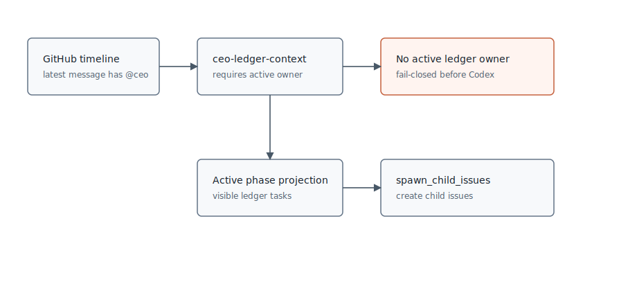
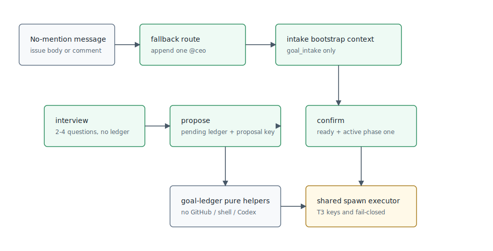

# 设计：goal-intake-t8

## 架构快照
变更前 CEO 普通 agent 只消费已有 active phase projection：

变更后新增 goal-intake bootstrap 与 pending proposal：

## 方案

### 1. 无 mention 目标兜底
沿用 `formatExternalCommentRoute` 的 CEO 式轻量判定，不在 TypeScript 中硬编码“支付宝”等业务词：

- `agents/ceo.md` 的“外部无 mention 评论兜底路由判定”增加目标形状规则：明显口语目标，例如“我想做一个 X / 我想要做一个 X / 帮我启动一个 X”，应 append `@ceo`，让普通 CEO agent 进入 goal-intake。
- runner 将兜底对象从“active latest comment”扩展为“可被处理的最新外部无 mention message”：包括 issue body 与 comment。issue body 没有 GitHub comment id，按 `issue-body:<bodyDigest>` 作为本地 route decision key，仍不保存全文。
- route append 仍只发布 `<ceo>:` role envelope，正文只有一个合法 agent mention；本轮不直接调用 CEO agent，下一轮 active poll 由普通 mention trigger 处理。
- CEO 判定失败、超时或返回非法 JSON 继续 fail-open，记录 route decision，保持 no-trigger 语义，避免同一消息重复消耗成本。
- 一旦 CEO 判定结果是 `append`，发布 handoff 评论就是可见结果边界：`postComment` 快速失败或 timeout 时，本轮必须返回 `failed`，不得把该目标消息按 no-trigger 吸收，不得推进 intake `updatedAt`，也不得写入“已 append”route decision；后续由既有 retry / dead-letter 路径留下可见痕迹。
- body 与 comment 的幂等键分开：issue body 使用 bounded digest key，comment 使用 GitHub comment id。两者都只存 route outcome、时间、reason / targetRole，不保存 message 原文。

### 2. CEO prescript 增加 intake bootstrap
`ceo-ledger-context` 当前要求当前 issue 唯一解析到 active phase。T8 增加一个受限分支：

- ledger 存在且能解析 active owner 时，保留现有 active projection 行为，spawn / roundtable 语义不变。
- ledger 缺失、为空、当前 issue 尚未出现在 ledger，或无 active phase 时，返回 `intakeBootstrap` prompt context：包含当前 issue source、可用 goal-intake workflow、明确禁止 spawn / roundtable 的说明，以及 milestone standards 引用。
- `parseCeoOrchestrationOutput` 在没有 visible task ids 时仍拒绝 `spawn_child_issues` / `roundtable`，因此 bootstrap 只打开 `goal_intake` 的 `interview / propose / confirm`。
- malformed ledger、多个 active phase、schema invalid 仍 fail-closed；bootstrap 只解决“尚未入账”这一正常新目标入口，不掩盖坏账本。

### 3. goal-intake action 契约
新增 `CeoScriptAction = "goal_intake"`，并把 `goal-intake` 加入 required CEO scripts。`parseCeoOrchestrationOutput` 支持三种 mode，均要求 CEO 响应末尾是 `in-progress` stage marker。

`interview`：

- 字段：`action`、`workflowId:"goal-intake"`、`mode:"interview"`、`body`、`questions`。
- 校验：`questions.length` 为 2-4；`body` 最多一个合法 mention，通常不 mention，避免采访时误交棒。
- 副作用：只发布可见 CEO 评论并保存 CEO role thread；不写 ledger、不 spawn。

`propose`：

- 字段：`proposalId`、`assumptions`、`goal`、`milestones`、`phaseOne`、`tasks`、`confirmationBody`、`provenance`。
- 校验：milestones 2-5；phase one tasks 3-7；每个 task 1-3 条验收语句；quality baseline 为 `demo | data-correct | production`；initial role 必须是可触发 agent；支付类示例必须显式声明不承诺真实资金、牌照、清结算。
- 副作用：写入 pending ledger bundle，再发布待确认提案评论。评论中包含 hidden `moebius-goal-intake-proposal-key:<digest>`，用户确认该提案才会进入 spawn。
- 如果 pending ledger 已保存但提案评论发布失败，本轮返回 `failed`，不保存 CEO role thread，不推进 intake `updatedAt`；后续重试用 proposal key 幂等识别已有 pending bundle，再补发提案评论。

`confirm`：

- 字段：`proposalKey`、`summary`、`groups`、`issues`、`provenance`。
- 校验：`proposalKey` 必须匹配一个 pending proposal；`issues` 的 task id 必须完全等于 pending phase one task 集合；每个 descriptor 的质量基准和验收语句必须与 pending task 一致；重复 confirm 时按 proposal key 幂等。
- 副作用顺序：确认 ledger proposal -> goal/tasks ready -> 激活 phase one -> 调用共享 `executeCeoSpawnChildIssues` 执行既有 T3 child issue 创建 / 找回 / child-ref 写回。
- 如果确认后已激活 phase one 但 spawn 或 child-ref save 中途失败，重试同一 proposal 时 `confirmGoalIntakeProposal` 对已 active phase no-op，spawn executor 继续按 hidden key 找回已创建 child issue 并补写 child ref，不创建第二份 active phase 或重复 child。

### 4. 账本写入与幂等
新增纯 helper，所有文件 IO 仍在 `goal-ledger-state.ts` 和 runner 中：

- `buildGoalIntakeProposalKey(source, proposalId)`：稳定 key 不包含标题、描述或 CEO 自由文本。
- `applyGoalIntakeProposal(state, input)`：创建或校验 pending goal bundle。相同 proposal key + 相同实体内容为幂等；相同 key 但实体内容冲突 fail-closed。
- `confirmGoalIntakeProposal(state, input)`：把 goal 和阶段一 task 转 ready，用现有 `switchActivePhase` 首次启动阶段一；重复确认同一 active phase 为 no-op，即使 child refs 尚未补齐也不得重复创建 phase。
- pending 状态不进入 active phase projection；确认前下游 spawn / join 不得消费这些 task。
- ledger note / provenance 只保存 bounded proposal key、source issue、message index、comment id、capturedAt 和短说明，不保存完整 issue body/comment。

### 5. Spawn 复用方式
从 `handleCeoAgentResult` 中抽出共享 executor，例如 `executeCeoSpawnChildIssues(input)`：

- 既有 `spawn_child_issues` 直接调用该 executor，行为不变。
- `goal_intake.confirm` 在 ledger 确认成功后，把确认 payload 中的 `groups/issues` 传给同一 executor。
- executor 继续使用现有 hidden orchestration key、GitHub key lookup、createIssue、ledger child-ref save、部分成功留痕与 fail-closed 逻辑；不复制 T3 spawn 规则。
- `goal_intake` 的 workflow id 参与 orchestration key，避免与 `milestone-spawn-child-issues` 互相撞 key。
- 对 confirm 的半成功恢复增加专门路径：当 ledger 已 active 但某个 task 没有 child ref 时，executor 先按 goal-intake orchestration key 查询父仓库；唯一命中则补写 child ref，未命中才创建 child issue，多命中 fail-closed。

### 6. switch_phase 契约边界
本 change 只在 spec 与 `goal-intake` 剧本中写清阶段一完成后的回访契约：

- 触发语义：阶段一集成验收通过后，未来 CEO 可基于 `switch_phase` 归档旧阶段、激活下一 pending phase，并采访阶段二口径。
- 本 change 不新增自动 phase switch pre-pass，不在 T4 join 后直接调用 `switchActivePhase`，也不做通用阶段工作流 UI。
- 如果 CEO 在本 change 的 runtime 中输出未实现的 `switch_phase` action，runner 应 fail-closed 可见说明“该 action 仅有契约，未接运行时副作用”。

### 7. 测试设计
可测逻辑覆盖面较大，必须新增单元测试与 runner 编排测试：

- `ceo-scripts.test.ts`：`goal-intake` required script 可加载，未知 / 重复 workflow 仍拒绝。
- `ceo-orchestration.test.ts`：解析 `goal_intake.interview/propose/confirm`，校验采访 2-4 问、里程碑 2-5、task 3-7、task 验收 1-3、role 白名单、支付类 disclaimers、proposal key。
- `goal-ledger.test.ts`：pending bundle 写入、相同 proposal 幂等、冲突 proposal fail、confirm 后 ready + active phase、重复 confirm no-op、pending task 不被 active projection 消费。
- `runner.test.ts`：issue body 与 latest comment 分别无 mention 目标路由到 CEO；append handoff 发布失败返回 failed；interview 不写 ledger；propose 写 pending 并发布提案；提案评论发布失败后重试补发；confirm 复用 spawn executor 创建 child issue；spawn 部分失败不删补偿；fail-closed 评论发布失败返回 failed；ledger active 但 child refs 不全时 retry 补写 child ref；issue body/comment 内容不进入 shell。
- `format-ceo.test.ts`：外部 fallback route 接受目标形状 -> `@ceo`，非目标文本 no_action。

## 权衡
- 不把 goal-intake 做成普通 `spawn_child_issues` 的一层 prompt 约定，因为 pending 入账、用户确认和 spawn 之间有状态闸门，必须由 runner fail-closed 管住。
- 不在 TypeScript 中写业务词分类器；目标形状识别仍放在 CEO persona，TypeScript 只做 JSON shape、单 mention、白名单和副作用边界校验。
- 不把全部里程碑拆细。T8 只允许粗里程碑 + 阶段一细化，符合 M3 的渐进拆解立场，避免一次性全量计划。
- 不实现 T9/T10 dogfood，也不真实创建外部“支付宝” issue；所有验收用模拟 issue 文本和 fake GitHub adapter。

## 风险
- Bootstrap 放宽 CEO prescript 可能误让无账本的普通 `@ceo` 进入 Codex。限制条件是 bootstrap 上下文只允许 `goal_intake`，parser 继续拒绝没有 visible task 的 spawn/roundtable。
- Confirm 阶段先激活 ledger 再 spawn，spawn 失败时会留下 ready/active 但 child refs 不全的中间态。通过 stable orchestration key 和 confirm 幂等重试恢复，不做删除补偿。
- 兜底路由扩到 issue body 后可能重复处理编辑后的 body。用 body digest route key 防重复，同时不保存全文。
- 可见 handoff / fail-closed 评论本身失败时，不能为了“避免刷屏”而落成 no-trigger；本方案明确这类发布失败属于未留下可见结果，必须按 failed 折叠给 intake retry / dead-letter。
