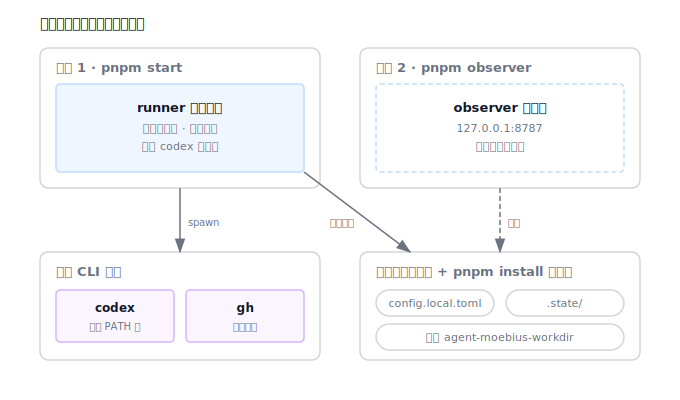
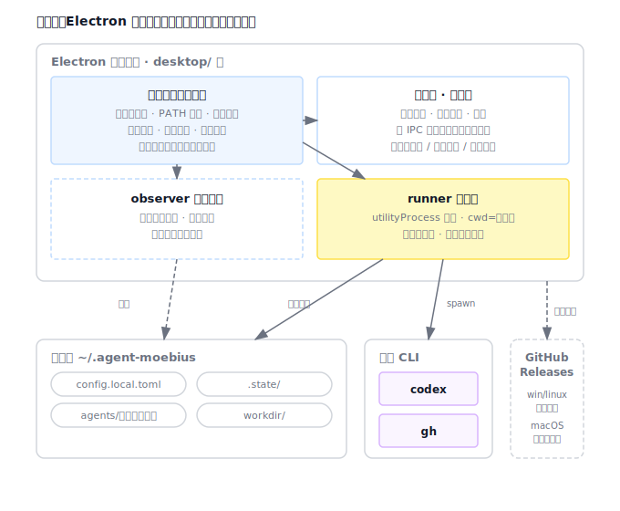

# 设计：add-desktop-shell

## 方案

### 进程拓扑

启动时序（主进程 `desktop/src/main.ts` 串联，自身不含业务逻辑）：

0. **单实例锁**：`requestSingleInstanceLock` 保证同时只有一个应用实例；第二个实例启动时激活已有窗口后退出，避免双跑 runner、并发写 `.state/`。
1. **数据根解析**（`data-root.ts`）：打包态默认 `~/.moebius`，开发态默认仓库根，`MOEBIUS_DATA_ROOT` 环境变量最高优先级覆盖。
2. **PATH 修复**（`shell-path.ts`）：macOS 图形应用继承不到终端 PATH（如 `/opt/homebrew/bin`），通过登录 shell 读出 PATH 合并进当前进程；读取失败保底沿用原 PATH，不阻断启动。
3. **首启种子拷贝**（`data-root.ts` 产出拷贝计划，主进程执行）：把 `agents/`（含 `ceo-scripts/`）与示例 `config.toml` 从应用资源拷贝到数据根；**已存在的文件一律不覆盖**，保证用户自定义素材在升级后不丢。`prompts/` 无运行时引用，不进清单（实现时再核实一次）。
4. **环境自检**（`env-doctor.ts`）：探测 codex 可执行、gh 可执行与登录态，产出结构化结果供状态页渲染；自检失败只呈现，不阻断启动。壳层所有外部命令调用（自检、PATH 修复）沿用仓库红线：`spawn(cmd, args[])` 数组参数，NEVER 用 shell 字符串拼接。
5. **observer 启动**：主进程内直接调用现有 `startObserverServer({ host: 127.0.0.1, port: 0, projectRoot: 数据根 })`——动态端口避免与手动 `pnpm observer`（8787）冲突；observer 保持只读旁路，壳层不加写接口。
6. **runner 启动**：`utilityProcess.fork(runner-child 入口)`，工作目录 = 数据根（`.state/`、`agents/` 相对路径自然落位），环境注入 `MOEBIUS_WORKDIR_ROOT=<数据根>/workdir`（否则打包态会按 `PROJECT_ROOT/..` 落进应用包附近）。`runner-child.ts` 只做一件事：调用 `src/runner.ts` 已导出的 `start()`。主进程捕获子进程 stdout/stderr 落盘到 `<数据根>/logs/`（按启动分文件，从简不做轮转），状态页崩溃态引用该路径；日志写入失败只记录、不中断 runner。
7. **主窗口**：加载状态页，主进程按固定间隔与事件推送状态快照。
8. **退出**：关闭主窗口 → 停 runner 子进程（先温和信号，超时强杀）→ 关 observer → 应用退出。

### 数据根与现有代码的衔接

- `src/config.ts` 新增环境变量覆盖：`config.toml` / `config.local.toml` / `agents/` 目录的解析位置可由数据根环境变量指定；不设置时行为与现状完全一致（`pnpm start` 不受影响）。
- `.state/` 各状态文件路径本就是相对路径、按进程工作目录解析，子进程工作目录指到数据根后零改动落位。
- observer 的 `projectRoot` 参数已存在，传数据根即可读到同一份配置与状态。

### 壳层模块与职责

| 模块 | 职责 | 形态 |
|---|---|---|
| `desktop/src/main.ts` | 启动时序装配、生命周期、IPC 注册 | 编排层，不含业务规则 |
| `desktop/src/runner-child.ts` | utilityProcess 子进程入口，调 `start()` | 一层薄胶水 |
| `desktop/src/data-root.ts` | 数据根解析、种子拷贝计划 | 纯逻辑，可测 |
| `desktop/src/shell-path.ts` | 登录 shell PATH 读取合并、失败保底 | 纯逻辑（注入命令执行器），可测 |
| `desktop/src/env-doctor.ts` | codex / gh 探测与登录态解析 | 纯逻辑（注入命令执行器），可测 |
| `desktop/src/runner-supervisor.ts` | 子进程状态机：停止/启动中/运行中/已崩溃；崩溃退避重启、连续 3 次停住、手动停止不重启 | 纯逻辑（注入派生函数与计时器），可测 |
| `desktop/src/updater.ts` | 版本比较；平台分支：macOS→「打开下载页」动作，Windows/Linux→electron-updater 自动更新 | 纯逻辑，可测 |
| `desktop/src/preload.ts` + `desktop/src/status-page/` | 状态页与窄 IPC | 展示层 |

窄 IPC 契约只有四个口：主进程 → 状态页的**状态快照推送**；状态页 → 主进程的**打开观察页**、**打开数据目录**、**检查更新**。不暴露任何配置写接口。

### 打包与发布

- esbuild 把主进程、preload、runner-child 连同 `src/` 依赖打成产物（运行时不再依赖 tsx）；`agents/`、示例 `config.toml` 作为 extraResources 随包分发。
- electron-builder 出三平台产物：dmg / zip（macOS）、nsis（Windows）、AppImage（Linux），发布目标 GitHub Releases。
- `.github/workflows/release-desktop.yml`：按 `desktop-v*` tag 触发三平台矩阵构建并上传 Releases——这是更新机制的通路前提。
- 更新：Windows/Linux 用 electron-updater 对接 Releases 全自动；macOS 无证书期间「检查更新」= 拉取最新 release 版本号与当前比较，有新版则跳转下载页。证书到位后 macOS 升级为自动更新并补签名公证（后续 change）。

## 权衡

- **Electron 而非 Tauri**：决策依据见 `docs/adr/0001-desktop-shell-electron.md`。核心一条：代码库是纯 Node/TS，Electron 让 runner 原样复用，Tauri 要把整条 Node 链路编译成边车二进制并引入 Rust 壳层。代价（安装包约 100-150MB、常驻内存偏高）被判定为开发者工具可接受。
- **observer 进程内而非子进程**：observer 本身是只读小 HTTP 服务且已有编程入口，崩溃隔离价值低，进程内启动最简单；runner 是长跑、会派生 codex 子进程的重活，才值得独立子进程 + 状态机监管。
- **关窗即退而非托盘常驻**：第一版生命周期最简化、行为可预期；托盘常驻涉及后台运行预期管理（用户以为退了其实在跑），留给后续 change 单独设计。
- **动态端口而非固定 8787**：避免与终端形态的 `pnpm observer` 并存冲突；状态页显示实际端口。
- **数据根 `~/.moebius` 而非系统用户数据目录**：对齐 codex CLI 的 `~/.codex` 习惯，用户在终端可直达，配置（`config.local.toml`）手改路径短；放弃了「跟随系统规范目录」的正统性。
- **首启种子拷贝而非只读引用应用资源**：`agents/` 是用户可改的角色素材，必须落在用户可写位置；「已存在不覆盖」牺牲了升级自动同步新角色的能力（升级带新角色时用户拿不到），第一版接受，后续可加差异提示。

## 风险

- **未签名 macOS 首装拦截**：macOS 15 起需在系统设置手动放行。缓解：下载页写清放行指引；证书到位后补签名公证。回滚点：不影响开发态与终端形态。
- **打包态路径回归**：asar 内 `import.meta.url` 派生路径与现状不同，`config.ts` 覆盖逻辑与种子拷贝是防线。缓解：路径解析全部进单测 + 打包冒烟验证（AI 验证流程第 5 条）。
- **应用退出与 runner 长跑竞态**：runner 可能正驱动 codex 子进程。缓解：收尾先温和信号再超时强杀；runner 本身的中断语义（不发评论、不写 thread、保持 issue active）已由现有 spec 保证，下轮心跳可恢复。
- **electron-updater 在未签名 Windows 上的 SmartScreen 提示**：不阻塞更新，仅体验瑕疵，记录到发布说明。
- **双形态状态分裂**：终端形态状态在仓库根 `.state/`，桌面形态在 `~/.moebius/.state/`；两种形态同时监听相同仓库会各自维护 intake 状态，导致同一 issue 双份处理、双份评论。缓解：AGENTS.md 明示「同一台机器两种形态不得同时监听相同仓库」，终端形态可设 `MOEBIUS_DATA_ROOT` 指向同一数据根来合一。
- **回滚思路**：`desktop/` 是独立包，整体移除即可回到纯终端形态；`src/config.ts` 的环境变量覆盖默认关闭，不影响既有链路。
