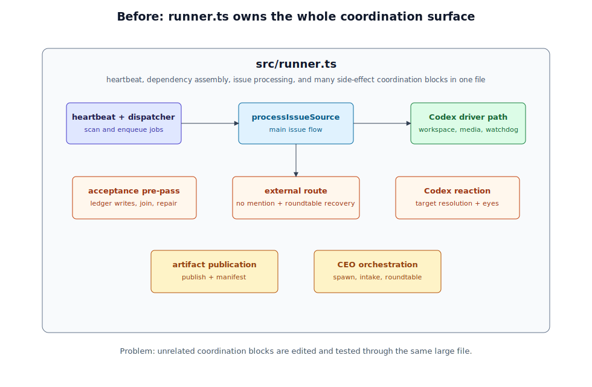

# 设计：split-runner-coordination-modules

## 方案

### 现状架构

`src/runner.ts` 既是主流程装配点，又内联多个高内聚协调块。主流程阅读时需要穿过大量与当前阶段无关的 helper，测试也容易继续集中到 `tests/runner.test.ts`。

### 改造后架构

改造后 `src/runner.ts` 仍是主编排入口，但把首批稳定子能力抽到 `src/runner/` 目录：

1. **验收 pre-pass 模块**
   - 新文件：`src/runner/acceptance-prepass.ts`
   - 从 `runner.ts` 移出：
     - `maybeProcessIntegrationAcceptancePrePass`
     - child task acceptance fact 入账
     - acceptance format reminder
     - closed child join blocked 上报
     - parent integration acceptance event 入账
     - integration repair child issue 创建协调
   - 该模块可以依赖 `goal-ledger.ts` 的纯函数、`ceo-orchestration.ts` 的受控 issue body renderer、`conversation.ts` 的 comment formatter、`github.ts` 的类型，但不得反向引入 runner heartbeat / scanner / dispatcher。

2. **外部路由模块**
   - 新文件：`src/runner/external-route.ts`
   - 从 `runner.ts` 移出：
     - `maybeRouteExternalNoMentionComment`
     - `resolveExternalNoMentionRouteTarget`
     - `resolveAgentAuthoredRouteGate`
     - `maybeRecoverRoundtableNoHandoff`
   - 保持 route decision ledger key、防重、agent-authored child task closed gate、roundtable participant recovery 语义不变。
   - 该模块只调用注入的 `formatExternalCommentRoute` / ledger / post comment 能力，不直接读取 agent 文件，不直接调用 `gh` 或 `codex`。

3. **Codex reaction 模块**
   - 新文件：`src/runner/codex-execution-reaction.ts`
   - 从 `runner.ts` 移出：
     - `resolveCodexExecutionReactionTarget`
     - `addCodexExecutionReaction`
   - 保持 best-effort 语义：reaction 失败只记录日志，不阻断 Codex 执行，不推进 role thread。

4. **共享运行契约**
   - 如实现中出现循环依赖风险，新增 `src/runner/runtime-contracts.ts` 承载窄接口与通用小函数，例如 `PostVisibleComment`、`RunnerLog`、bounded timeout helper、failure formatting helper。
   - 该文件只放 runner 子模块共同使用的运行契约，不放业务规则，不命名为 `utils` / `helpers`。

### 主流程保持

`processIssueSource` 的顺序保持为：

1. build timeline
2. acceptance pre-pass
3. roundtable recovery
4. mention trigger
5. external no-mention fallback route
6. selected agent workspace / prescript / media / reaction / Codex
7. artifact publication / CEO guardrail / comment / manifest / role-thread save

本 change 不把 `processIssueSource` 改成事件总线或插件管线；只把可单独命名和测试的协调块从主流程文件移出。

## 测试设计

- `tests/acceptance-prepass.test.ts`
  - child task 验收通过时写入 acceptance fact，并在 join ready 时请求父级集成验收。
  - 验收角色声明整体通过但逐条格式无法解析时，最多发布格式提醒，超过上限不重复刷屏。
  - waiting join 遇到 closed child 且缺验收 fact 时，在父 issue 发布 blocked 上报并用 hidden key 防重。
  - 父级集成验收失败时创建或找回 repair child，并写回 ledger reference。
  - ledger 写入 dependency 永不 resolve 时，模块调用必须在既有 timeout 内 settle 为失败结果；runner job 不得永久 in-flight。
  - ledger 写入失败或 repair child create / lookup 失败时，不保存虚假的 acceptance fact / repair reference；可见失败评论发布失败时向外抛错，由 runner 保持 failed 可重试。
  - blocked 上报或 acceptance format reminder 的 post comment dependency 失败时，不把本轮当作可见完成。

- `tests/external-route.test.ts`
  - active user comment 无 mention 时只判定一次 route key，append 成功后返回 `triggered-success` 并记录 route outcome。
  - route formatter fail-open 时不发布评论，返回 no-trigger route outcome。
  - route append comment dependency 快速失败时，本轮向外抛错或返回 failed，不记录成功 route decision；runner 后续可重试同一 comment id。
  - route formatter 或 ledger gate 慢成功 / 永不 resolve 的场景必须受既有 timeout 约束，不能让 issue 永久 in-flight。
  - agent-authored child issue 已有 passed fact 时确定性 no_action，不调用 Codex route。
  - roundtable participant 无 handoff 或错误 handoff 时只发布一次 CEO recovery。

- `tests/codex-execution-reaction.test.ts`
  - latest index 为 issue body 时 reaction target 是 issue。
  - latest index 为 comment 时 reaction target 是对应 comment id。
  - comment index 不存在或 addReaction 失败时只记录 failure，不抛出。
  - delayed addReaction resolve 不得改变调用顺序：reaction 仍发生在 Codex driver 之前，失败不阻断 Codex driver。

- `tests/runner.test.ts`
  - 保留主流程顺序型断言：acceptance pre-pass 在 trigger 前执行，external route 只在 trigger skip 后执行，reaction 在 Codex driver 前执行。
  - 保留 S1 发布边界断言：首条可见评论发布前的失败返回 failed；首条可见评论发布后失败不重入重复发帖。
  - 保留 L1 in-flight 断言：注入 never-resolve 子依赖时，经 timeout / watchdog 后 job settle，dispatcher 可释放 in-flight。

## QA 增补处理

QA 第 12 条提出的 6 条增补验收语句目前是测试设计建议，尚未由需求持有者或真人用户确认并入正式验收清单。本方案已把其中的故障注入方向纳入测试设计，但实现完成时正式验收仍以 issue 时间线中已确认的验收语句为准；如果真人确认 QA 增补，执行阶段会把它们并入最终验收证据清单。

## 权衡

- **不选只在 `runner.ts` 内重排**：成本低，但不能实质降低文件体积，也不能让子能力拥有独立测试入口。
- **不选事件总线 / 插件管线**：会改变执行模型，引入新的调度语义，不适合 production 首批重构。
- **不在首批拆 CEO spawn / goal-intake / roundtable executor**：CEO 编排副作用块更大且失败补偿规则密集，适合在本次模式稳定后作为第二阶段处理。
- **允许 runner 子模块做副作用协调**：它们属于 runner 主链路的一部分，可以接收注入的 GitHub / ledger / Codex 适配器；但纯业务规则仍留在既有纯模块，不能复制到新模块形成多事实源。

## 风险

- **循环依赖风险**：若新模块直接 import `ProcessIssueSourceDependencies` from `runner.ts`，会形成 runner 与子模块双向依赖。缓解：在新模块定义窄依赖接口，或抽到 `runtime-contracts.ts`。
- **测试行为遗漏**：搬运大块逻辑时可能只移动代码不补边界测试。缓解：每个新模块至少覆盖成功、失败、防重或 fail-open/fail-closed 路径。
- **可见行为回归**：reaction、artifact、role-thread save 等发布边界必须保持顺序。缓解：保留 runner 主流程测试，不只测新模块内部。
- **新巨文件风险**：`acceptance-prepass.ts` 可能仍较大。缓解：该模块职责单一，且后续可在同一命名空间下继续拆 `acceptance-repair.ts` / `acceptance-join.ts`；本阶段避免把不相关能力混入同一文件。
- **L1/S1/V1 回归风险**：拆分可能把原先由 runner catch / timeout / postVisibleComment 发布边界兜住的行为分散到子模块。缓解：新模块只接收有界依赖和窄 post/comment 接口；测试必须覆盖永不 resolve、快速失败、发布失败、状态防重和虚假引用不保存。
