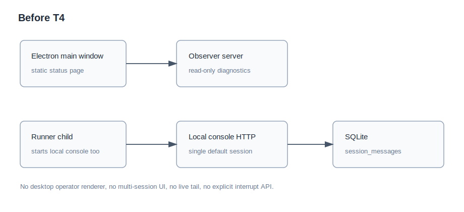

# 设计：local-console-t4-desktop-operator-console

## 方案

本方案把 T4 收敛成“本地通道契约 + 桌面 renderer + 展示组件”三层。核心链路继续复用 `conversation`、`triggers`、`codex` 和既有 agent persona，不在 T4 改写 GitHub runner 的业务语义。

### 1. 本地通道契约

在 `src/local-console/` 上扩展现有 HTTP/API 与 store，而不是新建第二套状态：

- `GET /api/local-console/state`：返回一个本地项目、会话列表、当前会话时间线、当前运行快照、全局计数和最近错误。
- `POST /api/local-console/sessions`：创建本地会话，写入 `sessions` 与必要的首条 user 消息占位或空会话元数据。
- `POST /api/local-console/sessions/:sessionId/messages`：向指定会话提交 user 消息；同一会话 running 时仍拒绝并返回可见错误，不并发启动第二个 run。
- `POST /api/local-console/sessions/:sessionId/interrupt`：中断该会话当前 run；无 active run 时返回幂等的 no-op 或 409 可见错误。
- 保留 T2 的 `GET/POST /api/local-console/messages` 作为兼容入口，内部映射到默认 session，避免一次性破坏已有测试。

新增/调整的本地 view model：

- `LocalConsoleProjectSummary`：本轮只有一个本地项目，名称来自数据根或 package name；保留 project id 以便 UI 两层导航稳定。
- `LocalConsoleSessionSummary`：`sessionId`、title、status、waiting/running/stuck/error/interrupted counts、createdAt、updatedAt。
- `LocalConsoleRunSnapshot`：`sessionId`、`runId`、role、status、startedAt、elapsedMs、runDir、stdoutTail、stderrTail、lastOutputSummary、interruptible、tailDiagnostic。
- `LocalConsoleMessageStatus` 增加 `interrupted` 与 `stuck`，用于区分用户中断、卡住和错误失败；错误失败继续使用 `failed`。

### 2. 运行直播

`codex.run()` 已经边运行边把 stdout 写入 `runDir/stdout.jsonl`、stderr 写入 `runDir/stderr.log`，并已支持 `AbortSignal`。T4 不需要改 Codex CLI 协议，只在 local runtime 中公开一个可轮询的 live snapshot：

1. claim pending message 后立即写入 `runDir` 和 `startedAt`，并在内存 `activeRuns` map 保存 `AbortController`。
2. renderer 以短轮询读取 `state`；server 有界读取 active run 的 stdout/stderr 文件尾部，解析最近一条 JSONL 可读文本，解析不到时降级为原始尾行或固定“正在运行，等待输出”。
3. 运行块必须始终有非空概括：角色、耗时、runDir 和最近输出四者至少展示一项；不得出现空白运行卡。
4. Codex 成功后继续按原逻辑写 agent message；Codex 非零退出 / spawn error 按错误失败写 system message；中断按 interrupted 写 system message，不进入 failed；idle/max-duration timeout 与 stale running 修复按 stuck 写 system message，不静默失败。

尾流读取的有界策略：

- 只读取 stdout/stderr 文件末尾固定窗口，建议默认每个文件最多 64 KiB；禁止为了渲染 state API 全量读无限增长的 stdout.jsonl。
- tail read 必须有独立 timeout，建议复用或新增 local console 配置项；超时、ENOENT、权限错误或 JSONL 解析失败都返回 deterministic fallback，并把 `tailDiagnostic` 放入 run snapshot 供 UI 展示或测试断言。
- tail read 失败不得改变 run 状态，不得阻塞中断操作，不得让轮询请求长时间悬挂。
- 输出摘要解析是纯函数：JSONL 可读文本优先，其次 stderr/raw tail，最后固定概括。该函数必须单测覆盖大文件、空文件、不可解析 JSON、慢/失败读取。

### 3. 中断语义

中断按钮调用 local runtime 的 `interruptRun(sessionId, runId)`：

- 若当前会话 active run 匹配，调用对应 `AbortController.abort("user-interrupted")`。
- 中断请求必须同时匹配 `sessionId` 与当前 `runId`；不匹配时不得 abort 任何其他会话的 active run，返回可见 no-op/409 结果。
- `codex.run()` 返回 `interrupted:user-interrupted` 后，store 在一个 transaction 中把原 user message 标为 `interrupted`，追加 system message，如“运行已被用户中断”，并释放 active run。
- UI 展示“已中断”作为中性事实，不染成错误；会话可以继续接收下一条消息。
- 失败、中断、卡住分流：fake Codex 非零退出或 spawn error 是 `failed`；用户点击中断是 `interrupted`；Codex idle/max-duration timeout 或启动时 stale running 修复是 `stuck`；三者在 SQLite、API 和 UI 上都可区分。

### 3.1 卡住状态

T4 原文要求“进行中 / 等待真人 / 卡住 / 错误”完备可见，因此 `stuck` 不是 QA 扩范围，而是原需求状态分支。

- `running`：active run 仍在运行，snapshot 包含 elapsed/runDir/tail。
- `waiting-human`：最新可见消息收尾行为等待真人，或后续 T5 账本/验收本地化明确给出人工闸口；T4 只做本地可判定的等待提示，不伪造账本状态。
- `stuck`：Codex idle timeout、max-duration timeout、进程崩溃后 stale running 修复，或 runtime 能确认 run 无法继续但不属于用户中断/普通失败。UI 文案应说清“运行卡住”和 reason/runDir。
- `failed`：Codex 非零退出、spawn error、local runtime 可记录的执行错误。
- `interrupted`：用户显式中断。

`stuck` 必须持久化到 SQLite/API，刷新 renderer 或重启桌面窗口后仍能看到 reason 与 runDir。实现阶段若发现某个 timeout 更适合归为 `failed`，必须更新方案或在 code-verified 中说明依据，不能静默合并状态。

### 4. 多会话与项目导航

本轮最小项目模型：

- 只有一个本地项目，来源为当前数据根 / 应用实例，不尝试管理多个 repository。
- 会话来自 SQLite `sessions` 表；默认 session 继续保留，新增会话使用 `local:<stable-id>`。
- 侧栏展示项目行和项目下平铺会话行；排序按 `conversation-console` 既有设计：等你、目标/普通会话、运行中、静止、已完成。本轮没有完整账本本地化时，等你只来自本地消息状态或最新 agent 收尾行的等待真人提示；卡住和错误必须可见，卡住用中性/警示文案，错误用危险事实样式；完整账本树留给 T5。
- 单时间线按 `session_messages` 渲染 user / agent / system；agent 消息折叠展示角色、stage、结论与交棒行，展开显示全文。

### 5. Electron 主窗口与诊断入口

桌面主进程负责启动本地 console server 并把 URL 注入 renderer；runner child 不再在桌面形态重复启动第二个 local console server。建议做法：

1. `desktop/src/main.ts` 在 PATH 修复和 seed copy 后启动 `startLocalConsoleServer({ projectRoot: dataRoot, port: 0 })`，保存 `localConsole.url`。
2. 派生 runner child 时设置环境变量禁用 runner 内部 local console server，避免双服务抢端口；终端 `pnpm start` 仍保持自动启动本地 console server。
3. preload 暴露窄 API：订阅 desktop 状态、获取 local console URL、打开诊断状态页、打开 observer、打开数据目录、检查更新。
4. BrowserWindow 默认加载新的 React renderer bundle；状态页保留为诊断页面，可通过操作台顶部菜单或诊断按钮打开。

这样 local console runtime 生命周期绑定主进程而不是 renderer：窗口刷新或 renderer 崩溃不会丢运行状态；应用退出时主进程统一关闭 local console server、observer 和 runner child。

### 6. Renderer 与 console-ui 分工

- `packages/console-ui` 新增纯展示组件：`ConsoleShell`、`SessionSidebar`、`Timeline`、`RunLiveBlock`、`StatusBanner`、`MessageComposer` 等，props/callback 输入，不依赖 Electron。
- `desktop` 新增 renderer app，负责 fetch/轮询 local console API、调用中断/发送/创建会话、把数据映射到 console-ui props。
- renderer 构建可沿用 Vite（与 console-ui 包一致）或 esbuild。实现阶段优先选 Vite；若与 Electron 打包链摩擦过大，降级为 esbuild 也必须保留 React renderer bundle 与 CSS 入口。

### 7. 测试设计

单元测试：

- local store：创建/列出 session，消息状态 `interrupted`、`stuck` 与 `failed` 分流，runDir/startedAt 持久化，重启后仍能读回。
- local runtime：慢 Codex running 时 snapshot 有非空 tail/概括；中断调用 abort 并释放 active run；fake Codex 非零退出写 failed；spawn error 写本地错误记录；idle/max-duration timeout 与 stale running 写 stuck。
- 输出解析与有界读取：JSONL 可读文本提取、不可解析 JSONL/raw stderr fallback、空文件 fallback 为非空 running 概括；大文件只读尾部；tail read timeout/failure 不拖垮 state API。
- console-ui：运行直播块、中断按钮、错误记录、会话侧栏排序与折叠消息渲染。
- desktop preload/main 纯逻辑：主窗口拿到 local console URL；诊断入口存在；runner child 禁用重复 local console server 的环境变量被注入。

集成/验收：

- API 级 fake Codex 慢输出：创建会话、发送消息、轮询 state，断言 running snapshot 包含 runDir、elapsedMs、尾行和 running 状态。
- API 级中断：慢 Codex running 时调用 interrupt，断言 Codex 被 abort，消息状态为 `interrupted`，system message 可见，后续消息可继续处理；sessionId/runId 不匹配不得误中断其他会话。
- API 级失败/卡住：fake Codex 非零退出或 spawn error 断言消息状态为 `failed`；idle/max-duration timeout 或 stale running 断言消息状态为 `stuck`；二者 system record 可见，页面不是空白。
- Electron/renderer Playwright 验收：启动桌面台或等价 renderer harness，截图保存到 `artifacts/acceptance/`：运行直播、中断后状态、失败错误记录；卡住状态截图作为 QA 建议验收，待需求持有者确认后并入正式清单。
- 回归：`pnpm test`、`pnpm typecheck`、`pnpm --filter @agent-moebius/console-ui test`、`pnpm --filter @agent-moebius/desktop test`。

## 权衡

- 选择 HTTP 短轮询而不是 SSE/WebSocket：牺牲亚秒级推送，换取与 T2 现有通道连续、测试简单、不会提前引入长连接生命周期。T4 的“直播”由 runDir/stdout 尾流满足；更复杂事件流留给 T5。
- 选择一个本地项目多会话，而非多 repository/project：符合 PM 确认的最小口径，保留 UI 两层心智，不把 T6 的 GitHub/local 互斥收口提前。
- 选择 `interrupted` 与 `stuck` 状态而非全部归入 failed：满足产品明确要求和 T4 原文“卡住”状态要求，并避免用户中断/运行卡住污染普通错误统计。
- 选择 Electron 主进程拥有 local console server：renderer 可重载，server 与运行状态仍在主进程；代价是桌面形态需要禁用 runner child 内部 local console server，避免重复启动。

## 风险

- Codex stdout 在某些阶段可能长时间无可读 JSONL 或无限增长。缓解：tail read 只读固定 byte 窗口并设 timeout；运行块用 elapsed/runDir/固定概括兜底，保证不空白；idle/max-duration watchdog 进入 stuck 状态。
- Electron renderer 构建引入 React/Vite 后可能影响 desktop build。缓解：先在 desktop build 脚本独立加入 renderer bundle，保留主进程和 preload 现有测试；若 Vite 摩擦大，改用 esbuild 打 renderer。
- 桌面主进程启动 local console server 会改变 desktop 装配路径。缓解：终端 `pnpm start` 路径保持不变；desktop runner child 只通过环境变量禁用重复 local server，不改 GitHub heartbeat 语义。
- 会话标题与等你状态在没有 T5 账本本地化前信息有限。缓解：标题来自首条用户消息或创建表单，等你状态只做本地可判定部分；不伪造 ledger/guardrail 状态。

## QA 增补验收建议（待需求持有者确认）

以下来自 QA 测试设计，不直接并入正式验收语句，除非 product-manager 或真人用户在 issue 时间线明确接受：

1. 构造 stdout.jsonl 大文件或慢读取故障，轮询 state API 应在有界时间内返回，运行块显示最近 tail 或确定性降级概括，服务不被单个尾流读取卡住。
2. 构造无可解析 JSONL 且 stderr 为空的慢 Codex run，桌面台应显示非空 running 概括、elapsed、runDir，不出现空白运行块。
3. 创建 session A 和 session B，A 运行中时切到 B 并对 B 发起中断请求，不应中断 A；只有携带 A 当前 runId/sessionId 的中断才会 abort A。
4. 构造 Codex idle-timeout 或 stale running 修复，桌面台应显示“卡住”或明确等价状态，并持久化可刷新查看；不得只归为普通静默失败。
5. 刷新 renderer 或重启桌面窗口后查看 interrupted/failed/stuck 记录，状态、reason、runDir 仍应从 SQLite/API 恢复可见。
