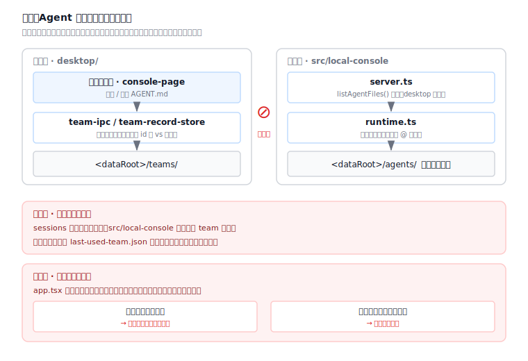

# 设计：agent-teams-runtime-binding

现状与改造后的模块依赖见  与 。

## 方案

### B. 团队标识与位置解耦（地基，先做）

问题在于同一个 `teamId` 同时承担身份和位置两个职责，且系统里存在两条不一致的解析：`resolveTeamLocation` 按 `teamId` 拼路径，`resolveRecordedTeamLocation` 查记录取目录名。重新定位只改记录不改 id，于是站错队的调用方全部失效。

| 文件 | 职责变化 |
| --- | --- |
| `desktop/src/team-record-store.ts` | `UserTeamRecord.directoryName: string` 改为可辨识的位置结构，区分受管目录（`teams/` 下，存目录名）与外部路径（存绝对路径）。`locationForRecord` 据此分派，不再无条件拼 `teamsRoot`。文档 version 1 → 2，v1 记录一律读为受管目录 |
| `desktop/src/team-record-store.ts` | 删除 `UserTeamRecord.lastKnownMembers`。保留 `lastKnownDefinition`——团队名称与描述是用户识别「这是哪一支团队」的依据，PRD 只禁止缓存**成员摘要** |
| `desktop/src/team-file-manager.ts` | 用户团队改走 `resolveRecordedTeamLocation`；内置团队保留按 id 拼路径（`.system/` 下目录名确实等于 id，且内置团队不可重新定位） |
| `desktop/src/team-external-change.ts` | 同上 |
| `desktop/src/console-page/app.tsx` | `checkAgentTeamMemberExternalChange` 的空 catch 改为落到该成员的 `loadError`，不再静默 |

重新定位成功后写回的是新位置本身，而不是「新目录名」，这样 `teams/` 以外的位置才真正可表达。

### A. 团队 → 会话 → 执行

**A1 存储**：`sessions` 表新增 `agent_team_ownership` 与 `agent_team_id`，均可空。NULL 表示未绑定，语义是「回退到全局 `agents/` 目录」，存量会话行为不变。改动落在 `src/sqlite-state-worker.ts`（建表与迁移）、`src/sqlite-state.ts`、`src/local-console` 的读写路径。

**A2 创建**：团队标识随创建会话的请求一起提交并落库，创建成功即完成绑定。`last-used-team.json` 退回它本来的职责——下次新建对话时的预选来源，不再兼任「当前会话的团队」。涉及 `desktop/src/console-page/new-conversation.ts`、`state-sync.ts` 与 local console 的 session 创建接口。

**A3 执行**：`listAgentFiles` 由无参改为接受 `sessionId`；`src/local-console/runtime.ts` 的调用点本就持有 `sessionId`。desktop 在启动 local console server 时注入实现：查会话绑定 → 走 B 修好的路径解析 → 列出该团队 `members/<slug>/AGENT.md`；无绑定则回退全局目录；团队处于需修复态时返回明确错误而不是空名单，避免「没有可用 Agent」被误报成路由失败。

**A4 界面**：`app.tsx` 拆出两个互不相干的状态——`agentTeamSelection` 只服务团队管理页的浏览与编辑，新增的会话团队状态从 `selectedSession` 读出并喂给操作台的 `selectedAgentTeamKey`。发送禁用、Composer 上的团队标识随之只反映会话真正绑定的团队。

**A5 实时健康度**：操作台已有每秒一次的 `refresh` 轮询，在其返回值里带上**当前会话绑定团队**的解析结果即可，不轮询全部团队。用户在应用外移走或修好团队目录，需修复标识与发送禁用随下一次轮询生效，不必进入团队页手动重试。

### C. 视图路由

不在各处补状态复位，而是在 `packages/console-ui/src/console/operator-console.tsx` 内建立单一入口：任何把用户带向某段对话的动作，都经由它同时完成「切换会话」与「主区回到对话视图」。四个出口——侧边栏选择会话、新建对话成功、搜索结果跳转、归档或移除项目导致的会话切换——统一走这个入口。

### D. 详情页交互

| 位置 | 改法 |
| --- | --- |
| `agent-team-detail.tsx` 的 `requestLeave` | 存在外部冲突时弹出阻止说明并列出待处理成员，取代直接 return。固化了静默失效的那条断言一并改写 |
| `agent-teams-page.tsx` 的 `returnToList` | 滚动位置恢复移入布局副作用，等列表 DOM 回到视图后再赋值，避开浏览器对当前内容高度的钳位 |
| `agent-markdown-mention-editor.tsx` | 处理输入法组字事件：组字期间不回写受控值、不重设光标，组字结束后再统一提交一次 |
| `operator-console.tsx` | 存在未保存草稿时经由 C 的路由入口离开团队页，触发既有的保存/放弃/取消三选项 |

## 权衡

**执行侧的团队解析用注入而不是下沉。** 可以把团队目录结构的知识移进 `src/local-console`，让服务端自己解析。不选，是因为 `teams/` 的布局、用户团队记录、系统团队播种都属于桌面壳的领域，`src/` 侧的 local console 还要服务非桌面形态；下沉会让它承担一份自己不拥有的存储约定。代价是 `listAgentFiles` 的签名要加参数，调用点需要传 `sessionId`。

**本次只绑标识，不冻内容快照。** PRD 要求「已有会话继续使用创建时载入的团队版本」，严格实现需要把创建时各成员 `AGENT.md` 全文随会话持久化。用户裁决先落标识、快照留 TODO，因为会话记录模块本身尚未设计，此刻定下快照存储形态大概率要推翻。折中是把列的位置与语义设计成可加一层——将来补快照时是新增，不是改写。风险明确记录在下节。

**保留团队定义缓存，只删成员摘要。** PRD 第 202 行禁止的是「独立、可能漂移的成员摘要」。团队名称与描述若也不缓存，需修复态的横行将无法告诉用户这是哪一支团队，与同一小节要求横行显示团队名称冲突。因此按最小范围执行裁决。

**视图路由抽单一入口而不是逐处补复位。** 逐处补的成本更低，但这个缺陷的本质是缺规则而非漏了一行——出口还会增加（后续的搜索跳转、通知跳转），补丁式修法会让同一个 bug 反复长回来。

## 风险

**内容快照缺位期间的行为偏差。** 在快照层补齐之前，用户修改 `AGENT.md` 或切换主 Agent 会追溯影响已有会话，与 PRD 三处表述不符。这是本次已知且经用户同意的暂时状态，TODO 记在 proposal 中；回滚不涉及此项。

**Agent 名单收窄可能暴露既有内容问题。** 绑定生效后，会话可 `@` 的角色从全局八个收窄为团队成员。若某支团队的 `AGENT.md` 里 `@` 了团队外角色，此前能撞上全局目录侥幸跑通，之后会明确失败。这是正确行为，但会表现为「以前能跑的现在不能跑」，需要在验证时确认 seed 团队自身不存在这种引用。

**两处数据迁移。** `sessions` 加列与团队记录 v1 → v2 都是向后兼容的加法，回滚只需还原代码——旧代码忽略新列、把 v2 记录当 v1 读会丢失外部路径信息，因此回滚前若已有团队被重新定位到 `teams/` 之外，需要先移回受管目录。

**测试基线本身有问题。** 现有 `operator-console.test.tsx` 直接把 `selectedAgentTeamKey` 当 prop 灌入，正是它挡住了本次的主干缺陷；`agent-team-detail.test.tsx` 把静默失效固化成了断言。这两处必须改写而不是沿用，否则修完仍然测不出来。
