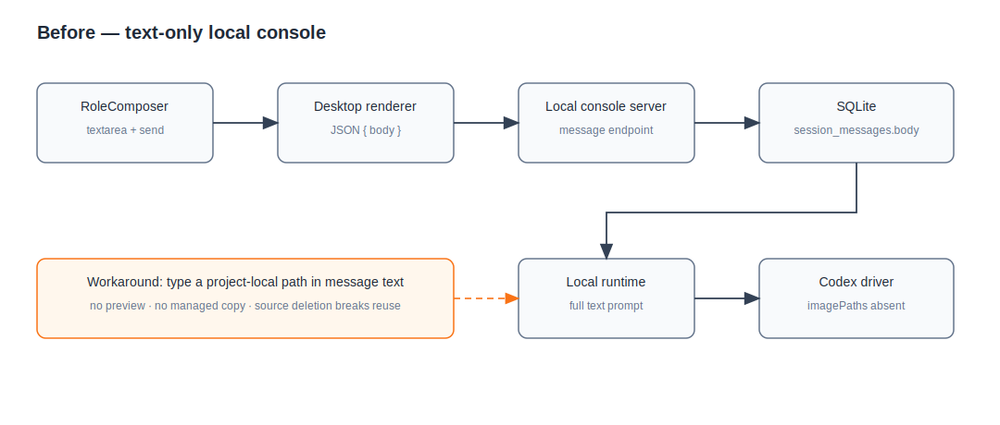

# 设计：local-console-managed-attachments

## Codex 参考约束

本方案只复用 Codex 已公开实现能够证明的语义：

- `UserInput::LocalImage` 与重复 `--image` 支持同轮多图片；composer 测试覆盖纯图片输入。
- 剪贴板图片规范化为 PNG 临时文件；PNG、JPEG、GIF、WebP 是当前图片工具链接受的格式。
- 图片输入的 `1 GiB` 常量是防止异常输入的高位 sanity guard，不是推荐上传大小，也不转写成面向用户的“正常文件上限”。
- local image 在 rollout 中持久化为编码图片内容，但 UI history event 仍保留本地路径以支持历史编辑；本项目不能借此推导出“原文件删除后仍可恢复”的完整附件生命周期，因此仍需自己的托管副本。
- 当前 `UserInput` 还包含音频、skill 和 mention 等变体，但没有通用普通文件变体；本项目只声称“没有普通文件类型”，普通文件采用自己的受控路径清单，不宣称具有图片相同的模型输入语义。

因此本 change 不沿用先前讨论中任意提出的“10 个、图片 10MB、文件 50MB”产品限制。实现使用流式 IO、磁盘空间错误和与 Codex 图片输入一致的高位单文件护栏保证有界，不在 composer 增加固定数量上限。

## 架构

基线引用 `docs/architecture/local-console-operator.svg`：当前 renderer 只发送 JSON 正文，SQLite 只有消息，local runtime 调 Codex 时不传图片。

改造后增加一条只属于 local-console 的托管附件链路。附件内容不进入 SQLite，不复制到项目/worktree，也不复用 GitHub `media-assets` 的 URL 下载职责。

## 数据模型与磁盘布局

把不可变内容与可变归属拆成两张表，避免“改一改重发”必须移动原消息附件或复制二进制。

`local_attachment_blobs` 是托管内容事实源：

| 字段 | 语义 |
| --- | --- |
| `blob_id` | 随机、不透明、不可从文件名推导的稳定内容 id；同时决定托管目录 |
| `kind` | `image` 或 `file`；只由服务端内容识别决定 |
| `display_name` | 清洗后的用户可见文件名，不参与路径解析 |
| `media_type` | 服务端识别或安全回退后的 MIME |
| `byte_size` | 实际流式写入字节数 |
| `sha256` | 托管内容完整性摘要 |
| `storage_key` | 仅允许服务端生成的相对键，不接收客户端路径 |
| `created_at` | 内容创建时间 |

`local_attachment_refs` 是草稿/消息归属事实源：

| 字段 | 语义 |
| --- | --- |
| `attachment_id` | renderer 可见的随机、不透明引用 id |
| `blob_id` | 引用不可变 `local_attachment_blobs.blob_id` |
| `draft_key` | 未发送时归属 `draft:new` 或 `draft:<sessionId>`；发送后为空 |
| `message_id` | 发送后引用 `session_messages.id`；草稿时为空 |
| `position` | 草稿或消息内的稳定顺序 |
| `created_at` / `updated_at` | 引用生命周期时间 |

ref 表约束 `draft_key` 与 `message_id` 恰有一个非空；`(message_id, position)` 和 `(draft_key, position)` 唯一。上传完成时在一个 transaction 中插入 blob 与首个 draft ref；消息发送只移动 ref 的归属。需要复用已发送附件时，为同一 blob 新建 draft ref，不修改原 message ref。消息/草稿查询 join 两表并按 `position` 返回安全 DTO；DTO 暴露 `attachment_id` 和显示元数据，不暴露 `blob_id`、`storage_key`、原始路径或运行路径。

附件原件放在 `<dataRoot>/.state/local-console-attachments/<blobId>/content`；受支持图片另存 renderer 派生的有界 PNG 缩略图 `preview`，供历史恢复后展示。文件名永远不进入真实存储路径；显示名只存在元数据中。写入顺序为：

1. renderer 先用 Chromium 图片解码能力尝试把 File 生成最长边不超过 512px、编码后不超过 2MiB 的 PNG 缩略图；若首次 PNG 超过预算，按更小边长重试编码。PNG/JPEG/GIF/WebP 成功生成缩略图后走图片上传，解码失败的受支持图片显示为失败项，不把原件送入 ready 状态。普通文件跳过此步骤。这两个数值是内部预览预算，不是用户原件限制。
2. local-console 在目标 id 目录流式写 `content.partial`，边写边计算字节数和 SHA-256，并在超过高位护栏时立即终止；服务端根据 magic bytes 决定原件是 PNG/JPEG/GIF/WebP 还是普通文件，客户端 MIME 只作显示提示。
3. 普通文件在原件完成后直接原子 rename 为 `content`，并原子写 blob 元数据与首个 draft ref。受支持图片先把原件落为 staged `content`，再接受同一 staged id 的小型 PNG preview finalization 请求；服务端校验 capability、draft 归属、PNG 签名、IHDR 尺寸和预览字节上限后原子落下 `preview`，此时才写 blob 与首个 draft ref。图片原件或 preview 任一缺失都不可发送。
4. SQLite 失败则尽力删除原件与缩略图；启动和有界 TTL 清理会回收 `.partial`、未完成的 staged 图片和无元数据引用的孤儿目录。已被消息引用的内容永不因原文件变化而重读。

删除未发送附件时先移除 draft ref；仅当该 blob 已无任何 ref 时才尽力删除 blob 元数据与内容，删除失败留下的孤儿由清理器收敛。现有产品没有消息删除，因此已发送 message ref 及其 blob 随 session 归档保留。

## 草稿、选择与上传

`RoleComposer` 保持受控组件：新增 `attachments`、`onFilesAdded`、`onAttachmentRemove`、`onAttachmentRetry`，但不直接调用 API。组件内部只负责隐藏的多文件 `<input>`、drag/drop 和 clipboard `File` 提取，并把 `File[]` 交给 desktop renderer。

desktop renderer 为每个 `draftKey` 维护服务端草稿附件列表：

- 选择/拖入文件后立即显示本地 object URL 占位；图片在 renderer 内生成有界 PNG 缩略图后再逐个流式上传，普通文件直接上传。缩略图生成逻辑放在可注入解码器的独立 helper 中，不塞进 React 组件。
- 剪贴板中有图片 `File` 时阻止把二进制内容粘进正文；普通文字粘贴保持原行为。
- 上传成功后用服务端 DTO 替换临时项；失败项保留文件句柄到当前 renderer 生命周期用于重试，重启后则显示持久化成功项，不伪造失败项已保存。
- 每个在途上传持有独立 `AbortController` 和 draft generation；移除 pending 项时立即取消请求并撤销本地占位，服务端在连接中断时删除 partial，任何迟到成功响应都不能把已移除项重新插回草稿。
- 新对话和每个 session 使用现有 `draft:new` / `draft:<sessionId>` 键。正文继续存现有 draft store，附件从 local-console SQLite 按同一 key 恢复，因此切换和重启后两部分重新组合。
- 发送只在所有附件为 `ready` 时可用；纯附件消息以 `readyAttachmentIds.length > 0` 满足发送条件。

「＋」与发送位于输入框右下角同一操作组；图片草稿使用缩略图，普通文件显示图标、文件名、类型、大小。每项都有可访问名称明确的移除/重试按钮，拖拽覆盖层不是唯一入口。

## API 与桌面安全边界

新增附件草稿 API：每个原文件使用一个原始字节流请求，受支持图片再用一个有严格小尺寸上限的 PNG preview finalization 请求；`draftKey` 与 URL 编码的显示名作为受控元数据传递。服务端必须边读边写原件，不得 `Buffer.concat` 整个文件；缺失/错误 `Content-Length` 仍以实际字节计数守护。preview 未成功落盘前，staged 图片不进入附件列表，也不能被消息 claim。

附件原件写入、图片 preview finalization、删除和派生缩略图读取端点要求桌面启动时生成的随机 capability，由 preload 与 local console server 各自持有，renderer 只把它放在附件请求 header；CORS 预检只额外放行这一固定 header。普通文件卡片只消费元数据，不向 renderer 提供任意文件内容读取，图片端点也不返回完整托管原件。普通 local-console JSON API 不因本 change 扩权。结构化图片预览由 renderer 携带 capability 获取有界缩略图 Blob 后生成 `blob:` object URL，切换草稿或卸载组件时 revoke；不把 token、文件系统路径或 `file:` URL 放进消息 DTO。

附件安全契约只约束新增的 attachment DTO、缩略图响应、manifest 和附件日志，不借本 change 删除既有 local-console 诊断 DTO 的 `runDir` 字段；但是 blob id、本轮附件副本路径不得流入这些既有字段、renderer 可见错误或日志。

服务端对 attachment ref id、draft key、消息/session 归属做严格校验：已有会话只能消费自己的 `draft:<sessionId>`，新会话创建只能消费 `draft:new`，同一个 ref 不能被两条消息重复 claim。路径只由服务端内部 blob id 和固定文件名拼出，并在读写前校验解析结果仍位于附件根目录。

## 与“改一改重发”的兼容边界

当前 PRD 已定义停下后可把原用户消息的正文和附件引用回填 composer，但该按钮与运行控制不属于本 change。本 change 提供窄的 store/runtime 能力：给定同一 session 中合法的 source user message 与目标 draft key，按原顺序为每个 message ref 克隆一个新的 draft ref，全部克隆在一个 transaction 中完成；原 message ref 不变，也不复制 blob 字节。跨 session、非 user source、目标 draft 已有冲突位置或任一 blob 缺失时整体拒绝。未来交互 change 只能调用这条能力，不能直接改 attachment 表或把已发送 ref 移回草稿。

## 消息提交与会话创建

`appendUserMessage` 和 `createSession` 的输入扩展为 `body` 加有序 `attachmentIds`。校验规则为“trim 后正文非空，或至少有一个 ready 附件”；正文仍以 trim 后值保存，纯附件消息保存空字符串。

SQLite worker 在同一个 transaction 中：

1. 校验全部 attachment refs 存在、仍属于当前 draft key、对应 blobs 已就绪且顺序/数量与请求一致。
2. 创建 session（仅首条消息路径）和一条 pending user message。
3. 把全部 refs 从 `draft_key` 原子转为新 `message_id` 并写入 position。
4. 提交后才触发 `processPending`；任一步失败则 session、message 和附件归属全部回滚。

纯附件首条消息的 session title 使用第一个附件显示名的确定性截断；有正文时继续使用现有正文标题规则。兼容端点仍接受只有 `body` 的旧请求。

## 时间线、prompt 与 Codex 运行

`LocalConsoleMessage` 增加只读 `attachments` 数组。时间线 UI把正文交给既有安全 Markdown renderer，把附件数组交给结构化附件组件，两者属于同一消息行。

local runtime claim 消息后，按本轮完整 prompt 范围列出消息附件，调用新的 local attachment preparation adapter：

- 将每个托管内容复制到 `<runDir>/input-attachments/<attachmentId>/<sanitized-display-name>`；目标路径仍由服务端生成并校验。
- 为每个附件形成包含 timeline message index、显示名、类型、大小和运行副本路径的 manifest，并追加到本地 prompt。路径只出现在给 Codex 的内部 prompt，不进入 renderer、持久消息或可见日志。
- `kind=image` 的运行副本按消息/附件顺序加入 `CodexRunOptions.imagePaths`；Codex CLI 自己完成图片输入规范化。
- `kind=file` 不加入 `imagePaths`；Agent 可以使用本机工具读取 manifest 中的运行副本。

附件准备失败发生在调用 Codex 前：记录可见、可重试的本地系统错误，释放 session，保留原消息和托管附件；不得静默跳过单个附件后继续运行。重试重新从托管副本构造全套运行输入，不读原路径。

## 测试与 AI 验证

### 单元/集成测试

- SQLite：blob/ref schema 迁移、顺序、归属互斥、首条消息/普通消息原子 claim、纯附件、message refs 到 draft refs 的原子克隆、跨 session 拒绝、引用计数清理、回滚和旧库兼容。
- 文件 adapter：流式计数、magic-byte 分类、staged 图片与 preview finalization、预览字节上限、路径穿越文件名、partial/rename、超限、磁盘错误、TTL/孤儿清理、原文件删除后仍可读取。
- runtime：prompt 范围附件复制、图片顺序映射 `imagePaths`、普通文件只进 manifest、准备失败不调用 Codex并释放 session、重试复用托管副本。
- API：capability 缺失/错误、固定 capability header 的 CORS 预检、上传中断、pending 移除取消、缩略图而非原件读取、读取/删除/引用克隆归属、附件 DTO 无 blob id/路径、旧 body-only 请求兼容。
- console-ui：选择、拖拽、图片粘贴、文字粘贴、图片/文件两种卡片、pending/failed/ready、纯附件发送条件、键盘与 accessible name。
- desktop renderer：有界 PNG preview helper、PNG/JPEG/GIF/WebP 与畸形图片处理、new/session draft key 隔离、重启恢复、首次发送、普通发送、失败保留、pending 移除取消与迟到响应抑制、成功清空及 selection mutation 期间不重复提交。

### AI/真实界面验证

- 在 Electron 开发态分别用「＋」、拖拽、剪贴板粘贴加入 PNG/JPEG/GIF/WebP 和一个普通文件，确认视觉、顺序、移除/重试和窄窗换行。
- 发送纯图片、图片加文字、多附件和纯普通文件消息；CDP 检查时间线只有一条用户消息、结构化附件不在 Markdown 内，新增附件 DTO、预览响应和 DOM 没有原始路径、托管路径或本轮附件副本路径。
- 发送后移动/删除所有原文件并重启应用，确认历史预览仍在；制造一次 Codex 前附件准备失败后重试，确认使用托管副本。
- fake Codex 捕获 argv/prompt：图片以重复 `--image` 出现，普通文件不出现在 `--image`，manifest 路径全部位于当前 runDir。

## 权衡

- 不直接把原始路径交给 Codex。它实现最短，但无法保证草稿恢复、历史、重试、worktree 切换或源文件删除后的可用性，并扩大 renderer 路径暴露面。
- 不把二进制放进 SQLite。数据库会快速膨胀且备份/迁移成本高；SQLite 保存归属和完整性元数据，磁盘目录保存内容，二者通过受控 adapter 收敛失败。
- 不在主进程引入 `sharp` 等原生图片依赖，也不使用只跨平台保证 PNG/JPEG 的 Electron `nativeImage` 承担四格式预览。Chromium renderer 已需接收用户 File，直接生成有界 PNG 缩略图；local-console 只验证、托管和授权读取，避免改变三平台打包契约。
- 不复用 GitHub `media-assets.ts`。它的职责是下载外部 URL、按 issue run 处理图片/视频并发布 artifact；本地附件需要草稿、消息归属、历史预览和任意普通文件，生命周期不同。
- 不使用 Markdown `file:` / `data:` 预览。附件保持结构化组件与 capability 读取，既不放宽正文渲染器，也不允许任意本地路径被加载。
- 不新增固定附件数量上限。Codex composer 本身使用列表并支持多图片；本项目以流式 IO、单文件高位护栏、磁盘错误和运行失败可见性控制资源，而不是未经依据的产品数字。

## 风险与回滚

- 托管内容与 SQLite 可能因进程崩溃短暂出现孤儿。原子 rename、消息 claim transaction 和启动清理保证只有“无引用文件”需要回收，不允许消息引用半写文件。
- blob 与 refs 分离后必须以 ref 存在性决定回收；清理器不得仅因某个 draft ref 删除就移除仍被历史 message ref 使用的 blob。
- 完整 prompt 每轮重附历史图片会提高输入成本，但当前 local runtime 本来就是 full prompt。实现必须以当前 prompt 范围为唯一选择规则，未来引入 resume/delta 时再把同一 adapter 的输入范围缩小。
- capability 泄露会扩大本地附件读取面。token 不写日志/DTO/DOM URL，内容请求需要 header，所有 id 仍随机且校验归属。
- 回滚代码时保留新增表和托管目录即可；旧版本会忽略它们，既有 `session_messages` 仍可读取。不得为回滚删除用户已发送附件内容。
