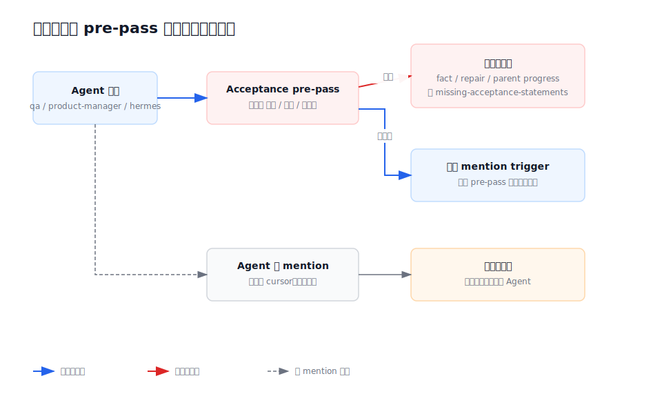

# 设计：local-console-primary-agent-closeout

## 方案

### 1. 控制模型从“验收抢占”改为“主 Agent 闭环”



当前 `processPending()` 在普通 mention trigger 前调用 `maybeProcessAcceptancePrePass()`。角色白名单与正文关键词可以把普通 Agent 消息升级为 `pass`、`fail`、`format-error` 或 `blocked`，成功写入后直接 `continue`，因此同消息 mention 不再进入正常触发链。没有 mention 的普通 Agent 回复则只推进 cursor，不再运行任何成员。


改造后的单一触发优先级：

1. 最新消息有合法 `@member`：运行该成员，显式交棒永远优先。
2. 最新消息来自用户且无 mention：运行当前团队主 Agent。
3. 最新消息来自非主 Agent 且无 mention：运行当前团队主 Agent，让它结合完整时间线自由收尾或继续派工。
4. 最新消息来自主 Agent 且无 mention：推进 cursor，本轮自然结束。
5. system 消息继续不是 trigger source。

runtime 不检查 Agent 正文是否包含“验收”“通过”“不通过”“完成”等业务词。测试与专业裁决只作为时间线内容交给下一位 Agent 阅读。

### 2. 复用快照首成员作为主 Agent 单一事实

桌面团队模型已经要求每支团队恰好有一名 `primaryAgentSlug`，`desktop/src/team-runtime-binding.ts` 的 `orderPrimaryFirst()` 在创建会话快照前把该成员排到首位，SQLite 又按 `sort_order` 原样持久化并在创建子会话时复制。因此 runtime 直接使用 snapshot 首成员即可识别当前主 Agent，不新增第二份持久化字段。

- 正常绑定会话：首成员来自已校验团队的主 Agent。
- 子会话：继承父会话的同序快照，主 Agent 不漂移。
- 团队切换：当前成员 run 完成后，pending snapshot 在下一条 Agent 回复被评估前整体替换；后续显式 mention 只在新团队名单内解析，没有可用显式目标时回到新团队主 Agent。即使刚完成的是旧团队主 Agent，新团队也按“当前步骤跑完再接管”的既有产品规则继续负责收尾。
- 未绑定 legacy 会话：继续按现有共享名单首成员兼容；不为此扩展产品承诺。

这样避免 `team.json.primaryAgentSlug`、snapshot 新字段与 `sort_order=0` 三份事实发生冲突，也不需要 SQLite migration。测试锁定“绑定、切换、子会话快照的首成员始终是主 Agent”这一现有跨模块契约。

### 3. 使用本地专用 prompt，而不是追加修补 GitHub prompt

当前 local runtime 复用 `buildRolePromptPlan()`，导致每个本地成员实际收到“你正在参与一个 GitHub Issue 共享时间线”的运行说明。仅在 persona 后追加主 Agent 规则会留下互相冲突的通道心智。

新增 `src/local-console/prompt.ts` 的纯 `buildLocalAgentPrompt()`，由 local runtime 独占使用；local 当前没有 role thread resume，因此不复制 GitHub `RolePromptPlan` 状态机，只组合成员 persona、当前本地 session 时间线和以下 runtime-owned context：

```text
本地团队上下文：
- 当前团队主 Agent：<primaryAgentSlug>
- 当前成员：<member slugs>
- 显式 @成员 表示继续交棒。
- 你不是主 Agent且没有明确下一位专业成员时，把控制权交回主 Agent。
- 你是主 Agent时，结合完整时间线决定继续派工、询问用户或无 mention 可见收尾。
```

这段上下文只表达团队结构与控制权，不替代用户可编辑的 `AGENT.md` 专业职责，也不规定固定角色顺序、固定验收阶段或固定措辞。它明确消息来自“本地对话 session”，不出现 GitHub issue/comment/reaction、role envelope 或 thread resume 说明。共享 `conversation.ts` 与 GitHub prompt 不改。

内置开发团队 persona 同步写入相同原则，让系统团队即使脱离 runtime 上下文阅读也自洽。

### 4. 移除本地程序化验收

实现删除：

- `src/local-console/acceptance-loop.ts` 及其 parser、blocked/reminder 文案和 decision builder。
- `LocalConsoleRuntime.maybeProcessAcceptancePrePass()`、上下文提取、evidence、repair descriptor 和调用入口。
- 本地 acceptance pre-pass 的生产调用接口、SQLite worker 写 handler、自动 `local_acceptance_facts` 写入、parent integration progress 与 acceptance repair child 创建。
- 只为上述行为存在的单元测试与 acceptance script cases。

保留：

- Agent 在自然语言中编写测试标准、检查步骤、通过/不通过意见和证据的自由。
- local child session 初始正文里的可选任务检查点；本地新结构化输出使用 `taskChecks?: string[]`，旧输出的 `acceptanceStatements` 仅作为兼容别名读取。两者都不存在时照常创建子会话；存在时在正文以“任务检查参考”展示，只作为 Agent 可读上下文，不被 runtime 提取成 formal acceptance scope。
- 已有数据库的 `local_acceptance_facts` 表与历史行，避免升级时破坏性删除用户数据；runtime 不再以它们驱动任何状态或路由。
- GitHub runner 的 acceptance、ledger 与相关 persona，因用户已明确本 change 不处理 GitHub。

`listLocalT5Facts()` 如仍被历史诊断或脚本兼容路径调用，可保留只读 legacy 字段，但新测试必须证明正常本地运行不会新增 acceptance fact。为避免一次性删除扩大迁移风险，纯 legacy table/schema/query 可以保留；生产 runtime 不再拥有写入口。

本地 child executor 目前复用 GitHub `parseCeoOrchestrationOutput()`，其 spawn/goal-intake descriptor 都强制 acceptance 字段。实现时给 parser 增加显式 caller policy，默认值保持 GitHub strict；只有 local caller 允许 canonical `taskChecks`、legacy `acceptanceStatements` 或空数组，并立即映射为 local descriptor。检查点沿用当前每任务最多 3 条的有界约束；新旧字段同时存在且内容冲突时明确拒绝，不静默猜优先级。这样不复制整套 parser，也不改变 GitHub runner 默认语义。受控 JSON 与 orchestration stage 仍只用于“创建子会话”这一明确副作用，不扩展成普通回复协议，更不承担通过/不通过裁决。

### 5. 内置开发团队规则

- 三份内置 persona 全部移除只适用于 GitHub issue 的共享时间线协议、role envelope、issue worktree 和 formal acceptance 治理，不再把本地 Agent 塞进已废弃通道的工作方式；保留本地仍在使用的 stage marker 生命周期契约。
- `dev-manager`：以本地团队主 Agent / 会话主理人为第一职责；接回任何成员结果后必须判断继续派工、询问用户或可见收尾。收尾不要求固定模板，也不以是否出现验收关键词为依据。
- `dev`：完成实现、说明证据后可以显式交给下一专业成员；没有明确下一成员时交回 `@dev-manager`。
- `qa`：自由给出测试设计、复核、通过或不通过意见；不要求固定“QA 结论”或“验收结论”机器格式。需要开发修复时显式交给 `@dev`，否则交回 `@dev-manager`。
- `team.json`：描述从“最终验收”调整为“方案、实现、测试、复核与主理收尾”，避免把验收暗示成必经阶段。

persona 以“结论先行、说明依据、明确下一步”为可读性原则，删掉固定验收走查、质量门裁决和 GitHub 评论模板；现有 stage marker 仍按原枚举输出。保留 marker 不是为了验收或路由，而是因为 `recordWorkspaceDiffIfNeeded()` 目前只在 `code-verified` 时生成 worktree diff；若未来要取消，应先另行把 diff 触发迁移到真实文件变化事实，不能在本 change 静默破坏。

用户团队的 `AGENT.md` 不被迁移或覆盖。runtime 结构兜底保证即使用户 persona 未写回主 Agent规则，非主 Agent 无 mention 时仍能回到当前团队主 Agent。

### 6. 一个控制流事实，不制造新的完成裁决

SQLite read model 从已有消息与 cursor 派生 `hasPendingControlWork`，不新增持久化状态或 migration：

- cursor 有 `active_message_id`；或
- `processed_through_message_id` 之后仍有可处理的 user/agent 消息；或
- 会话仍有真实 `running` 消息。

满足任一条件即为 `true`。同一会话只按一个布尔量计入 summary/project running 聚合，避免 active cursor 与 running message 重复计数。主 Agent 无 mention 回复被 claim 并推进 cursor 后变为 `false`；失败、卡住、停下等路径按现有事务推进或释放 cursor，同时继续由独立 anomaly facts 决定红点、重试和状态文案。

`hasPendingControlWork=false` 只表示控制流当前没有下一棒，不表示“任务完成”“质量通过”或“验收成立”。侧边栏蓝点、child `finished` 和结果卡片仍须同时遵守各自的 unread、异常、Git 可用性等既有条件，但不得再各自推导是否还有接力。这样不会用一个新布尔值换皮重建刚删除的验收系统。

### 7. 测试与 AI 验证流程

可测逻辑涉及 trigger 优先级、快照兼容和 cursor 推进，必须有单元测试：

1. 复现“报数”：QA 正文包含“测试与验收”“通过”“不通过”并显式 `@product-manager`，断言继续 product-manager，不出现 acceptance 系统消息，不新增 acceptance fact。
2. 非主 Agent无 mention：断言下一次 Codex role 是主 Agent。
3. 主 Agent无 mention：断言 cursor 推进且不再启动 Codex，避免自我循环。
4. 用户直接 `@qa`：QA 完成且无 mention 后仍运行主 Agent，证明当前版本没有直接点名例外。
5. 非主 Agent显式 `@dev`：显式交棒优先，不被强制提前拉回主 Agent。
6. 快照顺序：绑定、团队切换和子会话继承后，首成员始终是已校验主 Agent；未绑定 legacy 会话维持现有首成员兼容。
7. 重启发生在成员回复落库、主 Agent claim 之前：startup catch-up 只运行一次主 Agent，不重复成员回复。
8. 普通消息任意包含“验收”“通过”“不通过”：不产生程序状态副作用。
9. 接力状态：非主 Agent 无 mention 回复已落库但尚未被评估、或主 Agent run 已 claim 时，session summary 与 child card 仍为 running；主 Agent 无 mention 回复完成处理后才 idle/finished，并且蓝点只对应最终结果。
10. 本地 prompt：断言包含 local session、主 Agent 和成员上下文，不含“GitHub Issue 共享时间线”、GitHub comment/reaction 或 role envelope 指令。
11. local child 初始正文把共享 descriptor 的检查点显示为“任务检查参考”，不再使用 formal acceptance 标题或触发 parser。
12. local child descriptor 不含 `taskChecks` / `acceptanceStatements`：仍创建 child；含 legacy 字段时兼容显示为任务检查；同一输入在 GitHub strict caller 下仍因缺字段失败。
13. 运行中切换团队：旧团队当前成员跑完后，下一步由新团队名单解析；旧成员无可用显式交棒时回到新团队主 Agent，已完成步骤不重放。
14. 非成功终态：用户停下、run 没跑起来、卡住、项目/团队不可用时保留现有可见事实与重试路径，不伪造一条主 Agent 收尾，也不被 `hasPendingControlWork` 遮蔽或解释成成功。

AI 验证流程：

- 使用 fake local console server 执行“所有人依次报数”完整接力，输出角色调用顺序和时间线证据。
- 检查最终可见 Agent 是主 Agent，且其回复可自由总结“报数完毕”。
- 在最后一名专业成员回复后暂停主 Agent fake run，读取 session/sidebar/child summary，确认仍为进行中且没有提前蓝点或“已结束”。
- 同时读取结果卡片所消费的 `hasPendingControlWork`，确认主 Agent 完成前为 true、完成后为 false；不允许 UI 另用最后消息是否带 mention 复算。
- 查询 SQLite，确认 cursor 正常结束、没有新 acceptance fact、没有 `missing-acceptance-statements` 或格式诊断系统消息。
- 运行 `pnpm exec vitest run tests/local-console.test.ts`、更新后的本地 acceptance case、`pnpm typecheck` 与桌面 build。

## 权衡

- 选择主 Agent 结构兜底而不是完全依赖 `AGENT.md`：persona 是核心协作设计，但模型可能漏写 mention；“所有轮次最终回主 Agent”是用户已确认的产品不变量，runtime 应以团队结构保证。代价是每条非主 Agent 无 mention 回复都会多运行一次主 Agent。
- 选择快照首成员而不是新增 `primaryAgentSlug`：现有团队绑定已确保主 Agent 排第一，复用它能少一份 schema 与迁移；代价是该顺序契约必须在测试、类型注释和模块地图中明确，不能被未来排序重构悄悄破坏。
- 选择保留显式 mention 优先：允许成员按上下文自由接力，避免主 Agent 变成每一步都必须经过的中央转发器。只有接力自然停止时才回主 Agent。
- 选择一个后端 `hasPendingControlWork` 而不是为蓝点、子会话和结果卡片分别补条件：三者都需要先回答“还有没有接力”，分散推断会在团队接力或重启间隙产生互相矛盾的 UI；成功、失败和质量裁决仍是别的事实。
- 选择取消程序化验收而不是收紧关键词：任何自然语言启发式仍可能把讨论误判成控制事件；当前验收事实本身来自模型输出，保存为结构化行并不会提升真实性。
- 选择保留旧 SQLite 表：立即删表没有用户价值且不可恢复；停止运行时读写即可消除产品行为。代价是 schema 暂时保留一块 deprecated 数据。
- 选择给共享 orchestration parser 增加显式 local policy，而不是复制一套近似 parser：可以让 local 的任务检查可选，同时用默认 strict 保持 GitHub 行为；代价是共享函数必须有双 caller 契约测试，防止 local policy 被误传给 runner。
- 选择延期 JSON 裁决：显式 schema 能解决“Agent 声明了什么”的机器可读性，但不能单独证明声明真实；taskId、权限、证据、幂等与错误路径需要独立产品设计，不在本 change 仓促固化。

## 风险

- 主 Agent 额外运行增加耗时与 token 成本。缓解：只在非主 Agent 无显式下一棒时触发；成员间正常显式接力不经过主 Agent。
- 主 Agent 可能收到结果后再次派给刚完成的成员形成模型级循环。缓解：prompt 明确完整时间线与收尾责任；测试覆盖主 Agent无 mention 结束；未来若出现真实循环再独立设计有界防护，不在本 change 猜测业务完成条件。
- 旧用户团队 persona 可能仍写“正式验收”流程。缓解：不修改用户文件，但 runtime 不再解析这些文本；用户可在团队页自行调整 persona。
- 旧 acceptance facts 与新行为并存可能让诊断脚本误读。缓解：标记为 legacy，只按创建时间审计，不用于新路由；更新 roadmap 与脚本说明产品决策已取代旧证据。
- local runtime 当前复用共享 GitHub prompt builder，直接修改会意外改变 GitHub 语义。缓解：新增 local-only prompt 纯函数，`conversation.ts` 与 GitHub runner不改。
- cursor 位点与 UI 会话状态目前不是同一读模型，可能在主 Agent 接回前提前显示 idle/蓝点/child finished。缓解：session summary 把 cursor 后尚未评估的 trigger source 和 active claim 计入运行中，并补 selected session、sidebar 与 child summary 联合测试。
- `main-conversation-evidence-outlets` 仍计划用 `lastMessageMentionsAgent` 判断结果卡片，若并行实现会在主 Agent claim 前提前出卡。缓解：先交付本 change 的 `hasPendingControlWork`，结果卡片 change 只消费该事实；评审时禁止第二套 UI 推断。

回滚时可以恢复 acceptance pre-pass 调用与 parser，并关闭“非主 Agent无 mention 回主 Agent”分支；本方案不新增团队快照 schema，也不删除旧验收表，无需回滚数据库。
