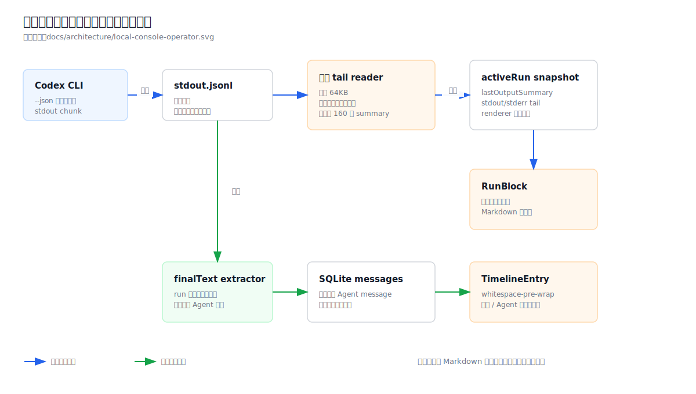

# 设计：main-conversation-streamdown-markdown

## 方案

架构基线：`docs/architecture/local-console-operator.svg` 与 `docs/architecture/module-map.md` 的 `local-console` / `console-ui` / `desktop-shell` 边界。

### 1. 保留“一次 run 一条活动记录”的产品模型



现状链路把 Codex stdout 全量写入 `stdout.jsonl`，local state API 每秒从最近 64KB tail 里递归找一段文本并折叠为 160 字摘要，`RunBlock` 只显示这行纯文本。运行完成后，最终 Agent 文本才以一条 SQLite 消息进入时间线；用户和 Agent 历史正文仍是纯文本。


改造后仍只有两类事实：

- **活动事实**：内存中的 `ActiveLocalRun.liveMarkdown`，生命周期绑定 `runId`，只供当前 snapshot 使用。
- **历史事实**：现有 SQLite 中最终落库的 user / agent / system messages。

活动事实绝不追加到 `session_messages`。同一 run 收到第二、第三段可见 Agent Markdown 时只替换 `liveMarkdown`；run 成功后仍只调用一次 `recordAgentResponse(finalText)`。因此 JSONL 事件数、工具调用数和 UI 消息数没有一一映射关系。

### 2. Codex 可见事件适配

在 `CodexRunOptions` 增加窄回调，例如 `onVisibleAgentMarkdown?: (text: string) => void`。JSONL event schema 不离开 Codex driver。`run()` 在继续原样 pipe stdout 到文件的同时，用独立的增量行 framer 只处理已经换行闭合的 JSON：

1. chunk 与上次残留拼接；
2. 逐条解析完整行；
3. malformed 行忽略并继续写文件，不影响 watchdog 或最终解析；
4. 未闭合尾行保留到下一 chunk，但单行缓存设置明确上限（默认 1 MiB）；超限后丢弃到下一换行、记录 diagnostic，不能无限占用内存；
5. driver 内部识别可见 Agent 事件后只把文本交给窄回调；回调异常被隔离和记录，不能让 Codex run 失败。

新增纯函数 `extractVisibleAgentMarkdown(event)`，当前只接受已知的 Agent 可见完整事件（实测为 `item.completed` + `item.type=agent_message`），返回其完整 `item.text`。它必须拒绝 command execution、reasoning、error、token usage、thread/turn 生命周期事件和空文本。未知 delta 格式不猜测、不拼接；将来 CLI 提供正式 delta contract 时在这个适配器内扩展。

local runtime 在建立 `ActiveLocalRun` 后把回调传给 driver。每次提取成功只更新对应 session + runId 的当前 `liveMarkdown`；若 run 已结束、被替换或回调属于 stale run，则忽略。active snapshot 新增 `liveMarkdown: string | null`，仍保留 `lastOutputSummary` 与 tail diagnostic 作为无可见消息时的确定性降级和开发诊断。

选择 driver 回调而不是每秒从 64KB tail 重建 Markdown：长命令输出可能把此前 Agent 进度段挤出 tail；全量重读又会让 state API 随 run 增长。内存只保留最新段既符合 PRD，也把空间固定为 O(当前段长度)。

### 3. 共享 Markdown renderer

在 `packages/console-ui/src/console/markdown-message.tsx` 提供一个唯一组件：

```text
MarkdownMessage
├─ content: string
├─ mode: static | streaming
├─ onOpenExternalLink?: (url) => void
└─ density: conversation | live
```

- `TimelineEntry` 的 user / agent body 使用 `mode="static"`。
- `RunBlock` 接收 `liveMarkdown`；存在时使用 `mode="streaming"` 与 `isAnimating=true`，不存在时把安全的人话 summary 当普通 Markdown 降级显示。
- system records、RunOutcome、SubSessionCard 与结果卡片继续走结构化组件，不进入 Streamdown。
- 若 `AgentMessage` 的展开正文仍作为入口存在，其完整正文同样调用 `MarkdownMessage`，不再用 `<pre>` 自建第二套渲染。

活动节点由 `activeRun.runId` 稳定标识。一次一秒 refresh 只 rerender 节点内容，不向 `messages.map()` 插入虚拟消息。完成 snapshot 必须满足二选一：活动 run 可见，或最终 agent message 可见；组件测试覆盖从前者切到后者时最终正文只出现一次。

### 4. Streamdown 能力与样式

依赖放在 `@moebius/console-ui`：

- `streamdown`
- `rehype-harden`：作为直接依赖提供显式 URL 协议与 prefix 配置，不从 Streamdown 的传递依赖偷 import。
- `@streamdown/code`：Shiki 代码高亮、复制和下载；语言按需加载。
- `@streamdown/cjk`：CJK 标点旁强调、删除线和自动链接边界。
- `@streamdown/math`：KaTeX + MathML；保持 `$$...$$` 缺省语法，避免金额 `$5` 被误判。
- `@streamdown/mermaid`：代码 fence 闭合后渲染；流式未闭合时不执行昂贵绘制。

Tailwind v3 `content` 增加 monorepo 根 `node_modules` 下 Streamdown 与四个插件的 dist globs；全局样式入口引入 Streamdown 和 KaTeX CSS。优先用 `[data-streamdown]` 选择器与 CSS 变量接入既有 `ink/sub/line/card/sunken/accent` 令牌，不覆盖 `components.code` 等完整插件管线。

版式约束：

- 标题层级在消息内降一级视觉重量，不能盖过会话标题。
- 段落、列表和引用保持 24px 正文行高；相邻 block 有稳定节奏。
- 表格和 fenced code 在自身容器横向滚动，不撑宽 760px 时间线。
- 图片响应式限宽并保留原比例；下载控件仅在 Streamdown 已提供且不处于 streaming 时出现。
- 流式 caret/动画只属于活动 run；历史消息使用 static mode，避免重开会话时重新动画。

### 5. 安全边界

不直接使用 Streamdown 的宽松默认 harden 配置。共享 renderer 显式组合：

1. `rehype-raw` 允许支持范围内的 HTML 进入 AST；
2. `rehype-sanitize` 使用安全 schema 删除 script、iframe、事件属性和危险节点；
3. `rehype-harden` 只允许链接协议 `http` / `https` / `mailto`，图片协议 `http` / `https`，`allowDataImages=false`；
4. Mermaid config 使用 `securityLevel: "strict"`。

链接点击使用 Streamdown link-safety 的 custom modal/handler（以安装版本公开类型为准）或等价的组件内确认；确认路径必须阻止默认导航并调用 `onOpenExternalLink(url)`。desktop app 经 preload 的单用途 IPC 交给 main。主进程用 `new URL()` 再次验证绝对 URL 与协议，只允许 `http:`、`https:`、`mailto:`，然后调用 `shell.openExternal`。无回调的 Storybook/测试环境只允许复制链接，不直接导航。

主 BrowserWindow 同时设置 `setWindowOpenHandler(() => ({ action: "deny" }))`，并阻止非应用自身 `file:` URL 的 top-level navigation，形成 renderer、IPC、窗口三层边界。Markdown 不获得本地文件打开能力；`file:`、相对本地路径、`data:`、`javascript:` 和应用自定义 scheme 都显示为不可执行内容。

### 6. 性能与降级

- 保留现有一秒 state polling，本 change 不引入 SSE/WebSocket，也不改变 selection refresh single-flight。
- runtime 只保留最新 Agent 段，不累计全部 commentary；完整 stdout/stderr 仍在 runDir 和右侧过程入口。
- Streamdown streaming mode 只用于一个活动节点；历史消息 static mode 使用其简化渲染路径。
- JSONL 尚无可见 Agent 消息、malformed、tail missing 或回调未注入时，显示现有确定性 summary；不能显示空白 run。
- Markdown 某个插件失败时必须局部降级为源码或普通 code fence，不能让整条时间线崩溃。

### 7. 测试与 AI 验证流程

可测逻辑与跨文件契约触发单元测试门槛。

**driver / local-console 单元测试**：

1. chunk 从 JSON 行中间断开，下一 chunk 补齐后只回调一次完整事件；单行超过 1 MiB 时有界丢弃并可继续处理下一行。
2. malformed 行、空行、半条尾行和未知 event 不阻断后续合法事件。
3. 实测八事件序列只提取两段 `agent_message`，命令与生命周期事件不成为消息。
4. 同一 run 的第二段覆盖第一段，active snapshot 始终只有一个 `liveMarkdown`。
5. stale run 回调被忽略；中断、失败和完成后不残留 live Markdown。
6. 最终 `recordAgentResponse` 仍只写一次，用户 + Agent 消息数量不随事件数增长。
7. 无 Agent 可见段、tail 缺失、超时或不可解析时保留非空 summary。

**console-ui / desktop 单元测试**：

1. 用户与 Agent 静态消息渲染标题、强调、引用、列表、链接、图片、inline/fenced code。
2. GFM 表格、任务列表、删除线、自动链接和脚注可见。
3. CJK 标点边界、Shiki、KaTeX 和 Mermaid 各有一个 fixture；未闭合 Mermaid 在 streaming 中不执行图表。
4. rerender 同一 `runId` 时活动记录 DOM 数量保持一，正文原地变化；完成切换后只见一份最终正文。
5. system facts 即使含 Markdown 标记也不被解释成标题、链接或图片。
6. script、iframe、事件属性、`javascript:`、`data:`、`file:` 和自定义协议不可执行；合法 URL 只触发确认与回调。
7. desktop IPC 对合法 `http/https/mailto` 调用一次 `shell.openExternal`，非法、相对或 malformed URL 不调用；主窗口拒绝新窗口和外部 top-level 导航。
8. 长表格、代码和图片不撑宽时间线；键盘能触达链接确认、复制和 Mermaid 控件。

**AI 验证**：

- 新增 Storybook “Markdown capability matrix” 与“live replacement” stories，覆盖用户、Agent、活动 run、暗/亮主题和 760px / 窄窗。
- 用 Playwright 让同一活动 run 依次显示进度 Markdown 与最终 Markdown，截图并断言时间线活动行数量始终为一、结束后最终正文只出现一次。
- 运行 `pnpm --filter @moebius/console-ui test`、Storybook build、desktop build、`pnpm typecheck`。
- 检查 desktop renderer bundle 中不残留未处理的 Streamdown/Tailwind 指令，打开实际 Electron 窗口验证代码复制、表格横滚、公式、Mermaid 和安全外链。

## 权衡

- 选择 Streamdown 全插件而不是只做基础 Markdown：用户已明确希望覆盖 Streamdown 支持且当前容易接入的能力；统一插件管线比之后逐个迁移更少重复样式和测试。代价是 bundle 增大，尤其是 Mermaid、Shiki 与 KaTeX，因此构建验收必须记录产物变化并确认首屏无明显阻塞。
- 选择 item-level live 而不是假装 token streaming：当前 CLI 实测只发完整 `agent_message` item。按真实事件更新不会制造视觉错觉，也为未来正式 delta contract 留出适配点。
- 选择内存缓存最新段而不是持久化 commentary：PRD 明确最新一句只用于在场感，完整过程已有 runDir；持久化会膨胀消息、改变重启语义并和最终回复重复。
- 选择允许 sanitized raw HTML 而不是完全禁用：它是 Streamdown 支持能力之一，sanitize + harden 能保留安全标签；代价是安全配置必须显式测试，不能跟随库的宽松默认漂移。
- 选择受控 IPC 打开链接而不是普通 `<a target="_blank">`：Electron renderer 不应取得窗口或本地协议导航能力。代价是一条窄 IPC 和主进程校验，但它是桌面安全所需而非 UI 便利逻辑。

## 风险

- Mermaid、Shiki、KaTeX 增加构建体积和启动成本。缓解：遵循插件的 lazy/cached 路径，只有实际语法才执行昂贵渲染；若验收发现首屏回归，优先动态加载插件而不是砍掉语法承诺。
- Streamdown 版本升级可能改变默认插件、安全或 class 名。缓解：锁文件固定解析版本，显式提供 harden 配置，并以 DOM/行为测试而非内部 class 名作为主判据。
- driver 增量 line framer 若处理不当会重复或漏事件。缓解：纯函数 chunk 测试覆盖断行、多行、malformed 与 final flush；最终文本仍由现有文件解析独立兜底。
- 活动 run 与最终消息可能在 refresh 边界短暂重复。缓解：server snapshot 保持 active map 删除与 response 落库的现有顺序，组件用状态切换测试锁定二选一呈现。
- 远程图片仍可能产生隐私请求。缓解：只允许 http/https、禁止 data/local scheme，并在产品文案与后续设置中保留“是否默认加载远程图片”的扩展点；本 change 不做代理或缓存。

回滚时可让 `TimelineEntry` 与 `RunBlock` 回到纯文本、停止传递 `liveMarkdown` 并移除外链 IPC；SQLite schema 与历史消息没有变化，不需要数据迁移或回滚。
