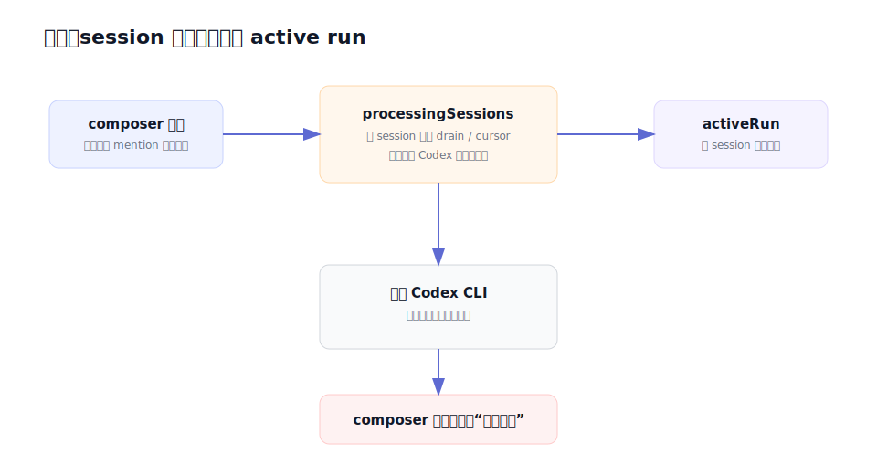
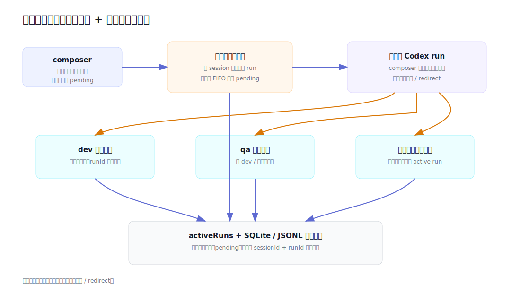

# 设计：multi-agent-primary-control-lanes

## 现状与改造后

架构基线取自 `docs/architecture/local-console-primary-agent-closeout.svg`；本 change 不引用其他 change 的图。

## 方案

### 1. 两类车道

- 每个 session 最多一个主理人 run。所有用户消息都以主理人为目标；用户正文中的成员 mention 只作为主理人可读意图，不在入站时改写目标。
- 每个专业成员最多一个活动 run，不同专业成员可以并行。runtime 用 `runId` 注册活动 run，并额外以 `sessionId + role` 约束同成员串行。
- 主理人输出的合法 mention 形成专业成员执行任务；目标成员已有活动 run 时先发出 redirect abort，旧 run 收敛终态后再启动新 run。

### 2. 待发射区复用 pending 消息事实

- 主理人活动期间提交的用户消息仍原子 claim 正文与附件，但保持 `pending`，不进入主时间线渲染；state 把它们作为 `pendingPrimaryMessages` 返回。
- 主理人空闲时 session drain 领取最早 pending 并把它变成 running；此刻该用户消息才进入主时间线。
- 多条 pending 保持 FIFO。主理人每次终态后只自动启动下一条，避免未处理内容一次性全部进入时间线。
- 进程重启后没有真实主理人 run 时，startup catch-up 会继续领取最早 pending。

### 3. 活动 run 投影

- API 主事实由 `activeRun` 升为 `activeRuns`，每项包含 role、runId、live Markdown、输出入口和 interruptible。
- 兼容字段 `activeRun` 暂时投影为主理人 run；没有主理人时为 `null`，不得回退指向专业成员。
- UI 按启动顺序渲染所有活动 run；主理人行不显示停止，专业成员行显示绑定该 runId 的停止。
- composer 只读取主理人 run：主理人运行时固定显示方形停止；草稿可发送时同时显示发送动作。

### 4. 停止与竞态

- 中断请求继续要求精确 `sessionId + runId`。runtime 在全量 active run 注册表中匹配，不再按 session 推断唯一 run。
- 202 表示已向仍活动的精确 run 发出 abort；409 表示该 run 已终态或从未匹配。desktop 在 409 后刷新事实，但不得把真正的目标不匹配永久吞成成功。
- 每条 run 自己产生 interrupted/failed/stuck/completed 终态；停止专业成员不释放主理人 pending，停止主理人会触发下一条 pending。

### 5. 兼容与恢复

- 现有单 run 状态消费者在迁移期继续读取主理人兼容投影。
- 重启修复必须把所有持久化 running run 识别为 orphan，而不是只处理每 session 一条。
- session/project 的 `runningCount` 和 `hasPendingControlWork` 同时覆盖所有活动 run 与主理人 pending，不把并行专业成员误判成已结束。

## 权衡

- 选择“主理人控制车道 + 每成员执行车道”，放弃 session 全局串行。它符合多 Agent 产品心智，但同一直接工作空间中的多个写成员可能产生文件级竞争；产品不伪装成隔离事务，团队 persona 与主理人负责避免冲突，独立工作空间仍只隔离会话而不隔离同会话成员。
- pending 复用已持久化消息与附件 claim，而不建立 renderer-only 队列。代价是 API 必须明确区分“待发射”和“已进入时间线”，收益是刷新、重启和附件生命周期不丢失。
- 保留 `activeRun` 兼容投影，避免一次性打断辅助页面与旧测试；新代码必须使用 `activeRuns`，兼容字段后续单独移除。

## 风险

- 全局 cursor 与并行 worker 完成顺序可能交错。实现必须让 worker 执行脱离主理人 drain，同时把其最终回复重新作为主理人可见输入，不允许两个执行者竞争同一 cursor claim。
- 主理人终态、用户提交与 worker 完成可同时发生。所有状态写仍经 store 串行写者，调度唤醒必须幂等。
- 同成员 redirect 需要等待旧 run 真正退出后再启动；仅调用 `AbortController.abort()` 不能视为已停止。
- 回滚时可以让 runtime 重新只消费兼容 `activeRun`，但不得删除已经落库的 pending 用户消息或运行终态。
