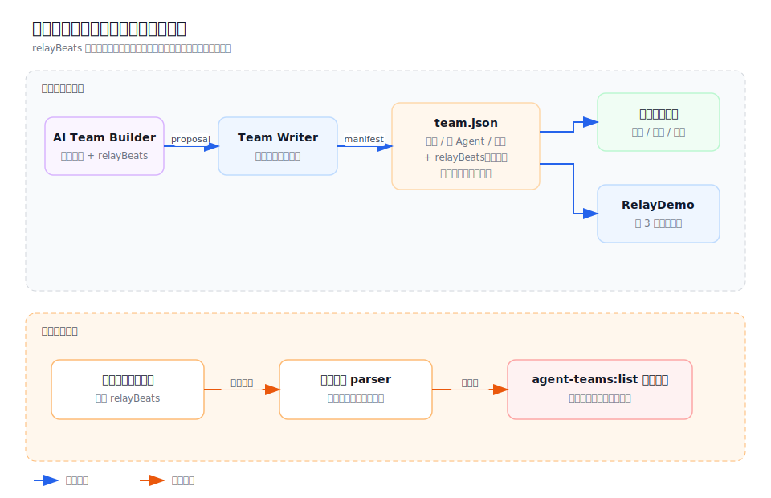
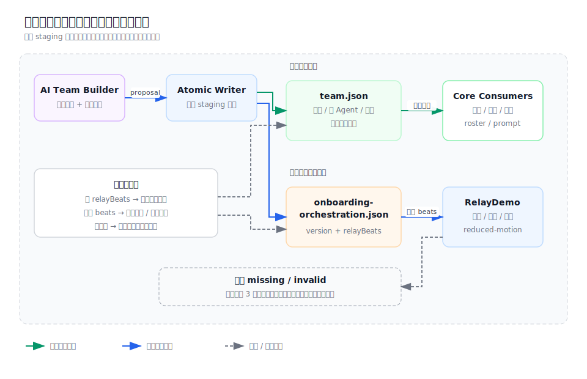

# 设计：separate-onboarding-orchestration

## 架构快照

基线：`docs/architecture/desktop-shell.svg` 与 `docs/architecture/module-map.md#desktop-shell`。





## 方案

### 1. 团队核心与引导编排分成两份 schema

`team.json` 只保留已经由 `openspec/specs/desktop-shell/spec.md` 规定的核心字段：

```json
{
  "name": "开发团队",
  "description": "规划、开发、审查与验收软件项目",
  "primaryAgentSlug": "manager",
  "memberOrder": ["manager", "developer", "qa"]
}
```

同目录新增可选的 `onboarding-orchestration.json`：

```json
{
  "version": 1,
  "relayBeats": [
    { "speakerSlug": "manager", "message": "先拆解目标并安排下一步。" },
    { "speakerSlug": "developer", "message": "定位问题并完成修改。" }
  ]
}
```

独立 parser 负责：

- 只接受已知顶层字段与 `version: 1`。
- `relayBeats` 必须是非空数组。
- 每拍只接受 `speakerSlug` 与非空 `message`。
- `speakerSlug` 必须属于当前核心定义的 `memberOrder`。
- 返回显式的 `ready | missing | invalid` 读取结果；不得把缺失/损坏转换成 `TeamDefinitionError`。

### 2. 核心团队读取不依赖编排

`readTeamSnapshot()` 继续只以 `team.json`、成员目录与 `AGENT.md` 判定 `usable | unfinished-draft | needs-repair`。编排 adapter 在团队列表 IPC 投影 renderer DTO 时单独读取：

- `ready`：携带 beats，正常播放。
- `missing | invalid`：携带安全的 unavailable 状态，不附内部路径或 parser 原文。

团队记录的 `lastKnownDefinition` 只缓存核心定义。身份指纹只哈希核心定义与按成员顺序读取的 `AGENT.md`。本地 session roster、主 Agent 解析和 Codex prompt 均不 import 编排模块。

### 3. 两代历史数据兼容

核心 manifest decoder 对旧内嵌 `relayBeats` 做窄兼容：

- 字段缺失：按纯核心团队读取。
- 字段存在：从核心返回值中剥离；即使其形状损坏也不让团队进入 `needs-repair`。
- 编排 adapter 仅在独立文件缺失时尝试把合法的内嵌值作为过渡读取源；独立文件存在时始终以独立文件为准。

用户团队下一次发生团队定义写入时，store 在覆盖 `team.json` 前执行安全迁移：

1. 若独立文件缺失且旧内嵌编排合法，先原子写 `onboarding-orchestration.json`。
2. 再用核心 serializer 原子覆盖 `team.json`，移除内嵌字段。
3. 任一步失败则本次团队定义写入失败；旧 manifest 仍可兼容读取，不丢演示。

记录缓存解析同样剥离缺失或内嵌字段，防止 `agent-teams:list` 在读取磁盘快照之前整体失败。新记录写回不再包含编排。

### 4. 身份指纹兼容

新指纹算法固定为：

```text
sha256(serializeCoreTeamDefinition + ordered AGENT.md contents)
```

重定位旧记录时：

1. 先比较新核心指纹。
2. 若记录缓存含旧内嵌编排，再用缓存中的合法 beats 计算一次旧版候选指纹。
3. 任一匹配即可确认同一团队；成功后记录只保存新核心定义与新核心指纹。

这个兼容只用于读取既有记录，不让新写入继续依赖演示数据。

### 5. AI 创建保持整支目录原子可见

AI builder 的 output schema 与 validator 继续要求非空 `relayBeats`，因为它仍是 onboarding 第 3 步的必要方案产物。writer 在同一个 staging 目录写：

```text
team.json
onboarding-orchestration.json
members/<slug>/AGENT.md
```

提交前分别用核心 parser、编排 parser 与成员 parser 完整重读；全部通过后才 rename 成正式团队目录并登记。AI builder DTO 可继续把 beats 留在 proposal 中供方案卡展示，但正式团队列表只能从独立编排 adapter 取得它。

### 6. 引导局部失败，不做错误回退

正常 `RelayDemo` 的 8–12 秒时序、连接线语义、重播和 reduced-motion 不变。编排状态不是 `ready` 时，演示卡替换为固定局部空态：

```text
┌ 接力演示 · 所选团队 ─────────────────┐
│                                      │
│  暂无可播放的协作示例                │
│  不影响这支团队的实际使用            │
│                                      │
└──────────────────────────────────────┘
              [ 上一步 ] [ 继续 ]
```

“继续”始终可用。页面不得加载开发团队脚本、伪造 beats、把内部文件名/路径暴露给 renderer，或让异常穿透到 React 根节点。

## 单元测试用例

1. 旧 `team.json` 和 v2 记录都没有 `relayBeats`：团队保持 usable，列表返回 ready，记录写回不含编排。
2. 最近版 `team.json` / 缓存内嵌合法 beats：核心定义成功剥离，独立文件缺失时引导演示仍能读取；下一次团队定义写入按“独立文件先、核心文件后”迁移。
3. 内嵌 beats 损坏：团队核心仍 usable，引导编排为 invalid，不抛 `TeamDefinitionError`。
4. 独立文件合法：优先于内嵌旧值并校验 speaker 属于成员。
5. 独立文件缺失、JSON 损坏、未知版本、越界 speaker：团队状态与身份指纹不变，renderer DTO 只得到 unavailable。
6. 旧记录指纹包含内嵌 beats：重定位接受旧算法一次，随后写回新核心指纹；不同团队仍拒绝。
7. AI writer 成功时同时生成三个类别的文件并完整重读；任一独立编排写入/校验失败时不暴露正式目录或登记记录。
8. 普通空白团队不写独立编排也仍可用于真实会话。
9. RelayDemo 对 ready 编排保持现有动画断言；missing/invalid 显示局部空态且“继续”可用。

## AI 验证流程

1. 用临时 data root 准备一个升级前团队及 `.agent-team-records.json`，运行 desktop 团队列表测试，确认不再出现 `relayBeats must be an array`。
2. 构建 desktop renderer，进入 onboarding 第 3 步验证内置开发团队仍播放原 6 拍、AI 团队播放自己的方案。
3. 选择一个没有独立编排文件的旧团队，截图确认局部空态、顶底布局不变且“继续”可点击。
4. 运行 desktop 定向测试、console-ui relay tests、`pnpm typecheck`；风险允许时再运行完整 `pnpm test`。

## 权衡

- 选择随团队目录保存独立文件，而不是放在全局 onboarding 状态：复制团队与 AI staging rename 可以自然携带示例，同时不会把 data root 级状态与团队 id 重新耦合。
- 文件名使用 `onboarding-orchestration.json`，明确它是展示制品；不使用泛化的 `workflow.json`，避免未来把示例误当真实执行协议。
- 不为无编排旧团队自动调用 Codex 或合成通用脚本：这会增加首启延迟、失败面并可能伪造团队实际职责。透明局部空态比错误演示更可信。
- 不让独立文件参与身份指纹：重定位身份应由团队核心与成员内容决定，展示脚本变化不应让同一团队变成“另一支团队”。

## 风险

- 兼容 decoder 若过宽会掩盖真正的核心字段损坏；实现必须只对 `relayBeats` 做窄剥离，其余未知字段继续拒绝。
- 两文件迁移无法获得跨文件系统事务；采用“先写独立文件、再改核心文件”保证崩溃时最多暂时重复，不会丢失已有演示。
- 团队成员后续修改可能让旧演示越界；因为演示不是运行规则，读取时显式判 invalid 并局部空态，不反向把团队标成需要修复。
- renderer DTO 若继续只用可选数组无法区分 missing 与 invalid；实现应使用明确状态而不是靠 `undefined` 猜测。
