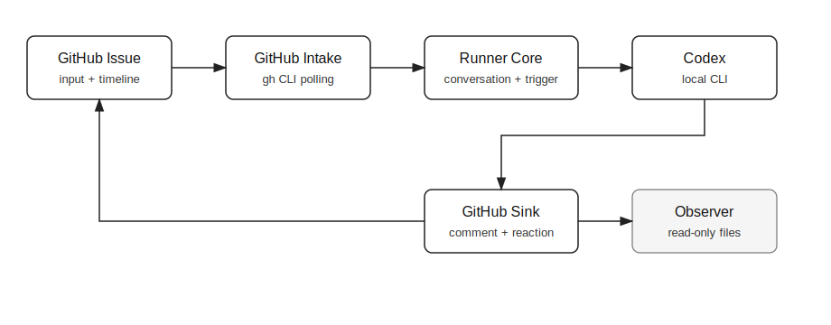
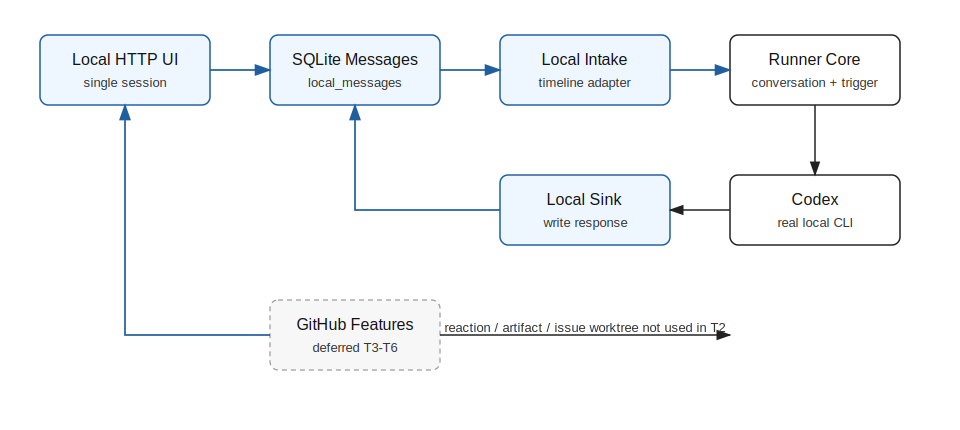

# 设计：local-console-t2-e2e-spike

## 方案





本轮采用“runner 外圈新增 local adapter”的最小垂直切片，不改 `conversation`、`triggers`、`codex` 的业务语义。

### 模块边界

新增建议模块：

- `src/local-console/server.ts`：loopback HTTP server，提供静态极简页面与 JSON API；不理解 Codex 细节。
- `src/local-console/store.ts`：SQLite schema、读写消息、状态迁移；所有本地消息状态从这里进出。
- `src/local-console/intake.ts`：读取待处理 user 消息，构造 local timeline，调用 mention trigger，生成待运行 job。
- `src/local-console/sink.ts`：把 Codex final response / failure 写回 SQLite。
- `src/local-console/runtime.ts`：单会话执行协调，保证同一会话串行；提交 Codex job 后把状态从 `pending` 推进到 `running` / `completed` / `failed`。
- `src/local-console/public/*` 或内联 renderer：极简 HTML/CSS/JS 页面，展示消息列表、运行状态和输入框。

`src/runner.ts` 只做装配：

- 启动现有 GitHub heartbeat。
- 同进程启动 local console server。
- 注入 agent discovery、mention trigger、Codex runner、driver pool 或串行执行器。
- 进程退出时关闭 local console server。

### 最小 SQLite 表

本轮只建单表，单会话但保留 `session_id`，方便 T3 升级：

```sql
CREATE TABLE IF NOT EXISTS local_messages (
  id INTEGER PRIMARY KEY AUTOINCREMENT,
  session_id TEXT NOT NULL,
  speaker TEXT NOT NULL,
  role TEXT,
  body TEXT NOT NULL,
  status TEXT NOT NULL,
  run_id TEXT,
  run_dir TEXT,
  error TEXT,
  created_at TEXT NOT NULL,
  updated_at TEXT NOT NULL
);
```

字段口径：

- `speaker`：`user`、`agent`、`system`。
- `role`：agent 消息的角色名；user / system 可为空。
- `status`：user 消息使用 `pending`、`running`、`completed`、`failed`；agent / system 消息使用 `displayed`。
- `run_id`：本地生成的 run 标识，用于把 user 消息、agent 回复和 Codex runDir 串起来。
- `run_dir`：Codex run directory 的 worktree 相对不可用，本轮只在本地 UI / 验收证据中显示路径摘要；不发布 artifact。

### Store 有界性与故障分支

SQLite store 是 T2 的本地输入源与输出汇，必须满足 L1 / S1 / V1：

- Store adapter 对 runtime 暴露异步接口，所有调用都通过 `LOCAL_CONSOLE_STORE_TIMEOUT_MS` 包装；建议默认 2 秒。
- 如果采用 `node:sqlite`，实现必须证明 store timeout 能覆盖测试注入的永久挂起；否则需要把同步 SQLite 调用隔离到 worker，或改用可异步取消 / 有 busy timeout 的 SQLite 依赖。
- SQLite connection 必须设置短 `busy_timeout`；`SQLITE_BUSY`、只读数据库、建表失败、写入失败都按 store failure 处理。
- `POST /api/local-console/messages` 写入 user 消息失败或超时：HTTP 返回 503 或等价可见错误；不得启动 Codex；不得伪造 completed 状态。
- `claimNextPendingMessage` 必须用原子条件更新把 `pending` 改为 `running` 并写入 `run_id`；claim 失败或超时不得启动 Codex。
- Codex 成功后的 sink 写回必须在一个受控写入序列中完成：追加 agent 消息，再把 user 消息标记为 `completed`。任一写入失败时不得标记 completed；runtime 尝试把 user 消息标记为 `failed` 并写 system error。
- 如果失败时连 failed / system error 都写不回，runtime 仍必须释放内存 session lock，并让页面 / API 在后续读取失败时显示 store error，而不是永久显示 running。
- 启动 local runtime 和每轮 poll 时执行 stale running 修复：超过 `CODEX_RUN_MAX_DURATION_MS + grace` 仍为 `running` 的消息标为 `failed` 或追加 system error；避免进程崩溃或 sink 写失败后页面永久卡住。

### 本地通道协议

HTTP 只监听 `127.0.0.1`：

- `GET /`：返回极简本地页面。
- `GET /api/local-console/messages`：返回当前单会话消息、运行状态、server 端口和 SQLite 路径摘要。
- `POST /api/local-console/messages`：接收 `{ "body": "..." }`，写入 `speaker=user,status=pending` 消息。

页面以 1 秒轮询刷新；本轮不做 WebSocket / SSE。输入框不做完整 `@` 补全，只保留“提交文本”能力；合法 mention 仍由 `conversation` 的 parser 和 mention trigger 裁决。

同一 session 运行中时，本轮选择“拒绝第二条提交”而不是排队：UI 禁用发送按钮，API 收到第二条 `POST` 返回 409 与可见错误摘要。这样最小化并发状态机，且能机械证明同一 session 同时最多一个 Codex run。

### 本地 timeline 适配

SQLite 消息按 `id` 升序映射为共享时间线：

- 第一条 user 消息映射为 `issue-body` 等价消息，index 为 0。
- 后续消息映射为 `comment` 等价消息，index 从 1 递增。
- agent 消息写入时使用现有 `formatAgentComment(role, finalText)` envelope，再交给 `buildTimeline()` 归一化；这样 speaker 识别规则与 GitHub 路径一致。

这保留“共享时间线 + speaker + mention trigger”的核心语义，同时避免在 T2 新增完整 session domain model。

### Codex 执行

local intake 命中 agent 后：

1. 读取 `agents/<role>.md`。
2. 使用 agent manifest parser 去掉 frontmatter，取 persona body 生成 prompt。
3. 使用现有 `buildRolePromptPlan()` 的 full prompt 形态调用 Codex；T2 不保存 role thread，不做 resume。
4. 调用 `runCodex()`，使用 `makeRunDir()` 生成 run directory。
5. 成功时通过 local sink 写入 agent 消息；失败时写入 system error 消息并把 user 消息标记为 `failed`。

无论 Codex 成功、失败、idle timeout、max-duration timeout 或 adapter 抛错，local runtime 都必须在 `finally` 分支释放 session lock。Codex timeout 类失败写入页面可见的 failed / system error，并保留 `run_dir`，供 code-verified 阶段引用 stdout / stderr 摘要。

T2 明确不执行 GitHub issue worktree capability：本地消息没有 GitHub issue source，无法创建 issue worktree。Codex cwd 使用项目根目录或 runner 进程 cwd。该缺口作为 spike 结论回流 T3/T4：本地会话需要重新定义 workspace capability 的 source key。

### GitHub 零调用边界

端到端验收必须使用 fake `gh`：

- 在临时目录创建 fake `gh` 可执行文件，任何调用都会向日志写入 argv。
- 以空 repository 配置的数据根启动 `pnpm start`，PATH 前置 fake `gh`。
- 打开 local console，发送本地消息。
- 等待真实 Codex 回复显示。
- 断言 fake `gh` 调用日志不存在或为空。

本轮不能用“单元 mock 没调用 github.ts”替代该验收；单元测试只负责保护纯逻辑，最终 code-verified 必须附 fake `gh` 零调用日志、Codex run 输出和本地界面截图。

### 测试设计

单元测试：

- SQLite store 建表、插入 user 消息、状态迁移、agent 回复追加。
- Store 写入快速失败、busy / timeout、claim 失败、sink 写回失败时的状态与错误可见分支。
- local timeline adapter 对 user / agent envelope 的 speaker 归一化。
- local intake 对无 mention 消息不调用 Codex，对合法 mention 生成 run job。
- local sink 成功 / 失败写回状态。
- stale running 修复把过期 running 消息转为 failed 或 system error。

集成测试：

- 使用 fake Codex adapter 跑本地 HTTP API 级闭环，验证 POST 消息后最终 GET 能看到 agent 回复。
- 使用 fake `gh` 前置 PATH，验证本地 API 级闭环不产生 `gh` 调用。
- 注入 never-resolving store / fake Codex，验证 local runtime 有界失败并释放 session。
- 注入慢成功 fake Codex，运行中提交第二条消息，验证 UI/API 拒绝或禁用第二条提交且不会并发启动第二个 Codex run。

AI / 手动验收：

- 使用真实 `codex` 跑 T2 原验收场景。
- 使用 Playwright 截取本地页面截图。
- 保存 fake `gh` 调用日志、Codex stdout 摘要和截图到 `artifacts/acceptance/`，在 `code-verified` 回复中显式引用。

QA 增补验收设计（待 product-manager 或真人用户确认后才并入正式验收清单）：

1. 注入 SQLite/store 写入快速失败 -> POST 本地消息应在 2 秒内返回可见错误或页面展示失败摘要，且不得启动 Codex，不得把该 user 消息标记为 completed。
2. 注入 SQLite/store 永久挂起或 busy 超时 -> local runtime 应在 `LOCAL_CONSOLE_STORE_TIMEOUT_MS` 内释放请求 / 会话锁，页面或 API 可见失败，清除故障后下一条本地消息仍可处理。
3. 注入静默不退出的 fake Codex -> local console 应在 Codex idle / max-duration timeout 后显示 failed 或 system error，session 可继续处理下一条消息，fake `gh` 调用日志为空。
4. 注入慢成功 fake Codex，并在 running 状态提交第二条本地消息 -> 应看到同一 session 同时最多一个 Codex run；第二条消息被 409 拒绝或 UI 禁用提交，但不得并发运行。
5. 跑原 T2 真实验收：不配 repository、不 `gh auth`，PATH 前置 fake `gh`，在页面发送本地 mention 消息 -> 应看到真实 Codex 回复、页面截图、Codex 输出摘要和 fake `gh` 空日志。

### Spike 结论回流点

实现完成后需要把结论追记到 `docs/roadmap/milestone-4-local-console.md` 的 T2 下方：

- adapter 边界：local intake / sink 需要哪些最小接口，哪些 GitHub-only 能力被隔离。
- 本地通道协议：HTTP + SQLite polling 是否足够支撑 T3/T4，是否需要 SSE / WebSocket。
- SQLite 表形态：单表能否支撑 T2，T3 统一持久化需要拆哪些实体。
- workspace capability 缺口：本地会话如何映射到 workspace source key。

## 权衡

- 选择极简 HTTP 页，不接 Electron / console-ui：牺牲视觉完整性，换取最短端到端反馈；T4 再接完整桌面台。
- 选择轮询，不做 WebSocket / SSE：牺牲实时性，避免把通道协议复杂度提前引入；T4 的运行直播再裁决。
- 选择单 SQLite 消息表：牺牲会话树、role thread 和 ledger 持久化，保住 T2 对“SQLite 消息表不断”的要求。
- 选择 full prompt，不做 role thread resume：牺牲长会话效率，避免在 T2 定义本地 role thread key；T3 统一持久化再补。
- 跳过 GitHub 专属 guardrail / artifact / media / reaction：牺牲本地对等性，避免扩大 spike；这些是 T5 的终点线范围。

## 风险

- `node:sqlite` 在当前 Node 版本可用但仍有实验警告，且同步调用不能天然被 Promise timeout 中断；若实现无法证明 store timeout / busy 故障注入，必须切换到 worker 隔离或明确异步 SQLite 依赖。
- dev persona 的 workspaceAccess 在本地无 GitHub issue source 时不可直接复用；T2 会绕过该 capability，可能导致 Codex cwd 与未来本地会话真实工作区不同。该差异必须写入 spike 结论。
- 真实 Codex 验收依赖本机 `codex` 可用与模型服务稳定；自动化测试应使用 fake Codex 保持确定性，但最终验收证据必须包含一次真实 Codex run。
- 同进程启动 local console 可能让已配置 GitHub repositories 的开发者同时拥有 GitHub heartbeat 与本地 demo 页。T2 不裁决互斥模式，T6 负责收口。
- 回滚方式：删除 `src/local-console/` 装配、SQLite state 文件和本 change 的 spec-delta；现有 GitHub runner 路径不应受影响。
