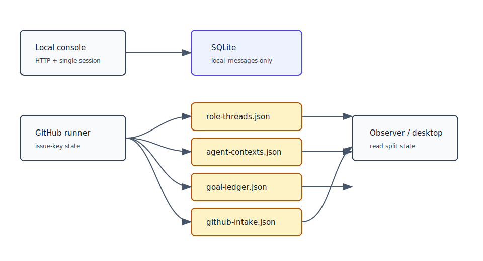
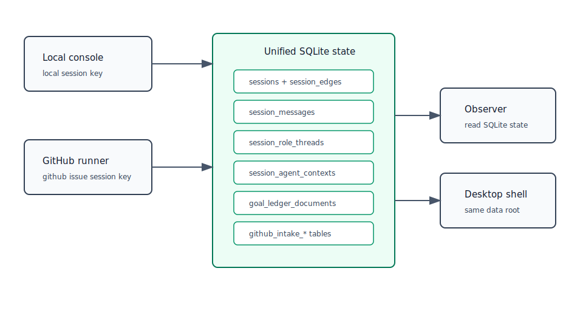

# 设计：local-console-t3-sqlite-persistence

## 方案

本方案采用“统一 SQLite store + 兼容现有状态 schema”的方式完成 T3。核心原则是只替换持久化载体和 key 口径，不重写 `conversation`、`triggers`、`codex`、`goal-ledger`、GitHub runner 调度等业务语义。

### SQLite 有界执行

复用 T2 的 SQLite 文件路径作为 T3 统一库，建议在实现中把 `LOCAL_CONSOLE_SQLITE_PATH` 抽象为更通用的状态库常量，但物理路径继续指向当前 `.state/local-console.sqlite`，避免 T2 数据被弃用。

T3 不继续把 `DatabaseSync` 直接暴露在 runner / observer 事件循环上。统一 SQLite store 的默认执行形态为 worker 隔离：

1. `DatabaseSync` connection、migration 和所有 SQL statement 都运行在 dedicated worker thread 内。
2. 主线程通过 request / response 协议调用 store operation，并在主线程计时；超时后返回 typed store timeout error。
3. 超时或永久挂起时，主线程终止该 worker，释放 runtime session / issue 推进锁；下一次 store operation 重新创建 worker 并重新打开 SQLite。
4. worker 内仍设置短 `PRAGMA busy_timeout`，用于真实 SQLite lock 的快速失败；主线程 timeout 是最后的有界兜底。
5. observer 读取也走同一有界 worker store；读取失败时返回 source-local 诊断，不阻塞全页渲染。

这样保留 T2 使用 built-in `node:sqlite` 的依赖选择，同时修复同步 SQLite 卡住时 Promise timer 无法触发的问题。实现阶段如果发现 worker thread 在目标 Node / Electron utilityProcess 环境不可用，必须停下更新方案，改用异步可取消 SQLite 依赖或等价隔离机制，不得回退为主线程同步调用。

### 数据库与迁移

基础 schema：

- `schema_migrations(version TEXT PRIMARY KEY, applied_at TEXT NOT NULL)`：记录幂等迁移。
- `legacy_migration_sources(source TEXT PRIMARY KEY, legacy_digest TEXT, status TEXT NOT NULL, imported_at TEXT, error TEXT)`：按 legacy source 记录迁移结果；只有 source transaction 成功提交后才写 `status='imported'`。
- `sessions(session_id TEXT PRIMARY KEY, source_type TEXT NOT NULL, source_owner TEXT, source_repo TEXT, source_issue_number INTEGER, parent_session_id TEXT, title TEXT, status TEXT NOT NULL, created_at TEXT NOT NULL, updated_at TEXT NOT NULL)`：会话基本单元。本地默认会话使用现有 `default`，GitHub issue 使用确定性 session key，例如 `github:tranfu-labs/agent-moebius#101`。
- `session_edges(parent_session_id TEXT NOT NULL, child_session_id TEXT NOT NULL, relation TEXT NOT NULL, created_at TEXT NOT NULL, PRIMARY KEY(parent_session_id, child_session_id, relation))`：T3 只持久化会话树关系，不要求 UI 展示完整树。
- `session_messages(id INTEGER PRIMARY KEY AUTOINCREMENT, session_id TEXT NOT NULL, speaker TEXT NOT NULL, role TEXT, body TEXT NOT NULL, status TEXT NOT NULL, run_id TEXT, run_dir TEXT, error TEXT, source_kind TEXT, source_id TEXT, created_at TEXT NOT NULL, updated_at TEXT NOT NULL)`：从 T2 `local_messages` 迁移而来，作为本地会话时间线事实源。GitHub 模式仍以 GitHub issue comments 作为公开时间线来源，不在 T3 镜像全部评论。
- `session_role_threads(session_id TEXT NOT NULL, role TEXT NOT NULL, thread_id TEXT NOT NULL, last_seen_index INTEGER NOT NULL, updated_at TEXT NOT NULL, PRIMARY KEY(session_id, role))`：替代 `.state/role-threads.json`。
- `session_agent_contexts(session_id TEXT NOT NULL, context_key TEXT NOT NULL, json TEXT NOT NULL, updated_at TEXT NOT NULL, PRIMARY KEY(session_id, context_key))`：替代 `.state/agent-contexts.json`，`context_key` 初期沿用 role 或 capability entry key。
- `github_intake_repositories(repo_key TEXT PRIMARY KEY, json TEXT NOT NULL, updated_at TEXT NOT NULL)` 与 `github_intake_issues(session_id TEXT PRIMARY KEY, issue_key TEXT NOT NULL UNIQUE, json TEXT NOT NULL, updated_at TEXT NOT NULL)`：替代 `.state/github-response-intake.json`，保留现有 intake 纯业务结构。
- `goal_ledger_documents(document_key TEXT PRIMARY KEY, json TEXT NOT NULL, updated_at TEXT NOT NULL)`：替代 `.state/goal-ledger.json`。T3 不重构 ledger 领域模型，仍复用 `goal-ledger.ts` 的 schema 校验和纯业务 helpers，以减少行为漂移。

迁移步骤按 source-local transaction 执行，避免一个 legacy 文件损坏或一个 source 失败阻断无关 store：

1. 初始化 SQLite，创建 `schema_migrations` 和所有 T3 表。
2. 若存在 T2 `local_messages` 且 `session_messages` 为空，把所有行复制到 `session_messages`，同时创建本地默认 session。
3. 若旧 `.state/role-threads.json` 存在且合法，把顶层 issue key 转成 session id 后写入 `session_role_threads`；缺失返回空态；损坏沿用现有 loader 报错。
4. 若旧 `.state/agent-contexts.json` 存在且合法，按同样 session key 规则写入 `session_agent_contexts`；缺失返回空态；损坏报错。
5. 若旧 `.state/github-response-intake.json` 存在且合法，repo state 写入 `github_intake_repositories`，issue state 按 issue key 生成 session id 后写入 `github_intake_issues`；缺失返回空态；损坏报错。
6. 若旧 `.state/goal-ledger.json` 存在且合法，写入 `goal_ledger_documents('default')`；缺失写入空 ledger；损坏沿用现有 loader 报错。
7. 迁移成功后只记录 migration marker，不删除旧 JSON，不再写旧 JSON。若 SQLite 已有对应数据，后续启动不重复导入旧 JSON，避免旧文件反向覆盖新事实。

每个 source 的具体原子性规则：

- 迁移前计算 legacy 文件 digest；若 `legacy_migration_sources.source` 已是 `imported`，后续启动直接忽略该 legacy 文件，不允许旧 JSON 反向覆盖 SQLite 新事实。
- 每个 legacy source 的导入和 marker 写入放在同一个 SQLite transaction 中；导入中抛错或进程崩溃时 marker 不写入，SQLite 回滚该 source 的部分写入。
- 若 target table 已存在 SQLite 新事实但该 source 没有 imported marker，初始化必须返回冲突诊断并停止该 source 的自动导入，不得猜测覆盖方向。实现测试用例需要覆盖这一分支。
- 对 observer 而言，一个 source 损坏只产生该 source 的诊断；例如 goal ledger legacy 损坏时，role threads / agent contexts / intake 仍可读取或显示自己的状态。对 runner 而言，当前操作所依赖的 source 损坏时沿用现有失败路径。
- SQLite 文件整体损坏属于统一 store 不可用，runtime / observer 返回可见 store diagnostic；这不等同于单个 legacy JSON 损坏。

### Store 适配

实现一个内部 SQLite state store 工具层，统一处理：

- 数据根路径解析和目录创建。
- worker request / response、`DatabaseSync` 初始化、`PRAGMA busy_timeout`、事务封装。
- 主线程 store timeout 包装，保持 `goal-ledger-state` 现有 timeout / AbortSignal 能力；超时必须能释放调用方锁并终止卡住的 worker。
- JSON payload 的 parse / stringify 只在 store 边界发生，业务层仍拿强类型对象。
- entry-level merge 在单个 SQLite transaction 中完成，替代 per-file mutex；进程内仍可保留 keyed lock 以降低同步 SQLite 的重入风险。

各 adapter 保持现有导出函数签名，优先把调用方改动压到最小：

- `loadRoleThreadStateStore` / `saveRoleThreadStateEntry` 返回和接收的 shape 不变，只是顶层 key 从 issue key 逐步切换为 session id。GitHub 调用边界通过 `makeGitHubSessionId(source)` 保持一 issue 一 session。
- `loadAgentContextStateStore` / `saveAgentContextStateEntry` 保持 shape 不变，workspace pre script 仍按当前 issue worktree capability 行为执行。
- `loadGitHubResponseIntakeState` / `saveGitHubResponseIntakeState` 保持纯业务结构不变，`StatePersister` 的脏写循环只调用 SQLite save。
- `loadGoalLedgerState` / `saveGoalLedgerEntry` 继续用 `parseGoalLedgerState`、`assertGoalLedgerState`、`withGoalLedgerEntry`，SQLite 只负责 durable document 和事务。
- local console store 从 `local_messages` 切到 `session_messages`，API snapshot 不变；重启后同一 `session_id` 能读回历史消息、状态、run id / run dir 和错误。

### Session key 口径

新增 session key helper，集中规则：

- Local: T2 默认会话继续为 `default`，后续多会话可用 `local:<id>`。
- GitHub issue: `github:<owner>/<repo>#<issueNumber>`。
- GitHub repo idle scan state 保持 repo key，不强行挂到单 session。

GitHub 模式的外部行为保持 issue 级隔离：评论读取、comment id、reaction target、artifact release、worktree path、branch name仍基于 GitHub source，不暴露 session key。

### Observer / desktop

Observer 继续只读，不新增写接口。T3 只把状态读取源从 JSON 文件切到 SQLite：

- ledger tree 从 `goal_ledger_documents` 读取并复用现有 render model。
- intake、role thread、agent context diagnostics 从对应表读取。
- run manifest `jsonl` 本轮可保持原路径；若实现发现 observer 对 “统一持久化” 的验收必须包含 manifest，再停下请需求持有者确认，因为 T3 原文只列了 role threads / ledger / intake / agent contexts。

Desktop 壳不新增 T4 UI 能力，只保证相同数据根重启后 local console / observer 能读到一致状态。

### 测试设计

单元测试：

- SQLite schema migration 幂等；已有 T2 `local_messages` 被导入 `session_messages`。
- 四个旧 JSON state adapter 的合法文件迁移、缺失文件空态、损坏文件错误语义。
- migration 在部分表写入后抛错并重启时，不写 imported marker，再次初始化不会重复、不漏项，也不会用旧 JSON 覆盖已确认的新 SQLite 事实。
- worker store 被注入永久挂起时，local console POST、state store save/load、observer 读取都在配置 timeout 内返回可见错误，释放 session / issue 推进锁。
- 真实 SQLite lock 或 busy 分支快速失败时，不启动 Codex，不把 user 消息标记为 completed，解除故障后后续操作可继续。
- role thread / agent context entry-level merge 在 SQLite 中不会覆盖同 session 其他 role / context。
- goal ledger save entry 继续执行 schema 校验、timeout / abort 分支和 entry-level merge。
- GitHub intake save/load 保持 repo state、issue state、route decision ledger 和 active/idle 字段不变。
- session key helper 对 GitHub issue source 生成稳定 key。
- legacy role thread JSON 迁移后，同一 GitHub issue 同一 role resume 复用原 thread id，不同 issue 不共享。
- migration 成功后保存 role thread、intake、goal ledger、agent context，只更新 SQLite；旧 `.state/*.json` 的 mtime 和内容不变。

集成 / 回归测试：

- local console 使用同一 SQLite 数据根：提交消息、写入 role thread / ledger / intake / agent context fixture，关闭并重建 runtime/server 后，snapshot 与各 store 读数保持一致。
- desktop 或 server 启动路径使用同一数据根时不会回退写旧 JSON。
- 现有 GitHub runner 全测试套件保持全绿，重点覆盖 `runner`、`scanner`、`issue-dispatcher`、`state-persister`、`goal-ledger-state`、`github-intake-state`、`agent-context-state`、`state`。
- `pnpm typecheck` 必须通过。

## 权衡
- 选择保留现有状态对象 schema，并用 SQLite 表 / JSON payload 承载复杂 state：牺牲一部分 SQL 可查询性，换取 GitHub 模式 behavior-preserving 和较低迁移风险。完整 ledger 关系型建模可留到 T5 本地全功能对等时按真实查询需求再做。
- 选择复用 T2 SQLite 文件路径：牺牲更通用的文件命名整洁度，换取 T2 数据平滑升级和“基于 T2 最小表继续扩展”的明确连续性。
- 选择不镜像 GitHub issue comments 到 SQLite：GitHub 模式公开时间线仍以 GitHub 为事实源，符合本里程碑“本地与 GitHub 数据不互通”的设计；T3 只统一 runner 自身状态持久化。
- 选择不删除旧 JSON：牺牲一点磁盘整洁度，换取可审计和可回滚；运行时不再写旧 JSON，仍满足废弃 JSON 事实源。

## 风险
- Worker 隔离会让 store 实现比 T2 单表同步调用更复杂。缓解：把 worker 协议限制在 state store 内部，外部 adapter 函数签名不变；测试覆盖 timeout 后 worker terminate 和后续恢复。
- 旧 JSON 损坏语义不完全一致。缓解：迁移实现复用现有 loader / parser，测试覆盖缺失、损坏、合法三类路径。
- Source-local 迁移会让不同 state 的迁移成功与失败同时存在。缓解：observer 显示 source-local 诊断；runner 只在依赖的 source 失败时失败，避免无关 store 相互阻断。
- Session key 切换可能影响 role resume 或 workspace context 查找。缓解：GitHub session id 由 issue source 确定性派生，迁移时旧 issue key 一次性转换；runner prompt / GitHub API 仍使用原 issue source。
- Goal ledger 全量 JSON document 存 SQLite 可能无法支持后续本地子会话查询。缓解：T3 只承诺持久化正确；T5 做本地全功能对等时再按实际查询关系增量拆表。
- 回滚方式：恢复 JSON-backed state adapters，并保留 SQLite 文件作为 T3 试运行产物；因为 T3 不删除旧 JSON，回滚不需要反向迁移。
